# Streaming Architecture

## Redpanda

### Course 1 : Streaming fundamentals

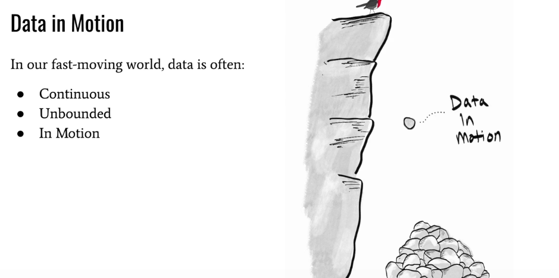

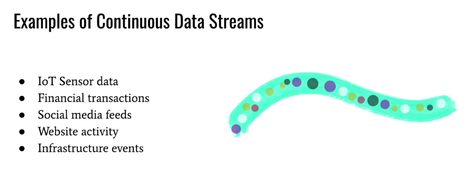

#### Streaming Data Processing

##### Real Life Example

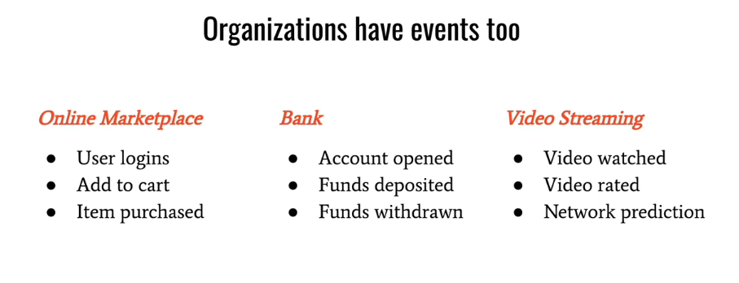

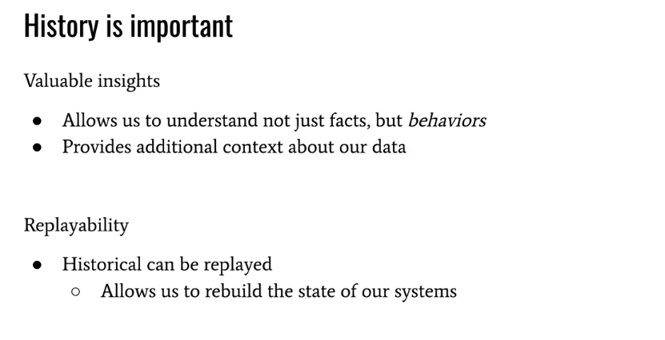

Many traditional systems have taught us to think of data in its resting state. Relational databases, distributed file systems, data lakes and data warehouses, all store bounded sets of data that are typically accessed on an ad hoc or scheduled basis. We typically think of this data as just a pile of bytes, that we can query whenever we need to.

The data in these systems are often modeled as objects or nouns, and these systems are good at certain tasks. For example, want to know how many users have signed up for your website? Well, you could run a query on the current snapshot of your users table to answer that question.

But viewing data in a resting state has limitations. If we want to process the data continuously, we have to make several trips to the storage layer, usually at some fixed and arbitrary interval, to create a report, make a business decision, or simply retrieve the data. This is called batch processing, and it’s often associated with high latency and slow decision making.

Also, these systems typically only concern themselves with the current state of the data, and lose track of the historical changes that took place beforehand. Extending our previous example - if you go to the users table, you’ll see the current snapshot or state of all the users in your system. But how did that state evolve overtime? And what intermediate state changes took place before we arrived at the current snapshot of our data? These questions are difficult to answer with traditional systems, hindering our ability to understand more complex behaviors in our data.

But in recent years, as data has become more ubiquitous and as our ability to collect data has improved, data systems have evolved beyond the data at rest model. Today, new systems have been developed to handle data in motion.

You see, more often than not, data is actually flowing in continuous and unbounded streams, and we need to process the data as soon as it becomes available.

Some examples of continuous data streams include:

- IoT sensor data
- Financial transactions
- Social media feeds
- Website activity
- Infrastructure events

Being able to process and store these kinds of infinite and fast-moving data streams has given rise to a new type of system: streaming data platforms.

Streaming data platforms are optimized for low-latency and high throughput, allowing us to store and access data quickly and continuously. They also allow us to process data as soon as it becomes available; This is called stream processing. But there are some other differences between streaming data platforms and traditional storage systems, as well.

First, instead of modeling data as nouns or things, event streaming involves the continuous collection, consumption, and processing of events. Events are exactly what they sound like. They describe something that occurs at a particular point in time.

For example, do you remember that time on your birthday where you ate too much cake? Eating too much cake on your birthday is an event. It’s something that happened at a particular point in time.

Organizations have events too. A marketplace like Etsy may have user_login events, add_to_cart events, and item_purchase events. A financial institution may have account_open events, funds_deposited and funds_withdrawn events. Video streaming services like Netflix may have events like video_watched, video_rated, or even events generated by machine learning models; for example - network_prediction events for adaptive video quality. Regardless of what industry you find yourself in, there are events all around you, you just have to know where to look.

Events drive intelligence, analytics, and product features. And it’s not uncommon for even a moderately sized organization to generate thousands or even millions of events per second. And again, these event streams are continuously flowing and theoretically infinite.

Another difference between traditional systems and streaming data platforms, is that instead of only being concerned with the current state of our data, streaming data platforms allow us to maintain the entire historical record of everything that happened beforehand. In other words - the intermediate state changes of our data. This pattern of capturing intermediate state changes using events is called event sourcing.

This is made possible thanks to the way event streaming platforms like Redpanda model events: as immutable, timestamped facts.

Now you may be asking, why are events immutable?

Well, events are immutable because history is important, and event sourcing allows us to preserve the history of our data. Immutability respects a simple fact:  we can’t change something that happened in the past. We all know that you ate too much cake on your birthday, and even if you’re in a better state now, historical events still provide us with a lot of good context about the past. Without the historical record, we wouldn’t know about that weird cake phase you went through, we would just know about your current state.

From an organizational perspective, the historical event record is important for a couple of reasons:

Some of the most important data insights lie within the historical record of your data. How did the data change over time? What events preceded the current event? What behaviors are present in our data? These questions are much easier to answer in an event-driven system that maintains the complete historical record.

Think about an ecommerce scenario. A user adds an item to their cart and then removes it. The current state shows an empty cart for this user. But knowing what happened before - i.e. that the user added a certain item to their cart, gives us some insight into what this user may be interested in. The current state doesn’t show that, but the historical state does.

Also, there is a huge operational advantage to event sourcing: we can easily rebuild the state of our downstream systems by re-processing the historical sequence of events. To understand the value of this, consider another example. What if you realize that after a few weeks of running your awesome data processing application, there’s a bug in your system and the data needs to be reprocessed?

This is extremely difficult and often impossible to do in traditional systems. But, with an event streaming platform like Redpanda, we have an immutable record of all the individual events that took place, which makes rebuilding the state much easier. But with an immutable record of all of the individual events that took place, it’s much easier with an event streaming platform like Redpanda.

Now, immutability doesn’t prevent us from representing the current snapshot of our data. We can still do that with streaming data platforms, just like we can with more traditional systems, as well.

Streaming data platforms just give a new capability, which is the ability to capture the current state of our data and the historical record of state changes.

#### Communication Patterns

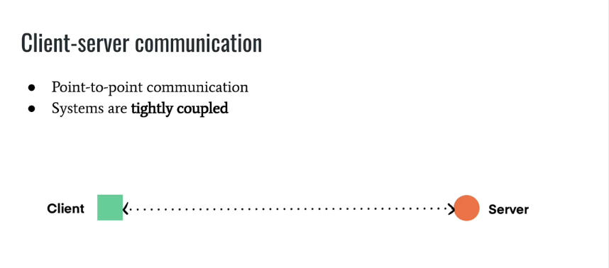

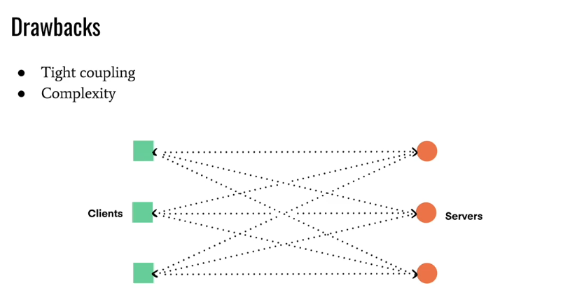

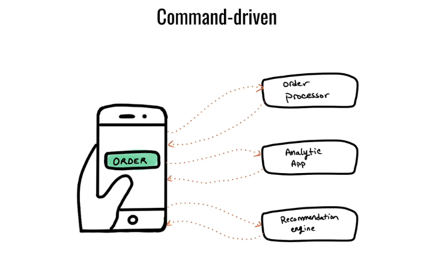

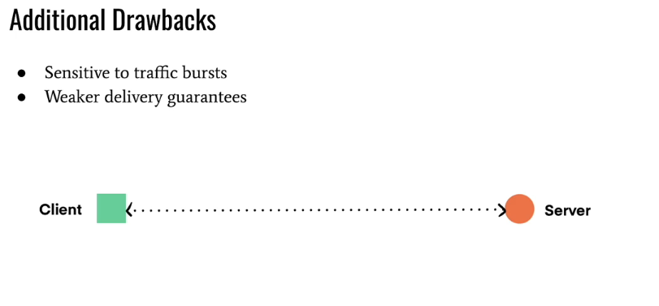

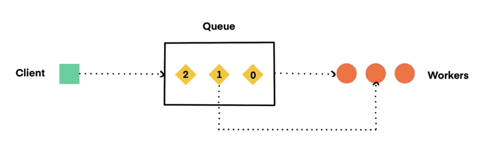

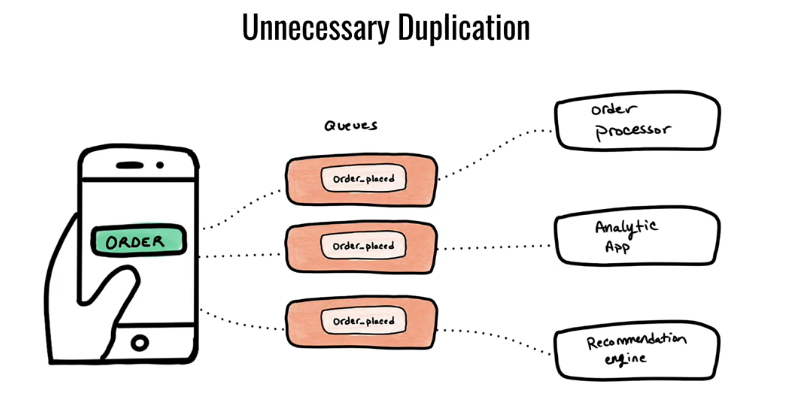

Perhaps the most common form of communication between systems is the client-server model. This form of point-to-point communication involves two parties talking directly to each other. In other words, a client sends a request to a server, and waits for a response. In order to talk to each other, the systems in a client-server architecture have to:

Know about each other so that they can exchange information directly

Anticipate and handle a wide range of errors that can occur when talking to each other

And because the systems talk to each other directly, they are said to be tightly coupled.

When the number of systems is small, this is somewhat manageable. However, it becomes difficult to scale as the number of systems begin to increase. As you can see in the following diagram, we can easily end up with complicated call chains or elaborate webs of communication.

These issues have become even more pronounced over recent years, especially as organizations adopt microservice architectures, which involves standing up many separate and specialized services.

And, while many service mesh technologies have been created to try to hide some of this complexity, they often add to the operational burden while only partially addressing the issues of point-to-point communication.

Now, as we mentioned earlier, events are the centerpiece of event-driven architectures. But in client-server architectures, the data being communicated is less clear, and in fact, most of the attention has not been focused on the data itself, but on requests and responses. However, if we actually look at what data is being communicated,  we can see that they are usually generic messages, or commands. We’ll refer to these as commands going forward.

As opposed to an event, which is just a simple, timestamped fact, commands are data packets that are intended to trigger some action. For example, Client A may tell a REST API to GET the items for a page, or PUT something in a database. Command-driven architectures reflect the tightly-coupled nature of the underlying systems, since you have one system telling another what to do, directly.

Events, on the other hand, are just facts. Just like in the physical world, facts can be observed, reacted to, and processed by any number of systems. And this simple realization is the starting point for how event-driven systems communicate.

The basic principle is that you can’t anticipate everything that downstream systems may want to do with your data, so why even try? It’s best to just publish the event somewhere, and allow any system that is interested in it to simply subscribe to the stream in order to read the data.

This is called the publish-subscribe communication pattern, or pub/sub for short. In this form of communication, there are two main entities: producers, which are responsible for publishing messages to a stream, and consumers, which read the messages from any stream they happen to be interested in. We’ll go into more detail in the next video, but the key idea is that producers and consumers don’t talk to each other directly, and aren’t even aware of each other. This is a much more scalable form of communication, and it is leveraged by event streaming platforms like Redpanda.

A user places an order. You may have one system that needs to process the order, a separate analytical system that enriches the data and makes it available for reporting, and a third system that acts as a product recommendation engine, which needs to consume orders so that it can make recommendations about different products.

There’s one event and three different systems that need to process it. A command-driven approach would involve issuing a separate command to each system, which is error-prone and inefficient.

It would be much better to represent the order as a simple event, and publish it somewhere that other systems can observe and process at will. The producing application shouldn’t need to know about each consumer application that needs to read the data.

Event-driven systems are designed around this simple concept. When we begin to model data as pure events, this is called event-first thinking.

There are a few other issues with point-to-point communication, as well. When systems talk to each other directly, receiving systems can easily get overwhelmed since they operate at the whims of whatever system is making a request. Therefore, high-volume or bursty traffic patterns can cause issues.

It would be much better to have a communication buffer that allows downstream systems to react to data asynchronously and at their own pace. And this is exactly what event streaming platforms like Redpanda offer, and we’ll dig more into that in the next video.

Finally,  point-to-point communication also comes with weaker delivery guarantees. If the receiving system is offline, the requesting system will need to retry and may eventually even give up. This is another problem that Redpanda addresses, which tolerates failures much better. We’ll see examples of this throughout this course.

##### Queue Architecture

For example, RabbitMQ is often compared with pub/sub systems like Kafka. 

However, queuing systems are very different. They have a single-consumer model and destructive consumer semantics. So once a message is processed, it is “popped” off the queue and unavailable to other systems, unless you explicitly duplicate that data.

Communication in queuing systems is similar to the command-driven approach we discussed earlier. Producers write messages to specific and sometimes separate locations to kick off specific tasks. Even though communication is asynchronous with queues, data producers and consumers are still tightly coupled, just like they are with the request-response pattern.

Also, queues have traditionally been much more difficult to scale. The brokers in a queueing system often take on extra computational burdens, and are sometimes called “smart brokers” to reflect this. For example, these brokers often have to manage cursor positions for the queues, manage locks for the messages that are out for delivery, execute more complex routing logic, and more. These burdens require a greater number of resources to achieve the same kind of throughput as pub/sub systems with simpler broker models.

Revisiting the previous Etsy example, a queuing system would not be appropriate since multiple systems need to process the event. Since queues have destructive consumer semantics and a single consumer model, you’d have to duplicate the event multiple times, in separate queues, for each downstream system that needs to read it. In this case, we’d need to duplicate the data in an order processing queue, an analytics queue, and finally in a recommendation queue. That’s inefficient.

#### Landscape of Streaming

##### Cloud Provider Options
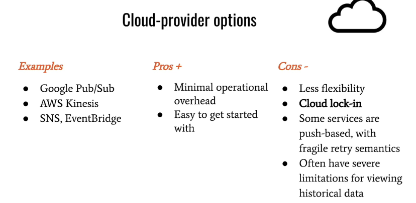

##### Apache Pulsar
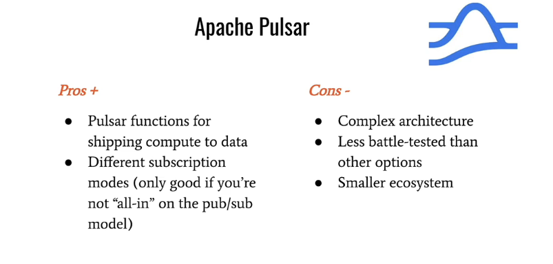

One thing that is great about Pulsar though is that it has something called Pulsar functions, which allow you to run stream processing apps on the Pulsar cluster, without deploying a separate system. So despite being less battletested than some of the other options we'll cover, we do like that feature.

##### Apache Kafka

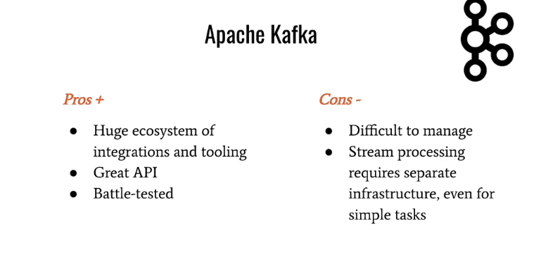

Kafka is a dominating force in the event streaming space. It was developed at LinkedIn, has a pull-based pub/sub communication model that is optimized for low-latency and high throughput, has a great API, a huge ecosystem of integrations and tooling, and has been sufficiently battle tested.

However, Kafka has a reputation for being complicated to manage, and its architecture, while less complex than Pulsar’s, is still somewhat complex. For example, it’s JVM-based, which often entails complex tuning, GC pauses, and low-level monitoring to make sure the systems and JVM processes are healthy. Also, while Zookeeper has been slated for removal, it was still recommended for production deployments of Kafka at the time of this recording, which adds to the operational overhead.

Fully managed options are available to help alleviate the operational concerns, including Confluent Cloud, AWS MSK, and Aiven, to name a few. But they often come at a high cost, since at the end of the day, it is still difficult to manage, but you are paying someone else to take on this burden.

Kafka also lacks Pulsar’s strongest feature, which is the ability to do stream processing and transformations where the data lives, instead of shipping large amounts of data to some separate system for processing. These network trips add up and can introduce undesirable latency when it comes time to process your event data.

##### Redpanda

#### Redpanda Overview

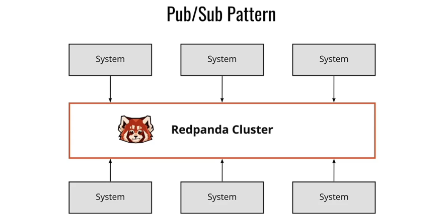

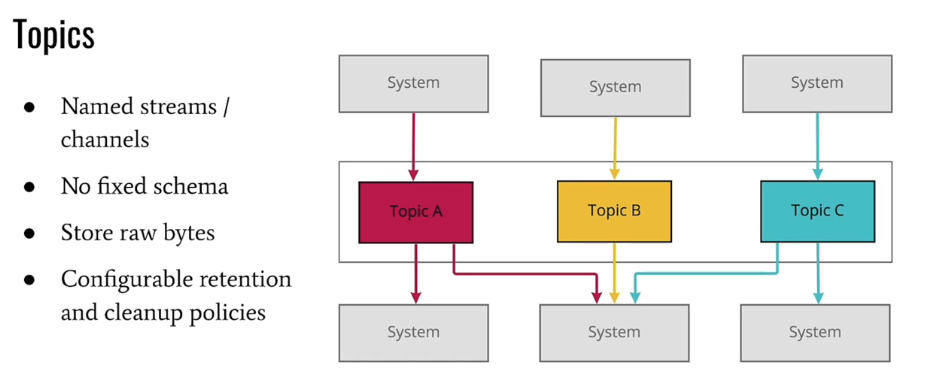

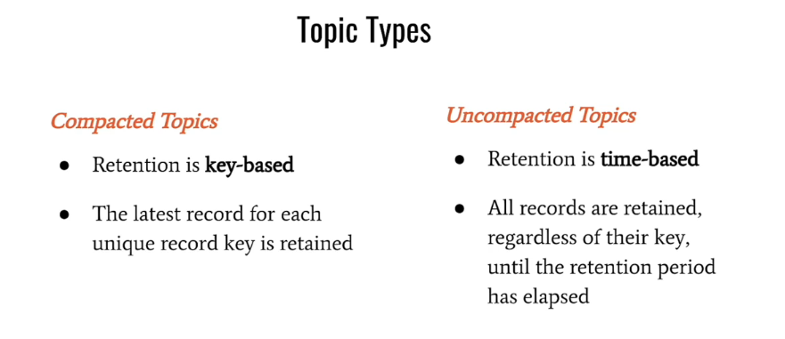

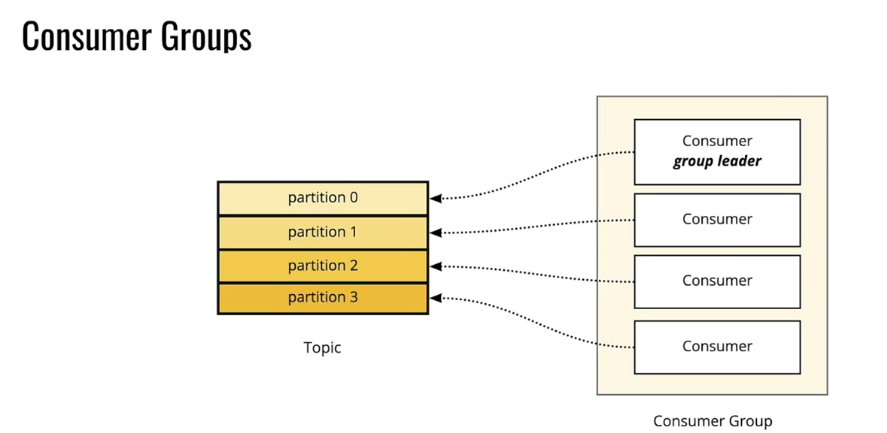

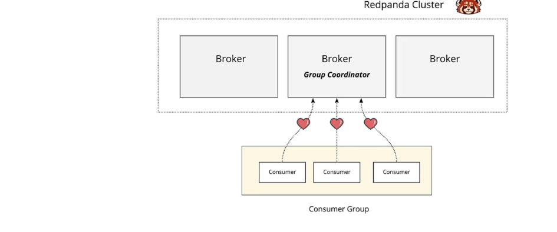

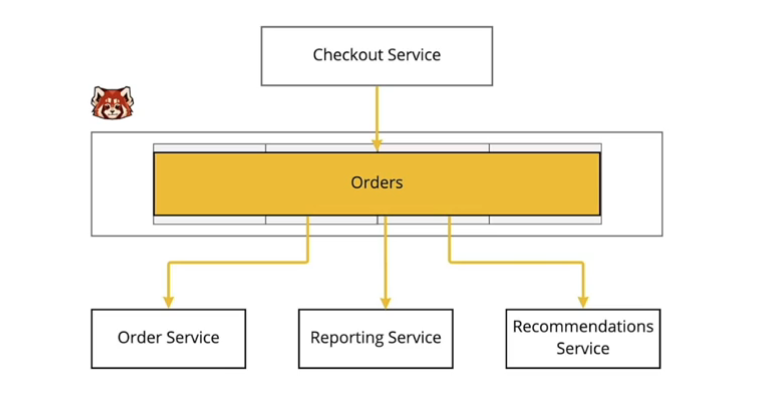

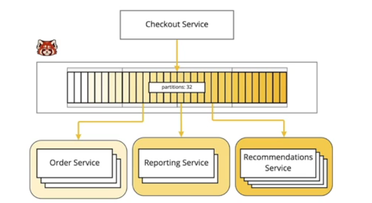

we learned how Redpanda, like many other data streaming platforms, leverages the pub/sub communication pattern. In other words, instead of two systems exchanging data directly, systems exchange data using a centralized communication hub. In the case of Redpanda, the communication hub is the Redpanda cluster.

A Redpanda cluster is made up of one or more servers, called brokers. As their name suggests, brokers are responsible for mediating communication between systems that produce data and systems that consume data. This allows us to build systems that are completely decoupled from each other, since data producers and consumers don’t need to know about each other, much less worry about all of the pitfalls involved in direct communication. Instead, systems communicate with the brokers, and Redpanda makes sure the data is communicated to the correct parties.

In addition to being the communication point for data producers and consumers, brokers are also responsible for storing data. This is different from more complex architectures, like what we find in Apache Pulsar, where brokers only handle communication and another set of servers is responsible for storing the data. Redpanda optimizes for operational simplicity, and this is apparent even in its broker model.

Most of the time, you’ll usually have multiple brokers in a production Redpanda cluster. This will provide redundancy and improve performance by distributing the work across many servers. While it's possible to have a cluster with just a single broker, that's fairly unusual in production.

The data that is stored on brokers is organized into topics. A topic is a named stream or channel where related events are published. For example, you might have a "payments" topic that contains the payment events for a given business. In general, a topic is a similar level of granularity to tables in a database. We can create any number of topics, which are identified by a human-readable name.

Each record within a topic is represented as a key-value pair, with a timestamp and optional set of headers. The key of each record can be used to group related events, which we’ll see in the next video, and the value contains the payload (for example, a byte-encoded JSON string), with all of the details about the event.

Topics can be configured in many different ways, and we’ll talk about this in more detail in the Redpanda Operations course, but they are usually distinguished by their data retention strategy. Compacted topics retain the latest record for each unique record key, while uncompacted topics delete data after a configurable retention period.

As you might imagine, Redpanda topics can get very large, so we need some way of horizontally scaling topics across many brokers in a Redpanda cluster. Otherwise, if topics could only be stored on a single machine, their maximum size would be limited to the largest machine in the cluster. This wouldn’t be ideal. Instead, we need to leverage the power of multiple machines to handle large amounts of event data, and subsequently, large topics.

But it’s hard to distribute and share just one of something, which is why topics are subdivided into smaller units, called partitions. Each topic partition contains a subset of the topic data (unless your topic was configured with just 1 partition, which isn’t recommended in production since it hinders scalability). We’ll get into more detail about the storage abstraction that partitions use in the next video, but for now, just know that the number of partitions is configurable when you create a topic, and generally a higher number of partitions improves our ability to scale.

Since partitions only contain a subset of the topic data, we can easily distribute them across many different brokers, allowing our topics to grow freely. Data is also replicated at the partition level in a Redpanda cluster.

So how does data actually make its way to a Redpanda topic? Well, in order to publish data to a topic, we use a producer. Producers don’t need to know who will come along to read the data they are producing, they simply publish the data to a topic, making it available to any downstream system that happens to be interested in it. Furthermore, the same Apache Kafka Producer API that is used to publish events to Kafka topics can be used to publish data to Redpanda topics. This allows Redpanda to work seamlessly with other tools and integrations in the Kafka ecosystem.

Finally, to retrieve data from Redpanda, we use a consumer. Consumers read data from one or more topics using a sequential read pattern. In other words, they read messages in the order they were produced. More on this in a minute.

But the really powerful thing about consumers is that they can work together to read data from a topic. This is really useful for large topics that require multiple consumers in order to keep up with the message volume.

A group of cooperating consumers is called a consumer group, and this is a key component that allows us to parallelize work and build high-throughput systems that process data efficiently with minimal latency. It’s like the saying, “many hands make light work,” but in Redpanda’s case, “many consumers make light work.”

Now, let’s take a minute to talk about how work is distributed across members of a consumer group. Each member of a consumer group is assigned one or more partitions in a Kafka topic. This is another important role of partitions - they not only allow us to scale from a storage perspective, but they also allow us to efficiently divide work across many consumers, and therefore scale our read workloads.

A special consumer in each consumer group, called the group leader, will handle the partition assignments for each consumer. But consumers never read from the same partition as another member of the group, since this would lead to double-processing.

However, consumers from different consumer groups can read from the same partition since they are working independently, and this is one of the main benefits of the pub/sub communication pattern that we discussed in the last chapter.

Furthermore, partition assignment among consumers can change over time, depending on the health of each consumer in the group. If a consumer becomes unhealthy (for example, due to a bug in the code or hardware failure), its partitions will be revoked and reassigned to a healthy member of the group. This makes Redpanda consumers fault tolerant and highly available, since they can continue processing data even if some members of the group are unhealthy, or if consumers go offline for any reason (for example, during a rolling restart of your application).

This brings us back to brokers. We already mentioned two roles of Redpanda brokers: storing data and mediating communication between producers and consumers. But brokers actually have another role, as well, which is monitoring the health of consumer groups. Consumers must heartbeat back to Redpanda brokers to prove that they are alive and well. If a consumer fails to heartbeat in time, the broker assigned to the consumer group, called the group coordinator, will trigger a rebalance, allowing the other consumers to cope with the failure and continue processing data. This involves sending a message to the group leader, who actually executes the rebalance.

We’ve covered a good bit, so let's put everything together with an example. We'll use the same example from our previous course -- orders at Etsy. Let's say we have a set of microservices : 

Checkout Service, which is the service users interact with to place orders

Order Service, which handles the backend processing of order events (payments, shipping, etc)

Reporting Service, which transforms and enriches order data for analytic purposes

Recommendations Service, which uses the order data to build recommendations for future orders 

To start, we'll have a Redpanda cluster with four brokers. Remember, multiple brokers are recommended for production clusters so that we can easily scale and replicate our data.

Within our Redpanda cluster, we’ll have a topic named "orders". Like a table in a database, this topic allows us to group related records for easy storage and retrieval.

Our topic has been configured with 32 partitions so that it can be split across multiple brokers, and so that we can split the read workloads across multiple consumers in each consumer group that needs to read from it.

Every time a user places an order, CheckoutService publishes an event to the orders topic. The OrderService, ReportingService, and RecommendationsService, all have consumers listening to the orders topic. As orders come in, each service will process the order events for their unique business cases. Since each service is consuming from the orders topic using a unique consumer group, they can easily parallelize work and handle failures.

