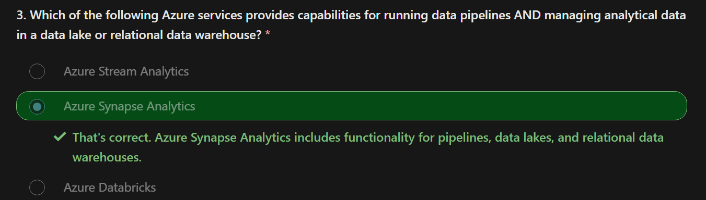
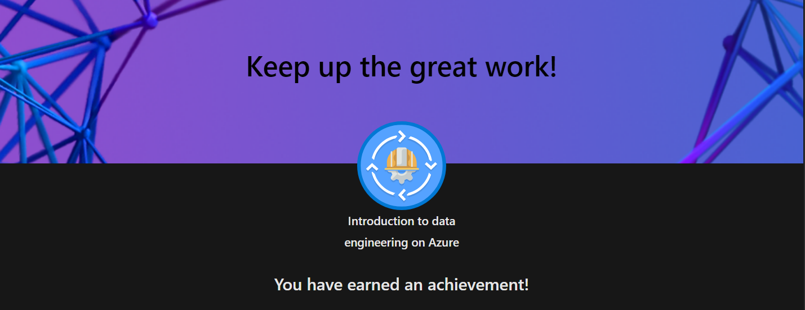
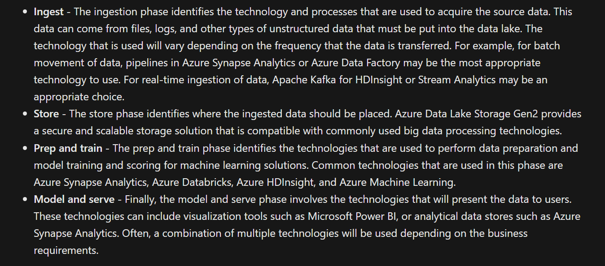
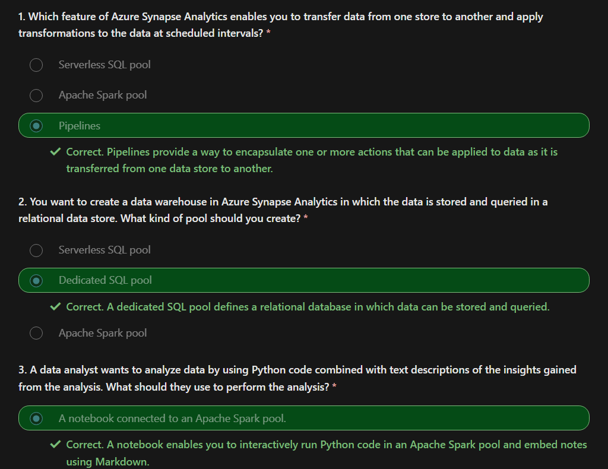

# Microsoft Azure

## Intro to DE with Azure

### Introduction

In most organizations, a data engineer is the primary role responsible for integrating, transforming, and consolidating data from various structured and unstructured data systems into structures that are suitable for building analytics solutions. 

An Azure data engineer also helps ensure that data pipelines and data stores are high-performing, efficient, organized, and reliable, given a specific set of business requirements and constraints.

### Types of Data

### Data Operations

#### Data Integration

Data Integration involves establishing links between operational and analytical services and data sources to enable secure, reliable access to data across multiple systems. 

For example, a business process might rely on data that is spread across multiple systems, and a data engineer is required to establish links so that the required data can be extracted from all of these systems.

#### Data Transformation

Operational data usually needs to be transformed into suitable structure and format for analysis, often as part of an extract, transform, and load (ETL) process; though increasingly a variation in which you extract, load, and transform (ELT) the data is used to quickly ingest the data into a data lake and then apply "big data" processing techniques to transform it. Regardless of the approach used, the data is prepared to support downstream analytical needs.

#### Data Consolidation

Data consolidation is the process of combining data that has been extracted from multiple data sources into a consistent structure - usually to support analytics and reporting. Commonly, data from operational systems is extracted, transformed, and loaded into analytical stores such as a data lake or data warehouse.

### Important Concepts

#### Operational and Analytical Data

Operational data is usually transactional data that is generated and stored by applications, often in a relational or non-relational database. Analytical data is data that has been optimized for analysis and reporting, often in a data warehouse.

#### Streaming Data

Streaming data refers to perpetual sources of data that generate data values in real-time, often relating to specific events. Common sources of streaming data include internet-of-things (IoT) devices and social media feeds.

Data engineers often need to implement solutions that capture real-time stream of data and ingest them into analytical data systems, often combining the real-time data with other application data that is processed in batches.

#### Data Pipelines

Data pipelines are used to orchestrate activities that transfer and transform data. Pipelines are the primary way in which data engineers implement repeatable extract, transform, and load (ETL) solutions that can be triggered based on a schedule or in response to events.

#### Data Lakes

A data lake is a storage repository that holds large amounts of data in native, raw formats. Data lake stores are optimized for scaling to massive volumes (terabytes or petabytes) of data. The data typically comes from multiple heterogeneous sources, and may be structured, semi-structured, or unstructured.

The idea with a data lake is to store everything in its original, untransformed state. This approach differs from a traditional data warehouse, which transforms and processes the data at the time of ingestion.

#### Data Warehouses

A data warehouse is a centralized repository of integrated data from one or more disparate sources. Data warehouses store current and historical data in relational tables that are organized into a schema that optimizes performance for analytical queries.

Data engineers are responsible for designing and implementing relational data warehouses, and managing regular data loads into tables.

#### Apache Spark

Apache Spark is a parallel processing framework that takes advantage of in-memory processing and a distributed file storage. It's a common open-source software (OSS) tool for big data scenarios.

#### Microsoft Azure Data Engineering Pipeline

### Quiz

### Achievement

## Azure Data Lake Gen2

Many BI solutions have lost out on opportunities to store unstructured data due to cost and complexity in these types of data in databases.

Data lakes have become a common solution to this problem. A data lake provides file-based storage, usually in a distributed file system that supports high scalability for massive volumes of data. 

Organizations can store structured, semi-structured, and unstructured files in the data lake and then consume them from there in big data processing technologies, such as Apache Spark.

Azure Data Lake Storage Gen2 provides a cloud-based solution for data lake storage in Microsoft Azure, and underpins many large-scale analytics solutions built on Azure.

### Azure Data Lake Storage Gen2

Azure Data Lake Storage combines a file system with a storage platform to help you quickly identify insights into your data. Data Lake Storage builds on Azure Blob storage capabilities to optimize it specifically for analytics workloads. 

This integration enables analytics performance, the tiering and data lifecycle management capabilities of Blob storage, and the high-availability, security, and durability capabilities of Azure Storage.

### Benefits

#### Security

Data Lake Storage supports access control lists (ACLs) and Portable Operating System Interface (POSIX) permissions that don't inherit the permissions of the parent directory. In fact, you can set permissions at a directory level or file level for the data stored within the data lake, providing a much more secure storage system.

**POSIX Style in Gen2**

In the POSIX-style model that's used by Data Lake Storage Gen2, permissions for an item are stored on the item itself. In other words, permissions for an item cannot be inherited from the parent items if the permissions are set after the child item has already been created. 

Permissions are only inherited if default permissions have been set on the parent items before the child items have been created.

#### Performance

Azure Data Lake Storage organizes the stored data into a hierarchy of directories and subdirectories, much like a file system, for easier navigation. As a result, data processing requires less computational resources, reducing both the time and cost.

#### Data Redundancy

Data Lake Storage takes advantage of the Azure Blob replication models that provide data redundancy in a single data center with locally redundant storage (LRS), or to a secondary region by using the Geo-redundant storage (GRS) option.

## Azure Data Lake Store vs Azure Blob Storage

In **Azure Blob storage**, you can store large amounts of unstructured ("object") data in a flat namespace within a blob container. Blob names can include "/" characters to organize blobs into virtual "folders", but in terms of blob manageability the blobs are stored as a single-level hierarchy in a flat namespace.

**Azure Data Lake Storage Gen2** builds on blob storage and optimizes I/O of high-volume data by using a hierarchical namespace that organizes blob data into directories, and stores metadata about each directory and the files within it. This structure allows operations, such as directory renames and deletes, to be performed in a single atomic operation.

Flat namespaces, by contrast, require several operations proportionate to the number of objects in the structure. Hierarchical namespaces keep the data organized, which yields better storage and retrieval performance for an analytical use case and lowers the cost of analysis.

## When to Use What?

## Stages of Processing Big Data

## Data Lakehouses

In some cases, the data warehouse uses external tables to define a relational metadata layer over files in the data lake and create a hybrid "data lakehouse" or "lake database" architecture. The data warehouse can then support analytical queries for reporting and visualization.

### ETL Architecture

- Azure Synapse Analytics can host pipelines to perform ETL processing using Azure Data Factory.

- These processes can then load data from operational data sources and load it into a data lake hosted in Azure Data Lake Gen2.

- The data is then processed and loaded into a relational data warehouse in an Azure Synapse Analytics dedicated SQL pool, from where it can support data visualization and reporting using Microsoft Power BI.

### Realtime Streaming Architecture

Increasingly, businesses and other organizations need to capture and analyze perpetual streams of data, and analyze it in real-time (or as near to real-time as possible). 

These streams of data can be generated from connected devices (often referred to as internet-of-things or IoT devices) or from data generated by users in social media platforms or other applications. Unlike traditional batch processing workloads, streaming data requires a solution that can capture and process a boundless stream of data events as they occur.

**Streaming Events**
Streaming events are often captured in a queue for processing. There are multiple technologies you can use to perform this task, including Azure Event Hubs as shown in the image. 

From here, the data is processed, often to aggregate data over temporal windows (for example to count the number of social media messages with a given tag every five minutes, or to calculate the average reading of an Internet connected sensor per minute). 

### Data Science and ML

Data science involves the statistical analysis of large volumes of data, often using tools such as Apache Spark and scripting languages such as Python. Azure Data Lake Storage Gen 2 provides a highly scalable cloud-based data store for the volumes of data required in data science workloads.

Machine learning is a subarea of data science that deals with training predictive models. Model training requires huge amounts of data, and the ability to process that data efficiently.

## Quiz

## Achievement 

## Azure Synapse Analytics

Azure Synapse Analytics provides a single, cloud-scale platform that supports multiple analytical technologies; enabling a consolidated and integrated experience for data engineers, data analysts, data scientists, and other professionals who need to work with data.

### Analytical Workloads Handled by Synapse Analytics

Azure Synapse Analytics provides a cloud platform for all of these analytical workloads through support for multiple data storage, processing, and analysis technologies in a single, integrated solution. 

The integrated design of Azure Synapse Analytics enables organizations to leverage investments and skills in multiple commonly used data technologies, including SQL, Apache Spark, and others; while providing a centrally managed service and a single, consistent user interface.

### Azure Synapse Analytics Exercise

This is an exercise in the MS Learn Path [link](https://learn.microsoft.com/en-us/training/modules/introduction-azure-synapse-analytics/3-how-works) but its paid.

### SQL Query Engines

Structured Query Language (SQL) is a ubiquitous language for querying and manipulating data, and is the foundation for relational databases, including the popular Microsoft SQL Server database platform. Azure Synapse Analytics supports SQL-based data querying and manipulation through two kinds of SQL pool.

- A built-in serverless pool that is optimized for using relational SQL semantics to query file-based data in a data lake.

- Custom dedicated SQL pools that host relational data warehouses.
The Azure Synapse SQL system uses a distributed query processing model to parallelize SQL operations, resulting in a highly scalable solution for relational data processing. 

You can use the built-in serverless pool for cost-effective analysis and processing of file data in the data lake, and use dedicated SQL pools to create relational data warehouses for enterprise data modeling and reporting.

### Exploring Synapse Analytics

Here is the [link](https://microsoftlearning.github.io/dp-203-azure-data-engineer/Instructions/Labs/01-Explore-Azure-Synapse.html) to experiment with Synapse Analytics.

### Quiz

### Achievement

