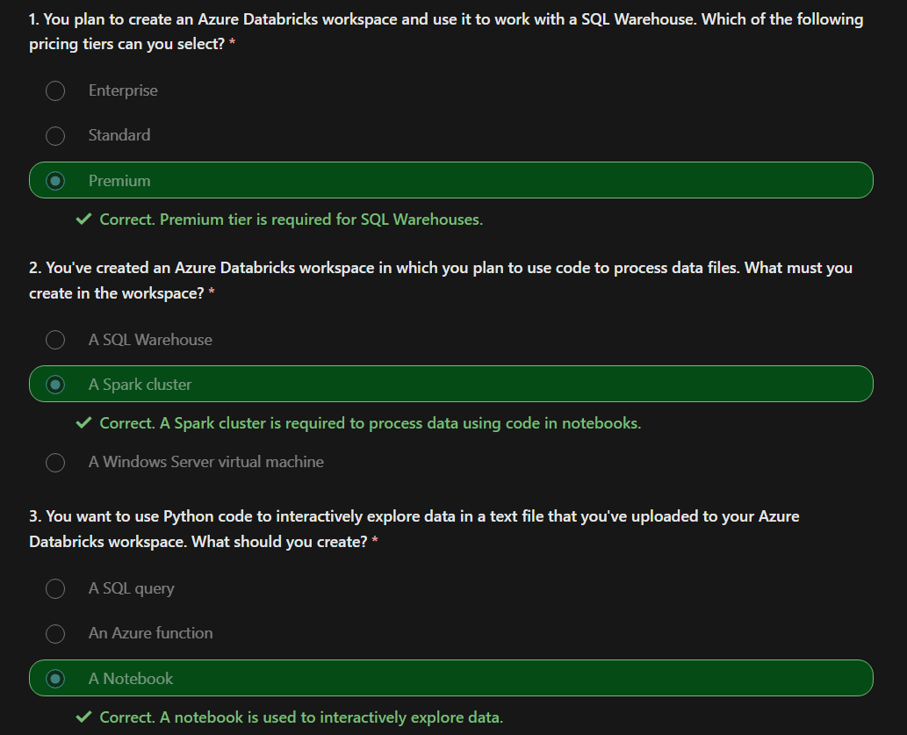
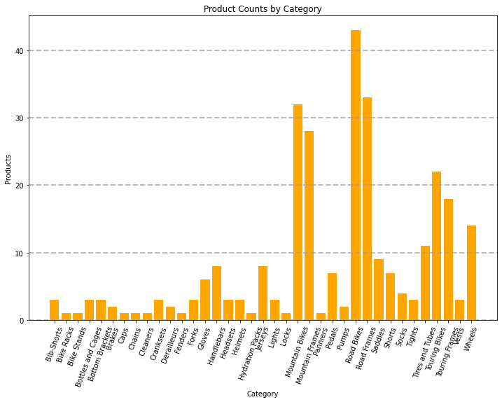
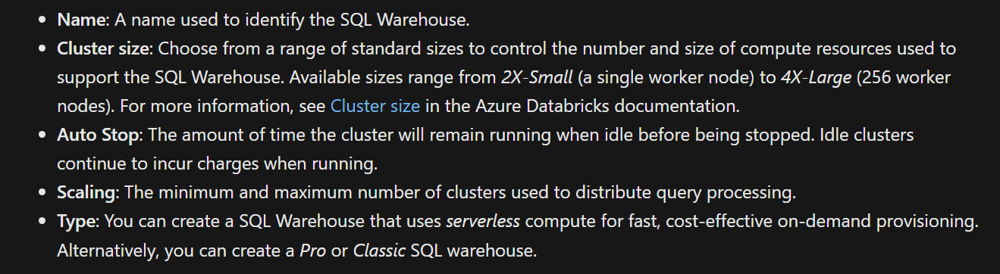

# Microsoft Azure - DP 203

DP 203 Study Guide - [PDF](https://query.prod.cms.rt.microsoft.com/cms/api/am/binary/RE4MbYT?WT.mc_id=Azure_BoM-wwl)

## Intro to DE with Azure

### Introduction

In most organizations, a data engineer is the primary role responsible for integrating, transforming, and consolidating data from various structured and unstructured data systems into structures that are suitable for building analytics solutions. 

An Azure data engineer also helps ensure that data pipelines and data stores are high-performing, efficient, organized, and reliable, given a specific set of business requirements and constraints.

### Types of Data


### Data Operations

#### Data Integration

Data Integration involves establishing links between operational and analytical services and data sources to enable secure, reliable access to data across multiple systems. 

For example, a business process might rely on data that is spread across multiple systems, and a data engineer is required to establish links so that the required data can be extracted from all of these systems.

#### Data Transformation

Operational data usually needs to be transformed into suitable structure and format for analysis, often as part of an extract, transform, and load (ETL) process; though increasingly a variation in which you extract, load, and transform (ELT) the data is used to quickly ingest the data into a data lake and then apply "big data" processing techniques to transform it. Regardless of the approach used, the data is prepared to support downstream analytical needs.

#### Data Consolidation

Data consolidation is the process of combining data that has been extracted from multiple data sources into a consistent structure - usually to support analytics and reporting. Commonly, data from operational systems is extracted, transformed, and loaded into analytical stores such as a data lake or data warehouse.

### Important Concepts

#### Operational and Analytical Data

Operational data is usually transactional data that is generated and stored by applications, often in a relational or non-relational database. Analytical data is data that has been optimized for analysis and reporting, often in a data warehouse.

#### Streaming Data

Streaming data refers to perpetual sources of data that generate data values in real-time, often relating to specific events. Common sources of streaming data include internet-of-things (IoT) devices and social media feeds.

Data engineers often need to implement solutions that capture real-time stream of data and ingest them into analytical data systems, often combining the real-time data with other application data that is processed in batches.

#### Data Pipelines

Data pipelines are used to orchestrate activities that transfer and transform data. Pipelines are the primary way in which data engineers implement repeatable extract, transform, and load (ETL) solutions that can be triggered based on a schedule or in response to events.

#### Data Lakes

A data lake is a storage repository that holds large amounts of data in native, raw formats. Data lake stores are optimized for scaling to massive volumes (terabytes or petabytes) of data. The data typically comes from multiple heterogeneous sources, and may be structured, semi-structured, or unstructured.

The idea with a data lake is to store everything in its original, untransformed state. This approach differs from a traditional data warehouse, which transforms and processes the data at the time of ingestion.

#### Data Warehouses

A data warehouse is a centralized repository of integrated data from one or more disparate sources. Data warehouses store current and historical data in relational tables that are organized into a schema that optimizes performance for analytical queries.

Data engineers are responsible for designing and implementing relational data warehouses, and managing regular data loads into tables.

#### Apache Spark

Apache Spark is a parallel processing framework that takes advantage of in-memory processing and a distributed file storage. It's a common open-source software (OSS) tool for big data scenarios.

#### Microsoft Azure Data Engineering Pipeline


### Quiz


### Achievement


## Azure Data Lake Gen2

Many BI solutions have lost out on opportunities to store unstructured data due to cost and complexity in these types of data in databases.

Data lakes have become a common solution to this problem. A data lake provides file-based storage, usually in a distributed file system that supports high scalability for massive volumes of data. 

Organizations can store structured, semi-structured, and unstructured files in the data lake and then consume them from there in big data processing technologies, such as Apache Spark.

Azure Data Lake Storage Gen2 provides a cloud-based solution for data lake storage in Microsoft Azure, and underpins many large-scale analytics solutions built on Azure.

### Azure Data Lake Storage Gen2

Azure Data Lake Storage combines a file system with a storage platform to help you quickly identify insights into your data. Data Lake Storage builds on Azure Blob storage capabilities to optimize it specifically for analytics workloads. 

This integration enables analytics performance, the tiering and data lifecycle management capabilities of Blob storage, and the high-availability, security, and durability capabilities of Azure Storage.

### Benefits

#### Security

Data Lake Storage supports access control lists (ACLs) and Portable Operating System Interface (POSIX) permissions that don't inherit the permissions of the parent directory. In fact, you can set permissions at a directory level or file level for the data stored within the data lake, providing a much more secure storage system.

**POSIX Style in Gen2**

In the POSIX-style model that's used by Data Lake Storage Gen2, permissions for an item are stored on the item itself. In other words, permissions for an item cannot be inherited from the parent items if the permissions are set after the child item has already been created. 

Permissions are only inherited if default permissions have been set on the parent items before the child items have been created.

#### Performance

Azure Data Lake Storage organizes the stored data into a hierarchy of directories and subdirectories, much like a file system, for easier navigation. As a result, data processing requires less computational resources, reducing both the time and cost.

#### Data Redundancy

Data Lake Storage takes advantage of the Azure Blob replication models that provide data redundancy in a single data center with locally redundant storage (LRS), or to a secondary region by using the Geo-redundant storage (GRS) option.

## Azure Data Lake Store vs Azure Blob Storage

In **Azure Blob storage**, you can store large amounts of unstructured ("object") data in a flat namespace within a blob container. Blob names can include "/" characters to organize blobs into virtual "folders", but in terms of blob manageability the blobs are stored as a single-level hierarchy in a flat namespace.


**Azure Data Lake Storage Gen2** builds on blob storage and optimizes I/O of high-volume data by using a hierarchical namespace that organizes blob data into directories, and stores metadata about each directory and the files within it. This structure allows operations, such as directory renames and deletes, to be performed in a single atomic operation.


Flat namespaces, by contrast, require several operations proportionate to the number of objects in the structure. Hierarchical namespaces keep the data organized, which yields better storage and retrieval performance for an analytical use case and lowers the cost of analysis.


## When to Use What?


## Stages of Processing Big Data


## Data Lakehouses

In some cases, the data warehouse uses external tables to define a relational metadata layer over files in the data lake and create a hybrid "data lakehouse" or "lake database" architecture. The data warehouse can then support analytical queries for reporting and visualization.

### ETL Architecture

- Azure Synapse Analytics can host pipelines to perform ETL processing using Azure Data Factory.

- These processes can then load data from operational data sources and load it into a data lake hosted in Azure Data Lake Gen2.

- The data is then processed and loaded into a relational data warehouse in an Azure Synapse Analytics dedicated SQL pool, from where it can support data visualization and reporting using Microsoft Power BI.


### Realtime Streaming Architecture

Increasingly, businesses and other organizations need to capture and analyze perpetual streams of data, and analyze it in real-time (or as near to real-time as possible). 

These streams of data can be generated from connected devices (often referred to as internet-of-things or IoT devices) or from data generated by users in social media platforms or other applications. Unlike traditional batch processing workloads, streaming data requires a solution that can capture and process a boundless stream of data events as they occur.

**Streaming Events**
Streaming events are often captured in a queue for processing. There are multiple technologies you can use to perform this task, including Azure Event Hubs as shown in the image. 

From here, the data is processed, often to aggregate data over temporal windows (for example to count the number of social media messages with a given tag every five minutes, or to calculate the average reading of an Internet connected sensor per minute). 

### Data Science and ML

Data science involves the statistical analysis of large volumes of data, often using tools such as Apache Spark and scripting languages such as Python. Azure Data Lake Storage Gen 2 provides a highly scalable cloud-based data store for the volumes of data required in data science workloads.

Machine learning is a subarea of data science that deals with training predictive models. Model training requires huge amounts of data, and the ability to process that data efficiently.

## Quiz


## Achievement 


## Azure Synapse Analytics

Azure Synapse Analytics provides a single, cloud-scale platform that supports multiple analytical technologies; enabling a consolidated and integrated experience for data engineers, data analysts, data scientists, and other professionals who need to work with data.

### Analytical Workloads Handled by Synapse Analytics


Azure Synapse Analytics provides a cloud platform for all of these analytical workloads through support for multiple data storage, processing, and analysis technologies in a single, integrated solution. 

The integrated design of Azure Synapse Analytics enables organizations to leverage investments and skills in multiple commonly used data technologies, including SQL, Apache Spark, and others; while providing a centrally managed service and a single, consistent user interface.

### Azure Synapse Analytics Exercise

This is an exercise in the MS Learn Path [link](https://learn.microsoft.com/en-us/training/modules/introduction-azure-synapse-analytics/3-how-works) but its paid.


### SQL Query Engines

Structured Query Language (SQL) is a ubiquitous language for querying and manipulating data, and is the foundation for relational databases, including the popular Microsoft SQL Server database platform. Azure Synapse Analytics supports SQL-based data querying and manipulation through two kinds of SQL pool.

- A built-in serverless pool that is optimized for using relational SQL semantics to query file-based data in a data lake.

- Custom dedicated SQL pools that host relational data warehouses.
The Azure Synapse SQL system uses a distributed query processing model to parallelize SQL operations, resulting in a highly scalable solution for relational data processing. 


You can use the built-in serverless pool for cost-effective analysis and processing of file data in the data lake, and use dedicated SQL pools to create relational data warehouses for enterprise data modeling and reporting.

### Exploring Synapse Analytics

Here is the [link](https://microsoftlearning.github.io/dp-203-azure-data-engineer/Instructions/Labs/01-Explore-Azure-Synapse.html) to experiment with Synapse Analytics.

### Quiz


### Achievement


## Azure Databricks Module

### What is Databricks?

Azure Databricks is a fully managed, cloud-based data analytics platform, which empowers developers to accelerate AI and innovation by simplifying the process of building enterprise-grade data applications. Built as a joint effort by Microsoft and the team that started Apache Spark, Azure Databricks provides data science, engineering, and analytical teams with a single platform for big data processing and machine learning.

By combining the power of Databricks, an end-to-end, managed Apache Spark platform optimized for the cloud, with the enterprise scale and security of Microsoft's Azure platform, Azure Databricks makes it simple to run large-scale Spark workloads.

### Databricks Workload Types

Azure Databricks is a comprehensive platform that offers many data processing capabilities. While you can use the service to support any workload that requires scalable data processing, Azure Databricks is optimized for three specific types of data workload and associated user personas:

- Data Science and Engineering
- Machine Learning
- SQL

### Key Concepts

* Apache Spark clusters - Spark is a distributed data processing solution that makes use of clusters to scale processing across multiple compute nodes. Each Spark cluster has a driver node to coordinate processing jobs, and one or more worker nodes on which the processing occurs. This distributed model enables each node to operate on a subset of the job in parallel; reducing the overall time for the job to complete.

* Databricks File System - Databricks File System (DBFS) - While each cluster node has its own local file system (on which operating system and other node-specific files are stored), the nodes in a cluster have access to a shared, distributed file system in which they can access and operate on data files. The Databricks File System (DBFS) enables you to mount cloud storage and use it to work with and persist file-based data.

* Hive Metastore - Hive is an open source technology used to define a relational abstraction layer of tables over file-based data. The tables can then be queried using SQL syntax. The table definitions and details of the file system locations on which they're based is stored in the metastore for a Spark cluster.

* Delta Lake builds on the relational table schema abstraction over files in the data lake to add support for SQL semantics commonly found in relational database systems. Capabilities provided by Delta Lake include transaction logging, data type constraints, and the ability to incorporate streaming data into a relational table.

* SQL Warehouses are relational compute resources with endpoints that enable client applications to connect to an Azure Databricks workspace and use SQL to work with data in tables. The results of SQL queries can be used to create data visualizations and dashboards to support business analytics and decision making. 

### Quiz


### Achievement 


### Using Spark in Databricks

* Describe key elements of the Apache Spark architecture.
* Create and configure a Spark cluster.
* Describe use cases for Spark.
* Use Spark to process and analyze data stored in files.
* Use Spark to visualize data.

### High Level Overview

- From a high level, the Azure Databricks service launches and manages Apache Spark clusters within your Azure subscription. Apache Spark clusters are groups of computers that are treated as a single computer and handle the execution of commands issued from notebooks. 

- Clusters enable processing of data to be parallelized across many computers to improve scale and performance. They consist of a Spark driver and worker nodes. The driver node sends work to the worker nodes and instructs them to pull data from a specified data source.

- In Databricks, the notebook interface is typically the driver program. This driver program contains the main loop for the program and creates distributed datasets on the cluster, then applies operations to those datasets. Driver programs access Apache Spark through a SparkSession object regardless of deployment location.


### How does spark execute jobs?

- Work submitted to the cluster is split into as many independent jobs as needed. This is how work is distributed across the Cluster's nodes. Jobs are further subdivided into tasks. The input to a job is partitioned into one or more partitions. These partitions are the unit of work for each slot.

- The secret to Spark's high performance is parallelism. Scaling vertically (by adding resources to a single computer) is limited to a finite amount of RAM, Threads and CPU speeds; but clusters scale horizontally, adding new nodes to the cluster as needed.

#### Parallelism in Spark

- The first level of parallelization is the executor - a Java virtual machine (JVM) running on a worker node, typically, one instance per node.

- The second level of parallelization is the slot - the number of which is determined by the number of cores and CPUs of each node.

- Each executor has multiple slots to which parallelized tasks can be assigned.

- The JVM is naturally multi-threaded, but a single JVM, such as the one coordinating the work on the driver, has a finite upper limit. By splitting the work into tasks, the driver can assign units of work to *slots in the executors on worker nodes for parallel execution.

- Additionally, the driver determines how to partition the data so that it can be distributed for parallel processing. So, the driver assigns a partition of data to each task so that each task knows which piece of data it is to process. Once started, each task will fetch the partition of data assigned to it.

#### Jobs and Stages

Depending on the work being performed, multiple parallelized jobs may be required. Each job is broken down into stages. A useful analogy is to imagine that the job is to build a house:

- The first stage would be to lay the foundation.
- The second stage would be to erect the walls.
- The third stage would be to add the roof.

Attempting to do any of these steps out of order just doesn't make sense, and may in fact be impossible. Similarly, Spark breaks each job into stages to ensure everything is done in the right order.

### Azure Cluster Architecture


When you create an Azure Databricks workspace, a Databricks appliance is deployed as an Azure resource in your subscription. 

When you create a cluster in the workspace, you specify the types and sizes of the virtual machines (VMs) to use for both the driver and worker nodes, and some other configuration options, but Azure Databricks manages all other aspects of the cluster.

The Databricks appliance is deployed into Azure as a managed resource group within your subscription. This resource group contains the driver and worker VMs for your clusters, along with other required resources, including a virtual network, a security group, and a storage account. 

All metadata for your cluster, such as scheduled jobs, is stored in an Azure Database with geo-replication for fault tolerance.


### PySpark Code Snippets

#### Loading Data into Dataframe

```py
df = spark.read.load('/data/products.csv',
    format='csv',
    header=True
)
display(df.limit(10))
```

#### Specifying a Database Schema

```py
from pyspark.sql.types import *
from pyspark.sql.functions import *

productSchema = StructType([
    StructField("ProductID", IntegerType()),
    StructField("ProductName", StringType()),
    StructField("Category", StringType()),
    StructField("ListPrice", FloatType())
    ])

df = spark.read.load('/data/product-data.csv',
    format='csv',
    schema=productSchema,
    header=False)
display(df.limit(10))
```

#### Filter and Group Columns

```py
pricelist_df = df.select("ProductID", "ListPrice")
```

#### Chaining Operations

```py
bikes_df = df.select("ProductName", "ListPrice").where((df["Category"]=="Mountain Bikes") | (df["Category"]=="Road Bikes"))
display(bikes_df)
```

#### Group By + Aggregation

```py
counts_df = df.select("ProductID", "Category").groupBy("Category").count()
display(counts_df)
```

#### SQL - Create db objects in catalog

The Spark catalog is a metastore for relational data objects such as views and tables. The Spark runtime can use the catalog to seamlessly integrate code written in any Spark-supported language with SQL expressions that may be more natural to some data analysts or developers.

```py
df.createOrReplaceTempView("products")
```

#### External Tables


#### Spark API to Access Data

```py
bikes_df = spark.sql("SELECT ProductID, ProductName, ListPrice \
                      FROM products \
                      WHERE Category IN ('Mountain Bikes', 'Road Bikes')")
display(bikes_df)
```

#### Use SQL Code Directly

```sql
%sql

SELECT Category, COUNT(ProductID) AS ProductCount
FROM products
GROUP BY Category
ORDER BY Category
```

### Visualizing Data

```py
from matplotlib import pyplot as plt

# Get the data as a Pandas dataframe
data = spark.sql("SELECT Category, COUNT(ProductID) AS ProductCount \
                  FROM products \
                  GROUP BY Category \
                  ORDER BY Category").toPandas()

# Clear the plot area
plt.clf()

# Create a Figure
fig = plt.figure(figsize=(12,8))

# Create a bar plot of product counts by category
plt.bar(x=data['Category'], height=data['ProductCount'], color='orange')

# Customize the chart
plt.title('Product Counts by Category')
plt.xlabel('Category')
plt.ylabel('Products')
plt.grid(color='#95a5a6', linestyle='--', linewidth=2, axis='y', alpha=0.7)
plt.xticks(rotation=70)

# Show the plot area
plt.show()
```



### Exercise : Exploring Spark

Here is the [link](https://adb-6109119110541327.7.azuredatabricks.net/?o=6109119110541327#notebook/366532548944596) for the Databricks workspace that has an introduction to spark.

### Achievement


### Using Delta Lake in Azure Databricks

Linux foundation Delta Lake is an open-source storage layer for Spark that enables relational database capabilities for batch and streaming data. By using Delta Lake, you can implement a data lakehouse architecture in Spark to support SQL_based data manipulation semantics with support for transactions and schema enforcement.

#### Benefits of Delta Lake

**Relational tables that support querying and data modification** - With Delta Lake, you can store data in tables that support CRUD (create, read, update, and delete) operations. In other words, you can select, insert, update, and delete rows of data in the same way you would in a relational database system.

**Support for ACID transactions** - Relational databases are designed to support transactional data modifications that provide atomicity (transactions complete as a single unit of work), consistency (transactions leave the database in a consistent state), isolation (in-process transactions can't interfere with one another), and durability (when a transaction completes, the changes it made are persisted). Delta Lake brings this same transactional support to Spark by implementing a transaction log and enforcing serializable isolation for concurrent operations.

**Data versioning and time travel** -  Because all transactions are logged in the transaction log, you can track multiple versions of each table row, and even use the time travel feature to retrieve a previous version of a row in a query.

**Support for batch and streaming data** - While most relational databases include tables that store static data, Spark includes native support for streaming data through the Spark Structured Streaming API. Delta Lake tables can be used as both sinks (destinations) and sources for streaming data.

**Standard formats and interoperability** - The underlying data for Delta Lake tables is stored in Parquet format, which is commonly used in data lake ingestion pipelines.

### Creating Delta Lake Tables

#### Create Delta Lake Table From A Dataframe

```py
# Load a file into a dataframe
df = spark.read.load('/data/mydata.csv', format='csv', header=True)

# Save the dataframe as a delta table
delta_table_path = "/delta/mydata"
df.write.format("delta").save(delta_table_path)
```

### Making Conditional Updates

While you can make data modifications in a dataframe and then replace a Delta Lake table by overwriting it, a more common pattern in a database is to insert, update or delete rows in an existing table as discrete transactional operations. To make such modifications to a Delta Lake table, you can use the DeltaTable object in the Delta Lake API, which supports update, delete, and merge operations.

```py
from delta.tables import *
from pyspark.sql.functions import *

# Create a deltaTable object
deltaTable = DeltaTable.forPath(spark, delta_table_path)

# Update the table (reduce price of accessories by 10%)
deltaTable.update(
    condition = "Category == 'Accessories'",
    set = { "Price": "Price * 0.9" })
```

The updates ae stored in the transaction log.

### Query a Previous Version of the table

Delta Lake tables support versioning through the transaction log. The transaction log records modifications made to the table, noting the timestamp and version number for each transaction. You can use this logged version data to view previous versions of the table - a feature known as time travel.

```py
df = spark.read.format("delta").option("timestampAsOf", '2022-01-01').load(delta_table_path)
```

### Catalog Tables

#### External vs Managed Tables

- A managed table is defined without a specified location, and the data files are stored within the storage used by the metastore. Dropping the table not only removes its metadata from the catalog, but also deletes the folder in which its data files are stored.

- An external table is defined for a custom file location, where the data for the table is stored. The metadata for the table is defined in the Spark catalog. Dropping the table deletes the metadata from the catalog, but doesn't affect the data files.

#### Creating Catalog Table From Dataframe

```py
# Save a dataframe as a managed table
df.write.format("delta").saveAsTable("MyManagedTable")

## specify a path option to save as an external table
df.write.format("delta").option("path", "/mydata").saveAsTable("MyExternalTable")
```

#### Creating Table with SQL

```py
spark.sql("CREATE TABLE MyExternalTable USING DELTA LOCATION '/mydata'")
```

#### Defining the Table Schema

```sql
%sql

CREATE TABLE ManagedSalesOrders
(
    Orderid INT NOT NULL,
    OrderDate TIMESTAMP NOT NULL,
    CustomerName STRING,
    SalesTotal FLOAT NOT NULL
)
USING DELTA
```

#### How to use catalog tables?

Catalog Tables can be used like the normal relational tables.

```sql
%sql

SELECT orderid, salestotal
FROM ManagedSalesOrders
```

### Spark Structured Streaming

A typical stream processing solution involves constantly reading a stream of data from a source, optionally processing it to select specific fields, aggregate and group values, or otherwise manipulate the data, and writing the results to a sink.

Spark includes native support for streaming data through Spark Structured Streaming, an API that is based on a boundless dataframe in which streaming data is captured for processing. A Spark Structured Streaming dataframe can read data from many different kinds of streaming source, including network ports, real time message brokering services such as Azure Event Hubs or Kafka.

#### Using Delta Lake as a Streaming Source

```py
from pyspark.sql.types import *
from pyspark.sql.functions import *

# Load a streaming dataframe from the Delta Table
stream_df = spark.readStream.format("delta") \
    .option("ignoreChanges", "true") \
    .load("/delta/internetorders")

# Now you can process the streaming data in the dataframe
# for example, show it:
stream_df.show()
```

By default, when delta lake table is used as a streaming source, only append operations are allowed. 

#### Using Delta Table as streaming sink

```py

from pyspark.sql.types import *
from pyspark.sql.functions import *

# Create a stream that reads JSON data from a folder
streamFolder = '/streamingdata/'
jsonSchema = StructType([
    StructField("device", StringType(), False),
    StructField("status", StringType(), False)
])
stream_df = spark.readStream.schema(jsonSchema).option("maxFilesPerTrigger", 1).json(inputPath)

# Write the stream to a delta table
table_path = '/delta/devicetable'
checkpoint_path = '/delta/checkpoint'
delta_stream = stream_df.writeStream.format("delta").option("checkpointLocation", checkpoint_path).start(table_path)

```

### Where are External and Managed Tables Stored?

- External tables that are defined by the path to the parquet files containing the table data.
- Managed tables, that are defined in the Hive metastore for the Spark cluster.

### Exercise : Delta Tables

Here is the [link](https://microsoftlearning.github.io/mslearn-databricks/Instructions/Exercises/03-Delta-lake-in-Azure-Databricks.html#create-a-notebook-and-ingest-data) to the exercise 

**Didnt Understand : Streaming Data and Delta Tables**

### Quiz


### Achievement


### SQL Warehouse in Databricks

#### Configurations in SQL Warehouses


#### Creating tables and databases

All SQL Warehouses contain a default database schema named default. You can use create tables in this schema in order to analyze data. However, if you need to work with multiple tables in a relational schema, or you have multiple analytical workloads where you want to manage the data (and access to it) separately, you can create custom database schema. To create a database, use the SQL editor to run a ```CREATE DATABASE``` or ```CREATE SCHEMA``` SQL statement.

```sql
CREATE SCHEMA salesdata;
```

```sql
CREATE TABLE salesdata.salesorders
(
    orderid INT,
    orderdate DATE,
    customerid INT,
    ordertotal DECIMAL
)
USING DELTA
LOCATION '/data/sales/';
```

### Exercise


Check out the complete exercise [here](https://microsoftlearning.github.io/mslearn-databricks/Instructions/Exercises/04-Azure-Databricks-SQL.html)

### Achievement


### Running Azure Databricks Notebooks in Azure Data Factory


