# Databricks

## Quick Access

1. [Databricks Lakehouse Fundamentals](https://vedanthv.github.io/data-engg-docs/databricks/#databricks-lakehouse-fundamentals)

2. [Data Engineering with Databricks](https://vedanthv.github.io/data-engg-docs/databricks/#course-1-data-engineering-with-databricks)

    - [Getting Started with Workspace](https://vedanthv.github.io/data-engg-docs/databricks/#getting-started-with-the-workspace)

    - [Transform Data with Spark](https://vedanthv.github.io/data-engg-docs/databricks/#transform-data-with-spark)

    - [Manage Data with Delta Lake](https://vedanthv.github.io/data-engg-docs/databricks/#managing-data-with-delta-lake)

    - [Building Data Pipelines wit DLT](https://vedanthv.github.io/data-engg-docs/databricks/#data-pipelines-with-delta-live-tables)

    - [Workflows in Databricks](https://vedanthv.github.io/data-engg-docs/databricks/?h=workflow#databricks-workflows)

    - [Data Access with Unity Catelog]()

3. Brian Cafferky Training Material

    - [Dimension Modelling Concepts]()

    - [Understanding Delta Event Logs]()

    - [Delta Live Table Pipeline Example]()

    - [Databricks Workflows Features]()

Databricks Workspace [link](https://community.cloud.databricks.com/?o=446238005128756)

## Databricks Lakehouse Fundamentals


### What is a Data Warehouse?

- Data Warehouse unlike relational databases provided Business Intelligence, analytics and pre defined schema logic.
- They were not designed for semi and unstructured data. They can't handle upticks in volume and velocity and had long processing times.

### Data lakes
 
 - Data Lakes had flexible data storage capabilities, streaming support and AI ML capabilities.
- But it introduced concerns and are not supported for transactional data. There is no data reliability and data governance is still a concern.

Hence businesses required two different data platforms. 

- The data warehouse had structured tables for BI and SQL Analytics, whereas data lakes had unstructured data for Data Science and Data Streaming.
- They also had different governance and security models and most important there were two separate copies of data.

#### How does the Lakehouse Solve this Problem?

- It can serve all ML, SQL and BI, streaming use cases.
- One security and governance approach for all data assets on cloud.
- An open and reliable data platform to efficiently handle all data types.

#### Key Features

- Transaction Support
- Schema Enforcement and Governance 
- BI Support 
- Data Governance
- Decoupled Storage from Compute and Separate Clusters.
- Support for Diverse data workload in the same data repository.

#### Problems with Data Lake

- Lack of ACID Transaction support
- Lack of Schema Enforcement
- Lack of Integration with Data Catalog

#### Delta Lake

- File based open data format that provides ACID transaction guarantees. We can handle metadata for petabytes of data.
- Audit history and time travel capabilities.
- Schema Enforcement ensures there is no wrong data that is in the tables and schema evolution to accommodate ever changing data.
- Supports Change Data Capture, Slowly Changing Dimensions and  Streaming Upserts.
- Delta Tables are based on Apache Parquet, common format for structuring data.
- It has a transaction log and acts as a single source of truth.

#### Photon

- Next Gen query engine that saves costs, its compatible with Spark APIs. Loading and querying data becomes increasingly faster.
- Each Spark Executor can have a photon engine that accelerates portion of spark and sql queries.

### Why is a Unified governance and security model structure important?

The more individual access points added to the system like users, groups or external connectors, the higher the risk of data breaches.

Some challenges are diversity of data assets, using two incompatible platforms and fragmented tool usage.

Databricks overcomes these challenges by using Unity Catalog for Data Governance, delta sharing to share data across any computing platform.

Unlike a few years back when each workspace/team had different Access Controls, User Management and Metastores, with Unity Catalog we can have centralized access controls and user management, including row and column level access permission privileges.

We can control access to multiple data items at one time eg. personal info can be tagged and a single rule can be defined to provide access as needed.

Unity provides highly detailed audit trails that define who has accessed what data at what time and also highlights the changes made.

Data Lineage is provided by Unity Catalog and it includes the history of data, what datasets it came from, who created it and when + the transformations performed on it.

### Data Sharing With Delta Sharing

Usually the data is shared as tables and not files. So this system is not scalable.

We cannot share data across platforms using traditional technology.

Delta Sharing allows the data to be moved to any cloud platform securely.

**Advantages**

- No new ingestion processes needed to share data and integrates with PowerBI, Tableau, Spark and Pandas.
- Data is shared live without copying it.
- Centralized Admin and Governance.
- The data products can be built and packaged via a central marketplace.
- There are privacy safe clean rooms to secure data and collaboration between vendors. 

### Divided Security Architecture

#### Control Plane
- Consists of managed backend services that Databricks provides.
- These live in Databricks own cloud account.
- It runs the web application and manages the notebooks, applications and clusters.

#### Data Plane

Data plane is where the data is computed. Unless we use serverless compute, the clusters run in the business owner's own cloud account.

The information in the control plane is encrypted at rest and in transit.

Databricks clusters are shortlived and do not persist after job termination.

If there are any security issues coming up, the service request can be generated and the Databricks employees are given access to the workspace for a certain duration of time.

### User Access and Identity

- Table ACL feature
- IAM Instance Profiles
- Securely Store access keys
- The Secrets API

### Instant Compute and Serverless

In normal scenario, we run clusters on the dataplane that's connected to an external storage.

But some challenges with this are that:

- Cluster Creation is complicated.
- Environment Setup is slow
- Capacity and costs of the business cloud account should be managed.

In Serverless Compute, Databricks allows us to run the clusters on their cloud account instead of the business.

The environment starts immediately and can scale in seconds.

These servers are unassigned to any user, always in a warm state and waiting to run jobs given by the users.

The three layers of isolation in the container that is hosting the runtime, virtual machine hosting the container and the virtual network for the workspace.

Each of the parts is isolated with no sharing or cross network traffic allowed.

Once the job is done, the VM is terminated and not used again for other compute tasks.

### Common Data Lakehouse Terminology 

#### Unity Catalog Components

1. Metastore: Top level logical container in Unity Catalog. It's a construct that represents the metadata. They offer improved security and other useful features like auditing.
2. Catalog : Top most container for data objects in Unity Catalog. Data Analysts use this to reference data objects in UC.

There are three main namespaces to address the data location names in UC. The format is ```SELECT * FROM catalog.schema.table```

3. Schema : Contains tables and views and is unchanged by UC. Forms the second part of the three level namespace. Catalogs can contain many schemas as desired.

4. Tables : SQL relations with ordered list of columns. They have metadata like comments, tags and list of columns.

5. Views : They are stored queries that are executed when we query the view. They are read only.

Other components are Storage Credentials created by admins and used to authenticate with cloud storage containers.

Shares and recipients is related to delta sharing for low overhead sharing over different channels inside or outside organization by linking metastores in different parts of the world. 

The metastore is essentially a logical construct with Control Plane and Cloud Storage.

The metadata information about the data objects and the ACLs are stored in control plane and data related to objects maintained by the metastore is stored in cloud storage.

### Challenges in Data Engineering Workload

- Complex Data Ingestion Methods
- Support For data engineering principles
- Third Party Orchestration Tools
- Pipeline Performance Tuning
- Inconsistencies between partners.

The Databricks Lakehouse platform provides us with managed data ingestion, schema detection, enforcement and evaluation along with declarative and auto scaling data flow with a native orchestrator.

#### Capabilities of DE in Lake House

- easy data ingestion
- auto etl pipelines
- data quality checks
- batch and stream tuning

#### Autoloader 

As data loads in the lakehouse, Databricks can infer the schema after processing the data as they arrive in the cloud storage.

It auto detects the schema and enforces it guaranteeing data quality.

The ```COPY INTO``` command is used by data analysts to load data from a folder to the Delta Lake Table.

### Delta Live Tables

ETL framework that uses a simple declarative approach to build reliable pipelines and automatically auto scales the infra so that data folks can spend less time on tooling and get value from data.

- We can declaratively express entire data flows in Python.
- Natively enable software engineering best practices such as separate dev and prod environments and test before deployment in a single API.

### Workflows

Orchestration service embedded in Databricks Lakehouse platform. Allow data teams to build reliable data workflows on any cloud.

We can orchestrate pipelines written in DLT or dbt, ML pipelines etc.

We can use external tools like Apache Airflow to manage the workflows or even use the API.

One example of delta live tables pipeline is using Twitter Stream API to retrieve live tweets to S3, then use delta live tables to ingest, clean and transform tweets and finally do sentiment analysis.

### Data Streaming Workloads

- Every organization generates large amounts of real time data. This data includes transaction records, third party news, weather, market data and real time feeds, web clicks, social posts, emails and instant messages.

- Some applications of real time data are Fraud Detection, Personalized Offers, Smart Pricing, Smart Devices and Predictive maintainence.

Databricks supports real time analytics, real time ML and real time applications.

Specific use cases include Retail, Industrial Automation, Healthcare and Financial Instituitions.

### ML Workloads

Problems

- Multiple Tools Available
- Hard to track experiments
- Reproducing Results is hard
- ML Models are hard to deploy

Solutions

- Built in ML Frameworks and model explainability
- Support for Distributed Training
- AutoML and Hyperparameter Tuning
- Support for hardware accelerators

## Credential


## Databricks Academy : Data Engineer Learning Plan

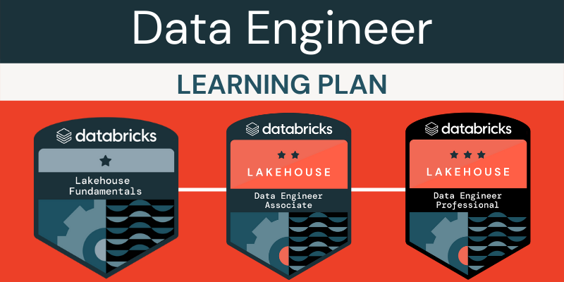

Link to the course : [click here](https://customer-academy.databricks.com/learn/lp/10/Data%2520Engineer%2520Learning%2520Plan)

### Course 1 : Data Engineering with Databricks

#### Goals

- Use the Databricks Data Science and Engineering Workspace to perform common code development tasks in a data engineering workflow.

- Use Spark SQL/PySpark to extract data from a variety of sources, apply common cleaning transformations, and manipulate complex data with advanced functions.

- Define and schedule data pipelines that incrementally ingest and process data through multiple tables in the lakehouse using Delta Live Tables in Spark SQL/PySpark. 

- Create and manage Databricks jobs with multiple tasks to orchestrate and monitor data workflows.
Configure permissions in Unity Catalog to ensure that users have proper access to databases for analytics and dashboarding.

#### Getting Started With the Workspace


**Architecture and Services**


- The data plane has the compute resources and clusters that is connected to a cloud storage. It can be single or multiple cloud storage accounts.

- The Control Plane stores the UI, notebooks and jobs and gives the ability to manage clusters and interact with table metadata.

- Workflow manager allows us to manage tasks and pipelines.

- Unity Catalog mostly provides with Data Lineage, Data Quality and Data Discovery

- There are three personas that Databricks provides : Data Science and Engineering Persona, ML Persona and SQL Analyst Persona

- Cluster is a set of computational resources where workloads can be run as notebooks or jobs.

- The clusters live in the data plane in the org cloud account but cluster mgmt is fn of control plane.

#### Compute Resources

##### Overview


##### Cluster Types
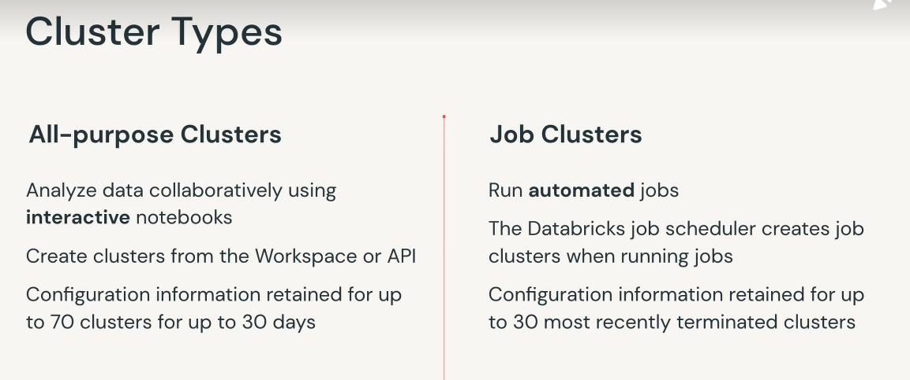

- Job Clusters cannot be restarted if terminated.
- All purpose clusters can be started whenever we want it to.

##### Cluster Mode
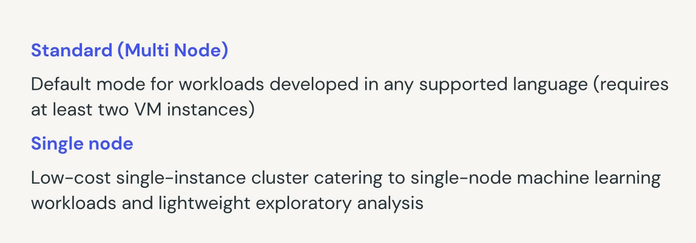

##### Databricks Runtime Version
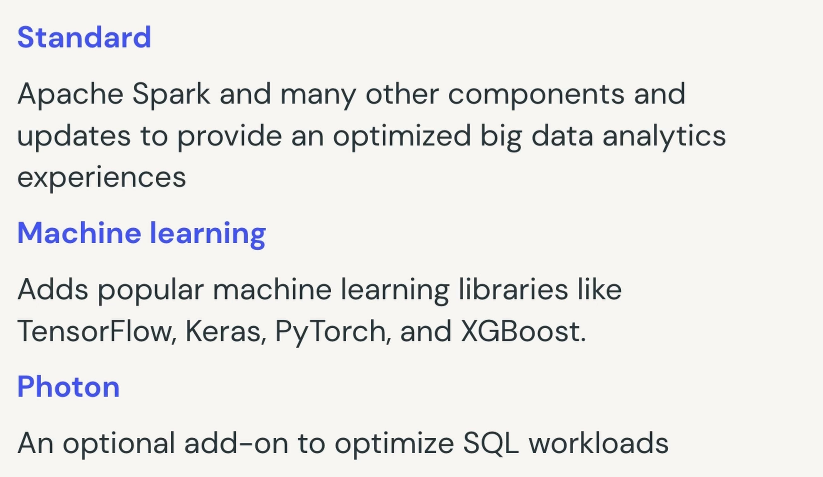

##### Access Mode

Specifies overall security model of the cluster.
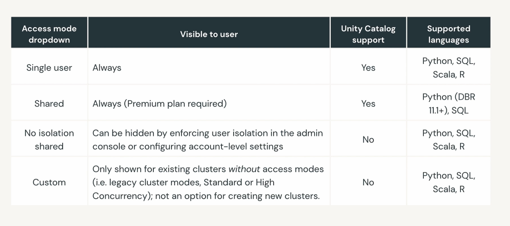

- DBFS mounts are supported by single user clusters.

##### Cluster Policies


##### Access Control Matrix
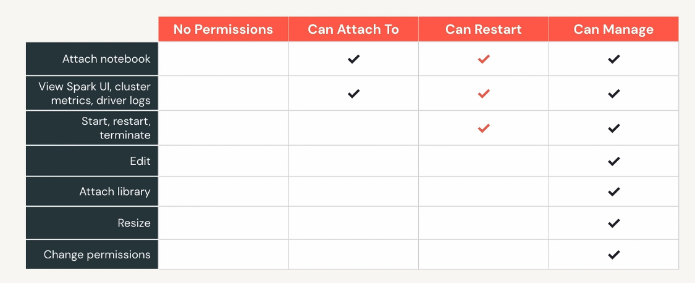

- On shared security mode multiple users can be granted access.
- On single user security mode, each user will have their own cluster.

##### Why Use Databricks Notebooks?
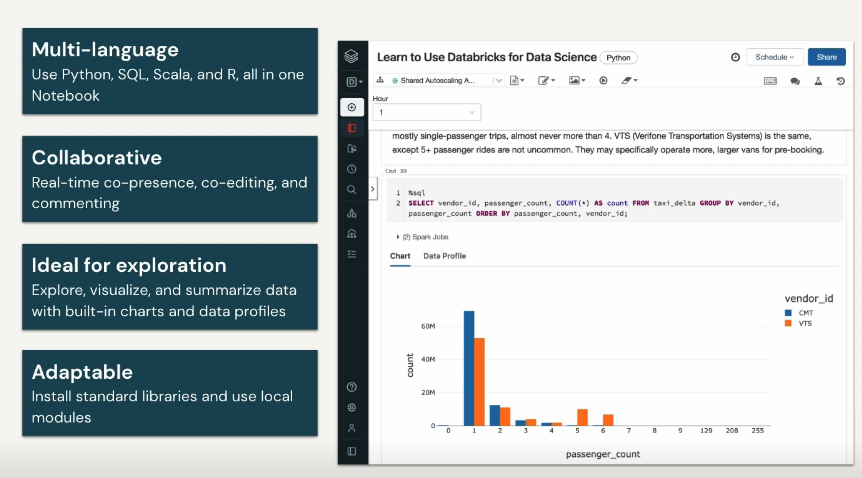


##### Databricks Utilities


##### Databricks Repos


Some supported operations include:

- Cloning a repository, pulling and upstream changes.
- Adding new items, creating new files, committing and pushing.
- Creating a new branch.
- Any changes that are made in a Databricks Repo can be tracked in a Git Repo

We cannot DELETE branches from repos in databricks. It has to be done using Github/Azure Devops.

Many operations of the control plane can be versioned using Repos feature like keeping track of versions of notebooks and also to test clusters.

#### Transform Data With Spark

##### Data Objects in the Lakehouse
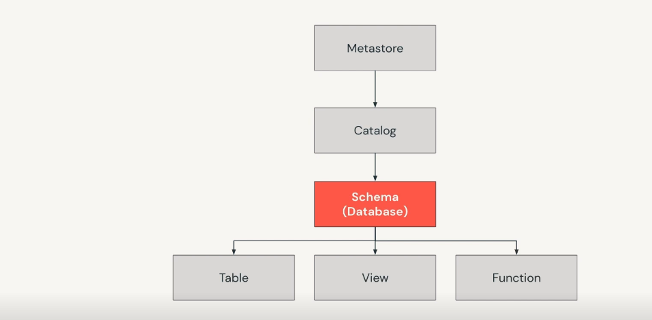

- Catalog - Grouping of Databases
- Schema - Grouping of Objects in catalog
- Every schema has a table that is managed or external

##### Managed vs External Storage


- Managed Tables are made up of files that are stored in a managed store location configured to the metastore. Dropping the table deletes all the files also.

- In case of external tables, the data is stored in a cloud storage location. When we drop an external table, this underlying data is retained.
- View is a saved query against one or more databass. Can be temporary or global. Temp Views are scoped only to the current spark session

- CTE's only alias the results of the query while that query is being planned or executed.

#### Extracting Data Directly from Files with Spark SQL

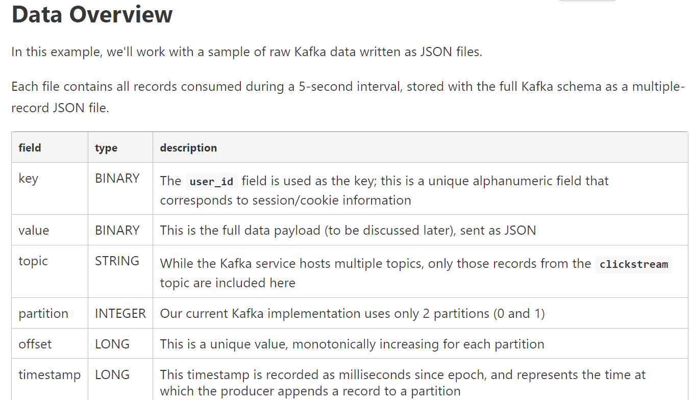

**Details in the JSON Clickstream File**

```sql
SELECT * FROM json.`${DA.paths.kafka_events}/001.json`
```


**Querying a Directory of Files**

```sql
SELECT * FROM json.`${DA.paths.kafka_events}`
```


**Create a View for the Files**

```sql
CREATE OR REPLACE VIEW event_view
AS SELECT * FROM json.`${DA.paths.kafka_events}`
```

**Create Temporary References**

```sql
CREATE OR REPLACE TEMP VIEW events_temp_view
AS SELECT * FROM json.`${DA.paths.kafka_events}`
```

**Common table expressions**

These only exist while running the cell. CTEs only alias the results of the query while the cell is being planned and executed.

```sql
WITH cte_json
AS (SELECT * FROM json.`${DA.paths.kafka_events}`)
SELECT * FROM cte_json
```

```sql
SELECT COUNT(*) FROM cte_json
```

The Temp Viws are scoped only to the current spark session. 

#### Working with Binary Files

Extract the Raw Bytes and Metadata of a File

Some workflows may require working with entire files, such as when dealing with images or unstructured data. Using **`binaryFile`** to query a directory will provide file metadata alongside the binary representation of the file contents.

Specifically, the fields created will indicate the **`path`**, **`modificationTime`**, **`length`**, and **`content`**.

```sql
SELECT * FROM binaryFile.`${DA.paths.kafka_events}`
```

#### Providing Options When Dealing with External Data Sources

**Directly Querying the csv file**

```sql
SELECT * FROM csv.`${DA.paths.sales_csv}`
```

The data is not formatted properly.


**Registering Tables on External Data with Read Options**

While Spark will extract some self-describing data sources efficiently using default settings, many formats will require declaration of schema or other options.

While there are many <a href="https://docs.databricks.com/spark/latest/spark-sql/language-manual/sql-ref-syntax-ddl-create-table-using.html" target="_blank">additional configurations</a> you can set while creating tables against external sources, the syntax below demonstrates the essentials required to extract data from most formats.

<strong><code>
CREATE TABLE table_identifier (col_name1 col_type1, ...)<br/>
USING data_source<br/>
OPTIONS (key1 = val1, key2 = val2, ...)<br/>
LOCATION = path<br/>
</code></strong>

**Creating a table using SQL DDL and Providing Options**

```sql
CREATE TABLE IF NOT EXISTS sales_csv
    (order_id LONG,email STRING,timestamp LONG,total_item_quantity INTEGER,items STRING)
USING CSV
OPTIONS (
    header = 'true'
    delimiter = "|"
)
LOCATION "${paths.dba_sales.csv}"
```

No data will be moved while creating out tables. the data is just called from the files.

**NOTE**: When working with CSVs as a data source, it's important to ensure that column order does not change if additional data files will be added to the source directory. Because the data format does not have strong schema enforcement, Spark will load columns and apply column names and data types in the order specified during table declaration.

**Checking the Description of the Table**

```sql
DESCRIBE EXTENDED sales_csv
```

**IMP!!!** : The table that is created using the external source will be in CSV format and not delta.


#### Limits of Tables with External Data Sources

- When we are using external data sources other than Delta Lake and Data Lakehouse we can't expect the performance to be good always.

- Delta Lake will always guarantee that we get the most recent data from the storage.

**Example**

Here is an example where external file data is being updated in out sales_csv table.

```python
%python
(spark.read
      .option("header", "true")
      .option("delimiter", "|")
      .csv(DA.paths.sales_csv)
      .write.mode("append")
      .format("csv")
      .save(DA.paths.sales_csv, header="true"))
```

The count method on this will not reflect the newly added rows in the dataset.

At the time we previously queried this data source, Spark automatically cached the underlying data in local storage. This ensures that on subsequent queries, Spark will provide the optimal performance by just querying this local cache.

Our external data source is not configured to tell Spark that it should refresh this data. 

We **can** manually refresh the cache of our data by running the **`REFRESH TABLE`** command.

Note that refreshing the table will invalidate out cache so it needs to be rescanned again. 

#### Using JDBC to extract data from SQL Databases

SQL databases are an extremely common data source, and Databricks has a standard JDBC driver for connecting with many flavors of SQL.

```sql
DROP TABLE IF EXISTS users_jdbc

CREATE TABLE users_jdbc
USING jdbc
OPTIONS (
	url = "jdbc:sqllite:paths.ecommerce_db",
	dtable = 'users'
)
```	

**Checking if there are any files in the JDBC**

Table Description


```sql
%python
import python.sql.functions as F

location = spark.sql("DESCRIBE EXTENDED users_jdbc").filter(F.col("col_name") == "Location").first["data_type"]
print(location)

files = db.fs.ls(location)
print(f"Found {len(files)} files"
```

#### How does Spark Interact with External Databases

- Move the entire database to Databricks and then execute logic on the currently active cluster.

- Pushing the query to an external database and only transfer results back to Databricks.

- There will be network transfer latency while moving data back and forth between databricks and DWH.
- Queries will not run well on big tables. 

### Cleaning Data using Spark

Data


**Check the table counts**

```sql
SELECT count(*), count(user_id),count(user_first_timestamp)
FROM users_dirty
```


We can observe that some data is missing.

```sql
SELECT COUNT(*) FROM users_dirty 
WHERE email IS NULL
```
848 records are missing.

Using Python the same might be done 

```python
from pyspark.sql.functions import col
usersDF = spark.read.table("users_dirty")

usersDF.where(col("email").isNull()).count()
```

#### Deduplicating the Rows Based on Specific Columns

The code below uses **`GROUP BY`** to remove duplicate records based on **`user_id`** and **`user_first_touch_timestamp`** column values. (Recall that these fields are both generated when a given user is first encountered, thus forming unique tuples.)

Here, we are using the aggregate function **`max`** as a hack to:

- Keep values from the **`email`** and **`updated`** columns in the result of our group by

- Capture non-null emails when multiple records are present

**Steps to Deduplicate**

1. Fetch All the Records [986 records]

```sql
CREATE OR REPLACE TEMP VIEW deduped_users AS 
SELECT user_id, user_first_touch_timestamp, max(email) AS email, max(updated) AS updated
FROM users_dirty
```

2. Filter records where user_id is not null [983 records]

```sql
CREATE OR REPLACE TEMP VIEW deduped_users AS 
SELECT user_id, user_first_touch_timestamp, email AS email, updated AS updated
FROM users_dirty
WHERE user_id IS NOT NULL;

SELECT * FROM deduped_users
```

3. Group by ```user_id``` and ```user_first_timestamp```

```sql
CREATE OR REPLACE TEMP VIEW deduped_users AS 
SELECT user_id, user_first_touch_timestamp, first(email) AS email, first(updated) AS updated
FROM users_dirty
WHERE user_id IS NOT NULL
GROUP BY user_id, user_first_touch_timestamp;

SELECT * FROM deduped_users
```

We can use max also since we dont care which value is grouped by for email and updated

```sql
CREATE OR REPLACE TEMP VIEW deduplicated AS
SELECT user_id,user_timestamp, max(email) AS email, max(updated) AS updated
FROM users_dirty
WHERE user_id IS NOT NULL
GROUP BY user_id,user_first_touch_timestamp;
``` 

In either case we get 917 records.

**Check for distinct ```user_id``` and ```user_first_touch_timestamp``` rows**

```sql
SELECT COUNT(DISTINCT(user_id, user_first_touch_timestamp))
FROM users_dirty
WHERE user_id IS NOT NULL
```
We get 917 rows.

### Validating Duplicates

Based on our manual review above, we've visually confirmed that our counts are as expected.
 
We can also programmatically perform validation using simple filters and **`WHERE`** clauses.

Validate that the **`user_id`** for each row is unique.

```sql
SELECT max(row_count) <= 1 AS no_of_duplicate_ids FROM(
	SELECT user_id, count(*) AS row_count
	FROM deduped_users
	GROUP BY user_id
)
```
- true -> if no duplicate ids
- false -> if dup ids are there


**Checking if each user has at most one email id**

```sql
SELECT max(row_count) <= 1 no_of_duplicate_email FROM (
	SELECT email,COUNT(user_id) AS user_id_count
	FROM deduped_users
	WHERE email IS NOT NULL 
	GROUP BY email
)
```

In Python the same thing is done via:

```python
display(dedupedDF
    .where(col("email").isNotNull())
    .groupby("email")
    .agg(count("user_id").alias("user_id_count"))
    .select((max("user_id_count") <= 1).alias("at_most_one_id")))
```

#### Working with RegEx

- Correctly scale and cast the ```user_first_touch_timestamp```
- Extract the calendar date and time in a human readable format
- Use ```regexp_extract``` to fetch the email domains. [Docs](https://spark.apache.org/docs/3.1.2/api/python/reference/api/pyspark.sql.functions.regexp_extract.html)

```sql
SELECT *,
	date_format(first_touch,"MM DD,YYYY",first_touch_date),
	date_format(first_touch,"HH:mm:ss",first_touch_time),
	regexp_extract(email,"?<=@.+") AS email_domain
FROM (
	SELECT *,
		CAST(user_first_touch_timestamp/1e6 AS time_stamp) AS first_touch
	FROM deduped_users
)
```

[Why divide by 1e6 to convert timestamp to a date?](https://stackoverflow.com/questions/65124408/pyspark-convert-bigint-to-timestamp-with-microseconds#:~:text=Divide%20your%20timestamp%20by%201e6,units%20of%20second%2C%20not%20microsecond.)

In Python

```python
from pyspark.sql.functions import date_format, regexp_extract

display(dedupedDF
    .withColumn("first_touch", (col("user_first_touch_timestamp") / 1e6).cast("timestamp"))
    .withColumn("first_touch_date", date_format("first_touch", "MMM d, yyyy"))
    .withColumn("first_touch_time", date_format("first_touch", "HH:mm:ss"))
    .withColumn("email_domain", regexp_extract("email", "(?<=@).+", 0))
)
```

### Complex Transformations on JSON data

```python
from pyspark.sql.functions import col

events_trigger_df = (spark
	.table("events_raw"),
	.select(col("key").cast("string"),
			col("value").cast("string"))
)
display(events_trigger_df)
```

The value column in the events data is nested.

#### Working With Nested Data

**Table**


The code cell below queries the converted strings to view an example JSON object without null fields (we'll need this for the next section).

**NOTE:** Spark SQL has built-in functionality to directly interact with nested data stored as JSON strings or struct types.
- Use **`:`** syntax in queries to access subfields in JSON strings
- Use **`.`** syntax in queries to access subfields in struct types

**Task: Check where the event name is finalized**

```sql
SELECT * FROM events_strings WHERE value:event_name = "finalize" ORDER BY key LIMIT 1
```

```python
display(events_string_df
	.where("value:event_name = 'finalize'")
	.orderBy("key")
	.limit(1)
)
```

**Extracting the schema of the JSON**

```sql
SELECT schema_of_json('{"device":"Linux","ecommerce":{"purchase_revenue_in_usd":1075.5,"total_item_quantity":1,"unique_items":1},"event_name":"finalize","event_previous_timestamp":1593879231210816,"event_timestamp":1593879335779563,"geo":{"city":"Houston","state":"TX"},"items":[{"coupon":"NEWBED10","item_id":"M_STAN_K","item_name":"Standard King Mattress","item_revenue_in_usd":1075.5,"price_in_usd":1195.0,"quantity":1}],"traffic_source":"email","user_first_touch_timestamp":1593454417513109,"user_id":"UA000000106116176"}') AS schema
```


**Task: Convert the JSON data to table/view**

```sql
CREATE OR REPLACE TEMP VIEW parsed_events AS SELECT json.* FROM
(
	SELECT from_json(value, '<the schemaabove>') AS json
	FROM event_strings
) 
```
Check 3:19 in  for the result...

```sql
SELECT * FROM parsed_events;
```

Some more code examples for ```from_json```

```python
#Convert JSON string column to Map type
from pyspark.sql.types import MapType,StringType
from pyspark.sql.functions import from_json
df2=df.withColumn("value",from_json(df.value,MapType(StringType(),StringType())))
df2.printSchema()
df2.show(truncate=False)
```
Docs for [Map Type](https://spark.apache.org/docs/3.1.1/api/python/reference/api/pyspark.sql.types.MapType.html)

Docs for [from_json](https://spark.apache.org/docs/3.1.1/api/python/reference/api/pyspark.sql.functions.from_json.html)

#### Array Manipulation Functions

- **`explode()`** separates the elements of an array into multiple rows; this creates a new row for each element.

- **`size()`** provides a count for the number of elements in an array for each row.

The code below explodes the **`items`** field (an array of structs) into multiple rows and shows events containing arrays with 3 or more items.

```sql
CREATE OR REPLACE TEMP VIEW exploded_events AS
SELECT *, explode(items) AS item
FROM parsed_events
```

```sql
SELECT * FROM exploded_events WHERE SIZE(items) > 2
```
Each element of the items column which is in json format is now in a separate row.


In Python,

```python
from pyspark.sql.functions import explode, size

exploded_eventsDF = (parsed_eventsDF
    .withColumn("item", explode("items"))
)

display(exploded_eventsDF.where(size("items") > 2))
```

#### Complex Array Manipulation Functions

```collect_set``` collects unique values for a field including those within arrays also.

```flatten()``` combines various values from multiple arrays in a single array.

```array_distinct()``` removes duplicate values from the array.

**Task: Pull out cart history details from the events table**

Step 1 : Collect all event names from the table for each user id

```sql
SELECT user_id, collect_set(event_name) AS event_history
FROM exploded_events
GROUP BY user_id
```


Step 2 : Explode event_hiistory

```sql
SELECT user_id, explode(collect_set(event_name)) AS event_history
FROM exploded_events
GROUP BY user_id
```


Step 3 : Collect all item ids by fetching them from the items json column

```sql
SELECT user_id,
  collect_set(event_name) AS event_history,
  collect_set(items.item_id) AS cart_history
FROM exploded_events
GROUP BY user_id
```
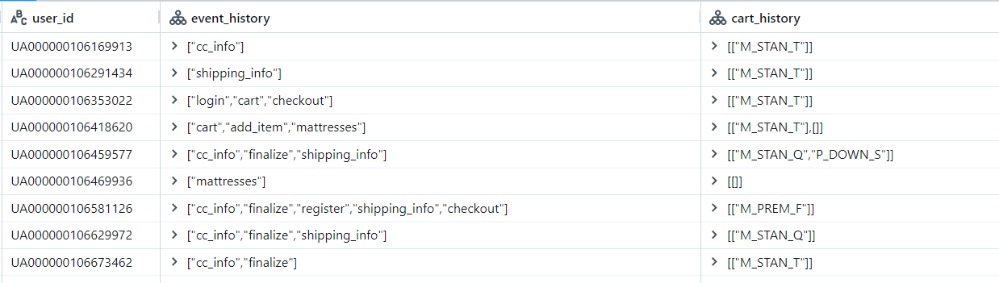

Step 4 : Flatten the above cart_history results

```sql
SELECT user_id,
  collect_set(event_name) AS event_history,
  flatten(collect_set(items.item_id)) AS cart_history
FROM exploded_events
GROUP BY user_id
```


```SQL
SELECT user_id,
	   collect_set(event_name) AS event_history,
	   array_distince(flatten(collect_set(items.item_id))) AS cart_history
FROM exploded_events
GROUP BY user_id
```

### SQL UDF Functions

User Defined Functions (UDFs) in Spark SQL allow you to register custom SQL logic as functions in a database, making these methods reusable anywhere SQL can be run on Databricks. These functions are registered natively in SQL and maintain all of the optimizations of Spark when applying custom logic to large datasets.

At minimum, creating a SQL UDF requires a function name, optional parameters, the type to be returned, and some custom logic.

Below, a simple function named **`sale_announcement`** takes an **`item_name`** and **`item_price`** as parameters. It returns a string that announces a sale for an item at 80% of its original price.

```sql
CREATE OR REPLACE FUNCTION sales_announcement(item_name STRING,item_price INT)
RETURN STRING
RETURN concat("The ",item_name,"is on sale for $",round(item_price*0.8,0))
```

This function is applied to all the columns at once.

Here is a Jupyter [notebook](https://www.databricks.com/wp-content/uploads/notebooks/sql-user-defined-functions.html) with all the common SQL UDF Functions.

- Persist between execution environments (which can include notebooks, DBSQL queries, and jobs).
- Exist as objects in the metastore and are governed by the same Table ACLs as databases, tables, or views.
- To **create** a SQL UDF, you need **`USE CATALOG`** on the catalog, and **`USE SCHEMA`** and **`CREATE FUNCTION`** on the schema.
- To **use** a SQL UDF, you need **`USE CATALOG`** on the catalog, **`USE SCHEMA`** on the schema, and **`EXECUTE`** on the function.

We can use **`DESCRIBE FUNCTION`** to see where a function was registered and basic information about expected inputs and what is returned (and even more information with **`DESCRIBE FUNCTION EXTENDED`**).

#### Case When Statements in SQL UDF

```sql
CREATE OR REPLACE FUNCTION item_preference(name STRING, price INT)
RETURNS STRING
RETURN CASE 
  WHEN name = "Standard Queen Mattress" THEN "This is my default mattress"
  WHEN name = "Premium Queen Mattress" THEN "This is my favorite mattress"
  WHEN price > 100 THEN concat("I'd wait until the ", name, " is on sale for $", round(price * 0.8, 0))
  ELSE concat("I don't need a ", name)
END;

SELECT *, item_preference(name, price) FROM item_lookup
```

### Python UDFs

### User-Defined Function (UDF)
A custom column transformation function

- Can’t be optimized by Catalyst Optimizer

- Function is serialized and sent to executors
- Row data is deserialized from Spark's native binary format to pass to the UDF, and the results are serialized back into Spark's native format

- For Python UDFs, additional interprocess communication overhead between the executor and a Python interpreter running on each worker node

**Define a Function**

```python
def first_letter_function(email):
	return email[0]
```

**Create User Defined Function**

- First serialize the function and then send it to the executors to be applied to the DataFrame records.

```python
first_letter_udf = udf(first_letter_function)
```

**Apply the UDF on the email column**

```python
from pyspark.sql.functions import col
display(sales_df.select(first_letter_udf(col("email"))))
```
**Register UDF to be used in SQL**

```python
sales_df.createOrReplaceTempView("sales")
first_letter_udf = spark.udf.register("sql_udf",fist_letter_function)
```

**Use it in SQL**

```sql
SELECT sql_udf(email) AS first_letter FROM sales
```

**Using Decorator Syntax**

Alternatively, you can define and register a UDF using <a href="https://realpython.com/primer-on-python-decorators/" target="_blank">Python decorator syntax</a>. The **`@udf`** decorator parameter is the Column datatype the function returns.

```python
@udf("string")
def first_letter_udf(str):
return email[0]
```

#### Normal Python UDFs vs Pandas UDFs

Pandas UDFs are available in Python to improve the efficiency of UDFs. Pandas UDFs utilize Apache Arrow to speed up computation.

* <a href="https://databricks.com/blog/2017/10/30/introducing-vectorized-udfs-for-pyspark.html" target="_blank">Blog post</a>
* <a href="https://spark.apache.org/docs/latest/api/python/user_guide/sql/arrow_pandas.html?highlight=arrow" target="_blank">Documentation</a>


The user-defined functions are executed using: 
* <a href="https://arrow.apache.org/" target="_blank">Apache Arrow</a>, an in-memory columnar data format that is used in Spark to efficiently transfer data between JVM and Python processes with near-zero (de)serialization cost
* Pandas inside the function, to work with Pandas instances and APIs

Normal Python UDF

```python
from pyspark.sql.functions import udf

# Use udf to define a row-at-a-time udf
@udf('double')
# Input/output are both a single double value
def plus_one(v):
      return v + 1

df.withColumn('v2', plus_one(df.v))
```
Pandas UDFs : Row at a time

```python
from pyspark.sql.functions import pandas_udf, PandasUDFType
@pandas_udf('double', PandasUDFType.SCALAR)
def pandas_plus_one(v):
    return v + 1
df.withColumn('v2', pandas_plus_one(df.v))
```

In the row-at-a-time version, the user-defined function takes a double "v" and returns the result of "v + 1" as a double. In the Pandas version, the user-defined function takes a  `pandas.Series`  "v" and returns the result of "v + 1" as a  `pandas.Series`. Because "v + 1" is vectorized on  `pandas.Series`, the Pandas version is much faster than the row-at-a-time version.

**Pandas Vectorized UDF**

```sql
import pandas as pd
from pyspark.sql.functions import pandas_udf

# We have a string input/output
@pandas_udf("string")
def vectorized_udf(email: pd.Series) -> pd.Series:
    return email.str[0]
```

**Registering UDF for usage in SQL Namespace**

```sql
spark.udf.register("sql_vectorized_udf", vectorized_udf)
```

**Using UDF in SQL Statement**

```sql
SELECT sql_vectorized_udf(email) AS firstLetter FROM sales
```

### Managing Data with Delta Lake 

Delta Lake enables building a data lakehouse on top of the existing cloud storage. Its not a database service or data warehouse.
It's built for scalable metadata handling.
Delta Lake brings ACID transaction guarantees to object storage.


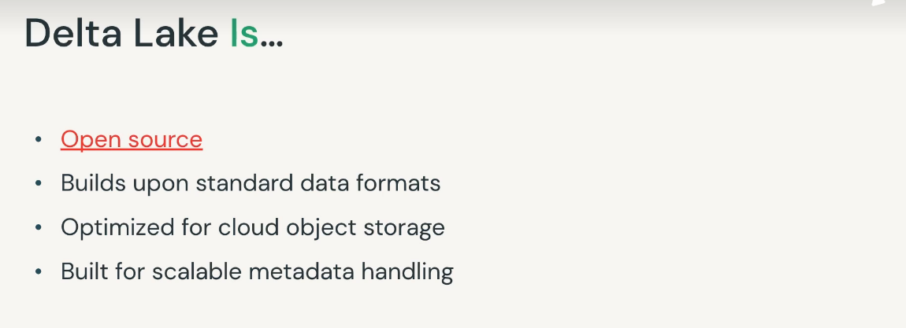

What is ACID?


#### Problems Solved by ACID

- Hard to append data
- Modification of existing data is difficult
- Jobs fail mid way
- Costly to keep historical data versions.

Its the default format to create tables in Databricks

### Schemas and Tables

Creating Schema in the default directory ```dbfs:/user/hive/warehouse```

```sql
CREATE SCHEMA IF NOT EXISTS ${da.schema_name}_default_location;
```

Creating Schema in a custom location 

```sql
CREATE SCHEMA IF NOT EXISTS ${da.schema_name}_custom_location LOCATION '${da.paths.working_dir}/${da.schema_name}_custom_location.db'
```

#### Creating Managed Tables

We dont need to mention the location of the tables.

```sql
USE ${da.schema_name}_default_location;

CREATE OR REPLACE TABLE managed_table (width INT, length INT, height INT);
INSERT INTO managed_table 
VALUES (3, 2, 1);
SELECT * FROM managed_table;
```

To find the location of the managed table we can use the ```DESCRIBE DETAIL managed_table``` command. Output is ```dbfs:/user/hive/warehouse/vedanthvbaliga_gnc9_da_delp_default_location.db/managed_table```

The default format of the table is delta.

If we drop the managed table, only the schema will be there, the table and data will be deleted.

Checking if the schema still exists

```python

schema_default_location = spark.sql(f"DESCRIBE SCHEMA {DA.schema_name}_default_location").collect()[3].database_description_value
print(schema_default_location)
dbutils.fs.ls(schema_default_location)

```

Output : dbfs:/user/hive/warehouse/vedanthvbaliga_gnc9_da_delp_default_location.db

#### ⚠️ Creating External Tables

```sql
USE ${da.schema_name}_default_location;

CREATE OR REPLACE TEMPORARY VIEW temp_delays 
USING CSV OPTIONS (
	path = "${da.paths.datasets}/flights/delay_departures.csv",
	header = "true",
	mode = "FAILFAST"
);

CREATE OR REPLACE EXTERNAL TABLE external_table LOCATION '${da.path.working_dir}/external_table' AS 
	SELECT * FROM temp_delays;

SELECT * FROM external_table
```


Dropping the external table deletes the table definition but the data is still there.

```python
tbl_path = f"{DA.paths.working_dir}/external_table"
files = dbutils.fs.ls(tbl_path)
display(files)
```

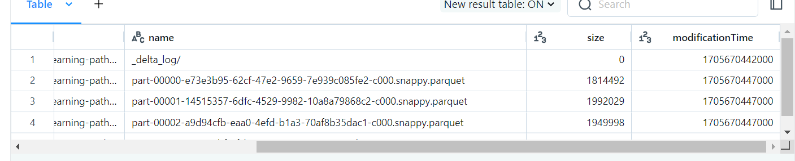

To drop external table schema use :

```sql
DROP SCHEMA {da.schema_name}_custom_location CASCADE;
```

If the schema is managed by the workspace-level Hive metastore, dropping a schema using CASCADE recursively deletes all files in the specified location, regardless of the table type (managed or external).

### Setting Up Delta Tables

After extracting data from external data sources, load data into the Lakehouse to ensure that all of the benefits of the Databricks platform can be fully leveraged.

While different organizations may have varying policies for how data is initially loaded into Databricks, we typically recommend that early tables represent a mostly raw version of the data, and that validation and enrichment occur in later stages. 

This pattern ensures that even if data doesn't match expectations with regards to data types or column names, no data will be dropped, meaning that programmatic or manual intervention can still salvage data in a partially corrupted or invalid state.

#### CTAS Statements

Used to populate the delta tables using data from an input query

```sql
CREATE OR REPLACE TABLE sales AS
SELECT * FROM parquet.`${DA.paths.datasets}/ecommerce/raw/sales-historical`;

DESCRIBE EXTENDED sales;
```

**Note**

CTAS statements automatically infer schema information from query results and do **not** support manual schema declaration. 

This means that CTAS statements are useful for external data ingestion from sources with well-defined schema, such as Parquet files and tables.

CTAS statements also do not support specifying additional file options.

#### Ingesting csv with CTAS

```sql
CREATE OR REPLACE TABLE sales_unparsed AS
SELECT * FROM csv.`${da.paths.datasets}/ecommerce/raw/sales-csv`;

SELECT * FROM sales_unparsed;
```

Output is as follows:
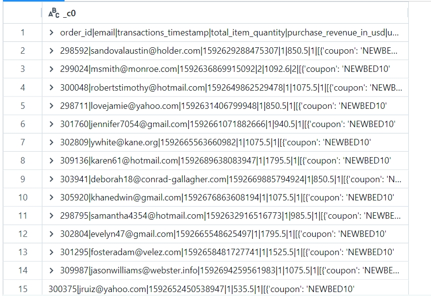

To fix this we use a reference to the files that allows us to specify the options.

We will specify options to a temp view and then use this as a source for a CTAS statement to register the Delta Table

```sql
CREATE OR REPLACE TEMP VIEW sales_tmp_vw
  (order_id LONG, email STRING, transactions_timestamp LONG, total_item_quantity INTEGER, purchase_revenue_in_usd DOUBLE, unique_items INTEGER, items STRING)
USING CSV
OPTIONS (
  path = "${da.paths.datasets}/ecommerce/raw/sales-csv",
  header = "true",
  delimiter = "|"
);

CREATE TABLE sales_delta AS
  SELECT * FROM sales_tmp_vw;
  
SELECT * FROM sales_delta
```

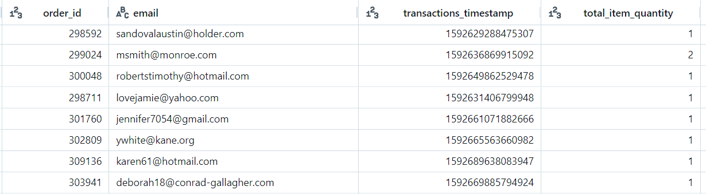

#### Filtering and Renaming columns from existing tables

```sql
CREATE OR REPLACE TABLE purchases AS
SELECT order_id AS id, transaction_timestamp, purchase_revenue_in_usd AS price
FROM sales;

SELECT * FROM purchases
```

### Declare Schema with Generated Columns


As noted previously, CTAS statements do not support schema declaration. We note above that the timestamp column appears to be some variant of a Unix timestamp, which may not be the most useful for our analysts to derive insights. This is a situation where generated columns would be beneficial.

Generated columns are a special type of column whose values are automatically generated based on a user-specified function over other columns in the Delta table.

```sql
CREATE OR REPLACE TABLE purchase_dates (
  id STRING, 
  transaction_timestamp STRING, 
  price STRING,
  date DATE GENERATED ALWAYS AS (
    cast(cast(transaction_timestamp/1e6 AS TIMESTAMP) AS DATE))
    COMMENT "generated based on `transactions_timestamp` column")
```

#### Mergin Data

Check how many records are in purchase_dates?

```sql
SELECT * FROM purchase_dates;
```
There are no records in the table.

Check how many records are in purchases?

```sql
SELECT COUNT(*) FROM purchases;
```
There are 10,510 records.

```sql
SET spark.databricks.delta.schema.autoMerge.enabled=true; 

MERGE INTO purchase_dates a
USING purchases b
ON a.id = b.id
WHEN NOT MATCHED THEN
  INSERT *
```

The SET command ensures that autoMerge is enabled we dont need to ```REFRESH``` after merging into the purchase_dates table.

It's important to note that if a field that would otherwise be generated is included in an insert to a table, this insert will fail if the value provided does not exactly match the value that would be derived by the logic used to define the generated column.

### Adding Constraints

**CHECK** constraint

```sql
ALTER TABLE purchase_dates ADD CONSTRAINT valid_date CHECK (date > '2020-01-01');
```
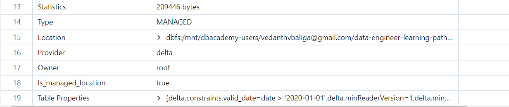

### Additional Options and Metadata

Our **`SELECT`** clause leverages two built-in Spark SQL commands useful for file ingestion:
* **`current_timestamp()`** records the timestamp when the logic is executed
* **`input_file_name()`** records the source data file for each record in the table

We also include logic to create a new date column derived from timestamp data in the source.

The **`CREATE TABLE`** clause contains several options:
* A **`COMMENT`** is added to allow for easier discovery of table contents
* A **`LOCATION`** is specified, which will result in an external (rather than managed) table
* The table is **`PARTITIONED BY`** a date column; this means that the data from each data will exist within its own directory in the target storage location.

```sql
CREATE OR REPLACE TABLE users_pii
COMMENT "Contains PII"
LOCATION "${da.paths.working_dir}/tmp/users_pii"
PARTITIONED BY (first_touch_date)
AS
  SELECT *, 
    cast(cast(user_first_touch_timestamp/1e6 AS TIMESTAMP) AS DATE) first_touch_date, 
    current_timestamp() updated,
    input_file_name() source_file
  FROM parquet.`${da.paths.datasets}/ecommerce/raw/users-historical/`;
  
SELECT * FROM users_pii;
```


**Listing all the files**

```python
files = dbutils.fs.ls(f"{DA.paths.working_dir}/tmp/users_pii")
display(files)
```


### Cloning Delta Lake Tables
Delta Lake has two options for efficiently copying Delta Lake tables.

**`DEEP CLONE`** fully copies data and metadata from a source table to a target. This copy occurs incrementally, so executing this command again can sync changes from the source to the target location.

```sql
CREATE OR REPLACE TABLE purchases_clone
DEEP CLONE purchases
```

If you wish to create a copy of a table quickly to test out applying changes without the risk of modifying the current table, **`SHALLOW CLONE`** can be a good option. Shallow clones just copy the Delta transaction logs, meaning that the data doesn't move.

```sql
CREATE OR REPLACE TABLE purchases_shallow_clone
SHALLOW CLONE purchases
```

### Loading Data Into Tables

#### Complete Overwrites

We can use overwrites to atomically replace all of the data in a table. There are multiple benefits to overwriting tables instead of deleting and recreating tables:

- Overwriting a table is much faster because it doesn’t need to list the directory recursively or delete any files.

- The old version of the table still exists; can easily retrieve the old data using Time Travel.

- It’s an atomic operation. Concurrent queries can still read the table while you are deleting the table.

- Due to ACID transaction guarantees, if overwriting the table fails, the table will be in its previous state.

Spark SQL provides two easy methods to accomplish complete overwrites.

```sql
CREATE OR REPLACE TABLE events AS
SELECT * FROM parquet.`${da.paths.datasets}/ecommerce/raw/events-historical`
```

**Reviewing the Table History**

```sql
DESCRIBE HISTORY events
```


#### Insert Overwrite

**`INSERT OVERWRITE`** provides a nearly identical outcome as above: data in the target table will be replaced by data from the query. 

- Can only overwrite an existing table, not create a new one like our CRAS statement.

- Can overwrite only with new records that match the current table schema -- and thus can be a "safer" technique for overwriting an existing table without disrupting downstream consumers.

- Can overwrite individual partitions.

Metrics that are defined during Insert Overwrite on running ```DESCRIBE HISTORY SALES``` is different.

Whereas a CRAS statement will allow us to completely redefine the contents of our target table, **`INSERT OVERWRITE`** will fail if we try to change our schema (unless we provide optional settings). 

Uncomment and run the cell below to generate an expected error message.

This gives an error

```sql
INSERT OVERWRITE sales
SELECT *, current_timestamp() FROM parquet.`${da.paths.datasets}/ecommerce/raw/sales-historical`
```

#### Appending Data

We can use **`INSERT INTO`** to atomically append new rows to an existing Delta table. This allows for incremental updates to existing tables, which is much more efficient than overwriting each time.

Append new sale records to the **`sales`** table using **`INSERT INTO`**

Note that **`INSERT INTO`** does not have any built-in guarantees to prevent inserting the same records multiple times. Re-executing the above cell would write the same records to the target table, resulting in duplicate records.

#### Merging Updates

<strong><code>
MERGE INTO target a<br/>
USING source b<br/>
ON {merge_condition}<br/>
WHEN MATCHED THEN {matched_action}<br/>
WHEN NOT MATCHED THEN {not_matched_action}<br/>
</code></strong>

We will use the **`MERGE`** operation to update historic users data with updated emails and new users.

Step 1 : Check ```users_30m``` parquet

```sql

SELECT * FROM PARQUET.`${da.paths.datasets}/ecommerce/raw/users-30m

```


Step 2 : Create view ```users_update``` and add data from ```users_30m``` dataset

```sql
CREATE OR REPLACE TEMP VIEW users_update AS 
SELECT *, current_timestamp() AS updated 
FROM parquet.`${da.paths.datasets}/ecommerce/raw/users-30m`
```

Step 3 : Check ```users``` and ```users_updated``` dataset

```sql
SELECT * FROM users;
```
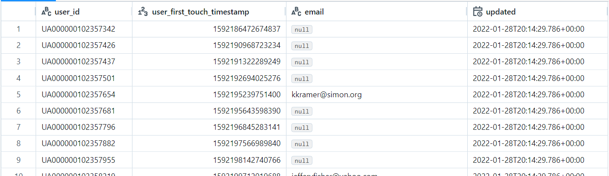

```sql
SELECT * FROM users_update;
```
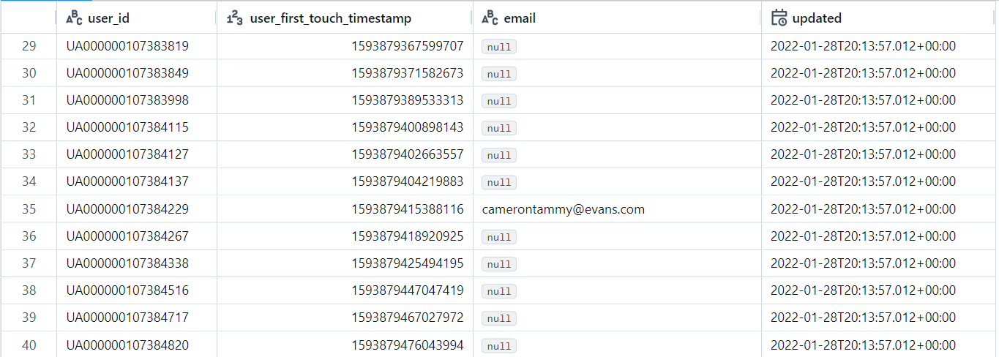

Step 4 : If the email in ```users``` is null and in ```users_update``` is not null then set email in users to ```users.email``` and ```users.updated``` to ```users_updated.updated``` , else insert whatever record is in users_update.

```sql
MERGE INTO users a
USING users_update b
ON a.user_id = b.user_id
WHEN MATCHED AND a.email IS NULL AND b.email IS NOT NULL THEN
  UPDATE SET email = b.email, updated = b.updated
WHEN NOT MATCHED THEN INSERT *
```


#### Insert-Only Merge For Data Deduplication ⚠️

A common ETL use case is to collect logs or other every-appending datasets into a Delta table through a series of append operations. 

Many source systems can generate duplicate records. With merge, you can avoid inserting the duplicate records by performing an insert-only merge.

This optimized command uses the same **`MERGE`** syntax but only provided a **`WHEN NOT MATCHED`** clause.

Below, we use this to confirm that records with the same **`user_id`** and **`event_timestamp`** aren't already in the **`events`** table.

```sql
MERGE INTO events a
USING events_update b
ON a.user_id = b.user_id AND a.event_timestamp = b.event_timestamp
WHEN NOT MATCHED AND b.traffic_source = 'email' THEN 
  INSERT *
```

**Logs Example**

```sql
MERGE INTO logs
USING newDedupedLogs
ON logs.uniqueId = newDedupedLogs.uniqueId
WHEN NOT MATCHED
  THEN INSERT *
```

The dataset containing the new logs needs to be deduplicated within itself. By the SQL semantics of merge, it matches and deduplicates the new data with the existing data in the table, but if there is duplicate data within the new dataset, it is inserted. Hence, deduplicate the new data before merging into the table.

If you know that you may get duplicate records only for a few days, you can optimize your query further by partitioning the table by date, and then specifying the date range of the target table.

```sql
MERGE INTO logs
USING newDedupedLogs
ON logs.uniqueId = newDedupedLogs.uniqueId AND logs.date > current_date() - INTERVAL 7 DAYS
WHEN NOT MATCHED AND newDedupedLogs.date > current_date() - INTERVAL 7 DAYS
  THEN INSERT *
```

### Incremental Loading

**`COPY INTO`** provides SQL engineers an idempotent option to incrementally ingest data from external systems.

Note that this operation does have some expectations:
- Data schema should be consistent
- Duplicate records should try to be excluded or handled downstream

This operation is potentially much cheaper than full table scans for data that grows predictably.

```sql
COPY INTO sales
FROM "${da.paths.datasets}/ecommerce/raw/sales-30m"
FILEFORMAT = PARQUET
```

### Versioning, Optimizing and Vacuuming

Create an example table with operations

```sql
CREATE TABLE students
  (id INT, name STRING, value DOUBLE);
  
INSERT INTO students VALUES (1, "Yve", 1.0);
INSERT INTO students VALUES (2, "Omar", 2.5);
INSERT INTO students VALUES (3, "Elia", 3.3);

INSERT INTO students
VALUES 
  (4, "Ted", 4.7),
  (5, "Tiffany", 5.5),
  (6, "Vini", 6.3);
  
UPDATE students 
SET value = value + 1
WHERE name LIKE "T%";

DELETE FROM students 
WHERE value > 6;

CREATE OR REPLACE TEMP VIEW updates(id, name, value, type) AS VALUES
  (2, "Omar", 15.2, "update"),
  (3, "", null, "delete"),
  (7, "Blue", 7.7, "insert"),
  (11, "Diya", 8.8, "update");
  
MERGE INTO students b
USING updates u
ON b.id=u.id
WHEN MATCHED AND u.type = "update"
  THEN UPDATE SET *
WHEN MATCHED AND u.type = "delete"
  THEN DELETE
WHEN NOT MATCHED AND u.type = "insert"
  THEN INSERT *;
```

This table gets stored in ```dbfs:/user/hive/warehouse/students```

The table is not a relational entity but a set of files stored in the cloud object storage.

```python
display(dbutils.fs.ls(f"{DA.paths.user_db}/students"))
```
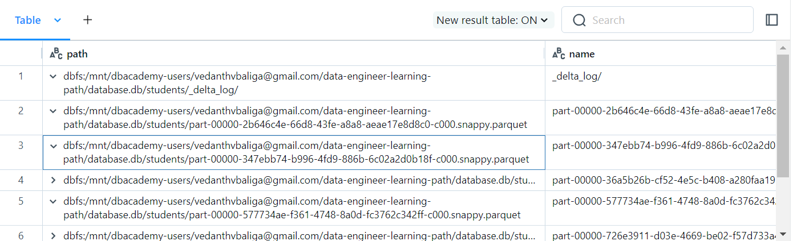

There is a directory called ```_delta_log``` where transactions on the Delta Lake Tables are stored

```python
display(dbutils.fs.ls(f"{DA.paths.user_db}/students/_delta_log"))
```
There are a total of 8 transaction logs in json format
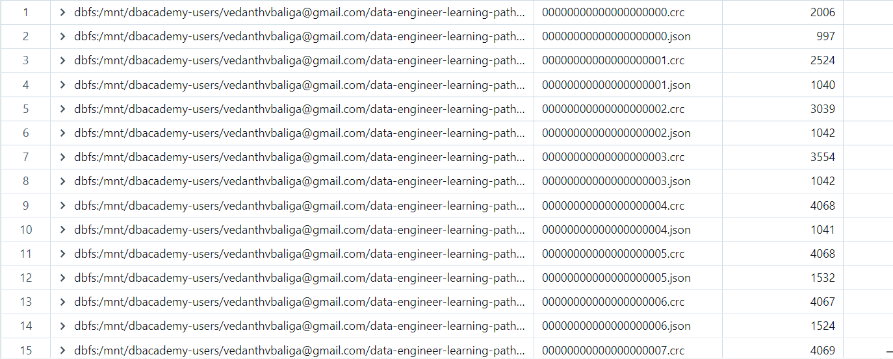

For large datasets we would have more parquet files. We can see that there are 4 files currently in students.


So what are the other files present for?

Rather than overwriting or immediately deleting files containing changed data, Delta Lake uses the transaction log to indicate whether or not files are valid in a current version of the table.

Here, we'll look at the transaction log corresponding the **`MERGE`** statement above, where records were inserted, updated, and deleted.

```python
display(spark.sql(f"SELECT * FROM json.`{DA.paths.user_db}/students/_delta_log/00000000000000000007.json`"))
```


The **`add`** column contains a list of all the new files written to our table; the **`remove`** column indicates those files that no longer should be included in our table.

When we query a Delta Lake table, the query engine uses the transaction logs to resolve all the files that are valid in the current version, and ignores all other data files.

### Optimizing and Indexing

When we use large datasets, we may run into problems of a large number of files.

Here since we did many operations that only changed/modified a small number of rows, there were more number of files.

Files will be combined toward an optimal size (scaled based on the size of the table) by using the **`OPTIMIZE`** command.

**`OPTIMIZE`** will replace existing data files by combining records and rewriting the results.

When executing **`OPTIMIZE`**, users can optionally specify one or several fields for **`ZORDER`** indexing. While the specific math of Z-order is unimportant, it speeds up data retrieval when filtering on provided fields by colocating data with similar values within data files.

```sql
OPTIMIZE students
ZORDER BY id
```

By looking at the output we can motice that 1 file was added and 4 were removed. 


As expected, **`OPTIMIZE`** created another version of our table, meaning that version 8 is our most current version.

Remember all of those extra data files that had been marked as removed in our transaction log? These provide us with the ability to query previous versions of our table.

These time travel queries can be performed by specifying either the integer version or a timestamp.

**NOTE**: In most cases, you'll use a timestamp to recreate data at a time of interest. For our demo we'll use version, as this is deterministic (whereas you may be running this demo at any time in the future).

**Going back to a previous state**

```sql
SELECT * 
FROM students VERSION AS OF 3
```

What's important to note about time travel is that we're not recreating a previous state of the table by undoing transactions against our current version; rather, we're just querying all those data files that were indicated as valid as of the specified version.

### Rollback to Previous Version

Suppose we are typing a query to manually delete some records from the table and by mistake delete the entire table. We can rollback to the previous version by rolling back the commit.

```sql
RESTORE TABLE students TO VERSION AS OF 8 
```

### Cleaning Up Stale Files and Vacuum

Databricks will automatically clean up stale log files (> 30 days by default) in Delta Lake tables.
Each time a checkpoint is written, Databricks automatically cleans up log entries older than this retention interval.

While Delta Lake versioning and time travel are great for querying recent versions and rolling back queries, keeping the data files for all versions of large production tables around indefinitely is very expensive (and can lead to compliance issues if PII is present).

If you wish to manually purge old data files, this can be performed with the **`VACUUM`** operation.

Uncomment the following cell and execute it with a retention of **`0 HOURS`** to keep only the current version:

By default, **`VACUUM`** will prevent you from deleting files less than 7 days old, just to ensure that no long-running operations are still referencing any of the files to be deleted. If you run **`VACUUM`** on a Delta table, you lose the ability time travel back to a version older than the specified data retention period.  In our demos, you may see Databricks executing code that specifies a retention of **`0 HOURS`**. This is simply to demonstrate the feature and is not typically done in production.  

In the following cell, we:
1. Turn off a check to prevent premature deletion of data files
2. Make sure that logging of **`VACUUM`** commands is enabled
3. Use the **`DRY RUN`** version of vacuum to print out all records to be deleted

To disable the retention duration of 0 safety mechanism just enable these parameters to false and true.

```sql
SET spark.databricks.delta.retentionDurationCheck.enabled = false;
SET spark.databricks.delta.vacuum.logging.enabled = true;
```

```sql
VACUUM students RETAIN 0 HOURS DRY RUN
```

By vacuuming the files, we are permanantly deleting the versions of the files and we cannot get it back.

After deletion, only the delta file with log of transactions remains.

### Data Pipelines with Delta Live Tables

#### The Medallion Architecture
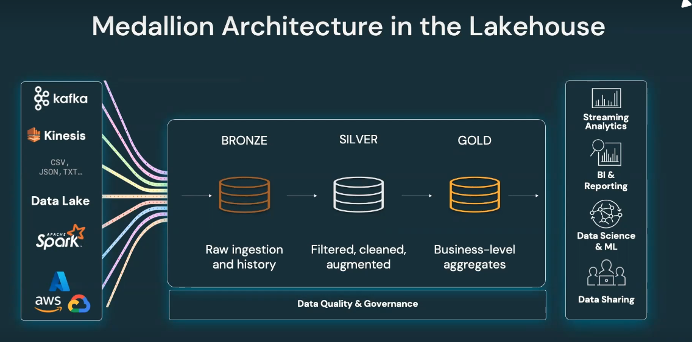

##### The Bronze Layer


##### The Silver Layer


##### The Gold Layer
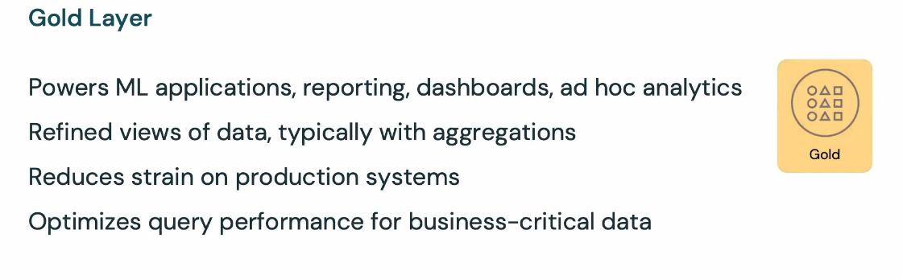

#### The Multi Hop Architecture
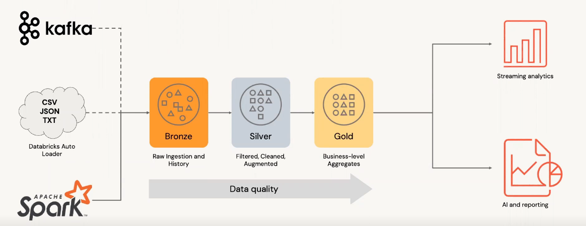

#### How DLT Solves Problems

Usually the bronze, silver and gold layers will not be in a linear dependency format.


#### What exactly is a live table?


**Streaming Live Tables**


#### Steps to Create a DLT Pipeline


#### Development Vs Production pipelines


We use job clusters in prod pipelines.

Hence if the pipeline in the prod needs to be run multiple times, then the cluster object has to be created multiple times.

But in the case of dev pipeines, we can keep the clusters running for faster debugging.

#### Dependencies in the Pipeline


All the tables in the pipeline have the same LIVE schema, so we need to mention the keyword ```LIVE.events```

This feature allows us to migrate the pipelines between databases in the environment.

When we are moving from dev to prod, then just change the schema from dev to prod and we can migrate very quickly.

#### Data Quality with Expectations
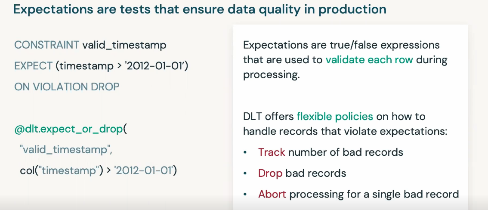


#### Why Event Logs are Important


#### Spark Structured Streaming [Ingest From Cloud]
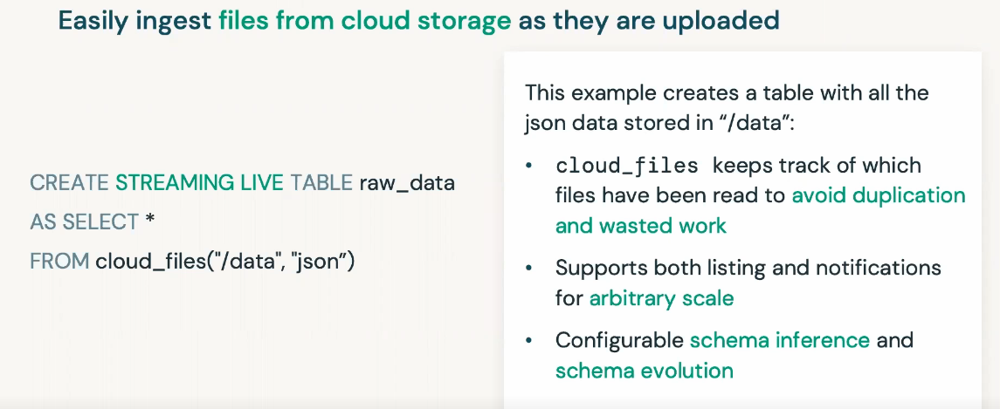

#### Streaming from an existing table

Usally the table that we are streaming from has data coming in from Kafka/Kinesis.

#### Parameters in DLT
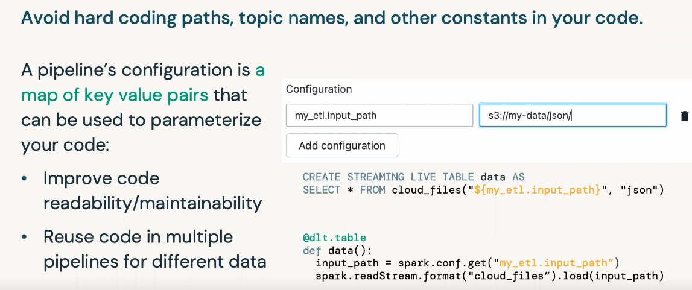

#### Change Data Capture

Here the source is ```city_updates``` and it must be a stream.

We need unique key like id that can idenitify the data that can be included in teh updates
A sequence no is required to apply changes in the current order.

**Example**

Initially cities table is empty, here we can see that berkley was misspelled in the first entry of city_updates table, so when we fix it by keeping the same id and different timestamp its updated in the cities table also.

#### What does DLT automate?
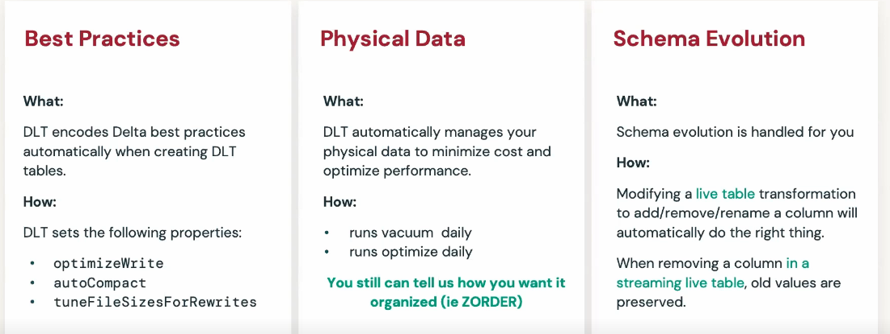

### Creating Pipelines

1. Setup the parameters like in the [Delta Live Tables UI Notebook]().

2. Then click '+' -> New DLT Pipeline.

3. Create the pipeline using the steps mentioned [here](https://adb-6109119110541327.7.azuredatabricks.net/?o=6109119110541327#notebook/2951115793282683/command/2951115793282684)

4. This is the final pipeline config [link](https://adb-6109119110541327.7.azuredatabricks.net/?o=6109119110541327#joblist/pipelines/create)

5. This is the final dashboard


In prod mode we delete the cluster resources after the pipeline completes.

I cannot run the pipelines due to restrictions in student account.
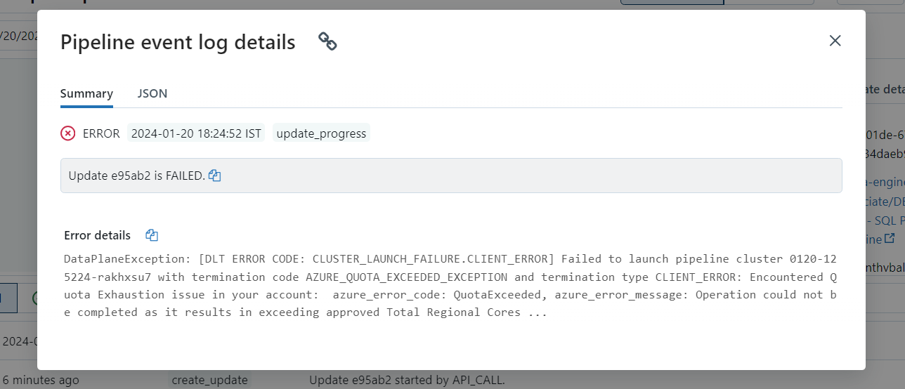

Here is the snapshot of the running pipeline from the course.


### Fundamental DLT SQL Syntax

This notebook demonstrates using Delta Live Tables (DLT) to process raw data from JSON files landing in cloud object storage through a series of tables to drive analytic workloads in the lakehouse. Here we demonstrate a medallion architecture, where data is incrementally transformed and enriched as it flows through a pipeline. This notebook focuses on the SQL syntax of DLT rather than this architecture, but a brief overview of the design:

* The bronze table contains raw records loaded from JSON enriched with data describing how records were ingested
* The silver table validates and enriches the fields of interest
* The gold table contains aggregate data to drive business insights and dashboarding

DLT syntax is not intended for interactive execution in a notebook. This notebook will need to be scheduled as part of a DLT pipeline for proper execution. 

If you do execute a DLT notebook cell interactively, you should see a message that your statement is syntactically valid. Note that while some syntax checks are performed before returning this message, it is not a guarantee that your query will perform as desired. We'll discuss developing and troubleshooting DLT code later in the course.

Delta Live Tables adapts standard SQL queries to combine DDL (data definition language) and DML (data manipulation language) into a unified declarative syntax.

#### Table as Query Results

There are two distinct types of persistent tables that can be created with DLT:
* **Live tables** are materialized views for the lakehouse; they will return the current results of any query with each refresh
* **Streaming live tables** are designed for incremental, near-real time data processing

Note that both of these objects are persisted as tables stored with the Delta Lake protocol (providing ACID transactions, versioning, and many other benefits). We'll talk more about the differences between live tables and streaming live tables later in the notebook.

#### Auto Loader

Databricks has developed the [Auto Loader](https://docs.databricks.com/ingestion/auto-loader/index.html) functionality to provide optimized execution for incrementally loading data from cloud object storage into Delta Lake. Using Auto Loader with DLT is simple: just configure a source data directory, provide a few configuration settings, and write a query against your source data. 

Auto Loader will automatically detect new data files as they land in the source cloud object storage location, incrementally processing new records without the need to perform expensive scans and recomputing results for infinitely growing datasets.

The **`cloud_files()`** method enables Auto Loader to be used natively with SQL. This method takes the following positional parameters:

* The source location, which should be cloud-based object storage
* The source data format, which is JSON in this case
* An arbitrarily sized comma-separated list of optional reader options. In this case, we set **`cloudFiles.inferColumnTypes`** to **`true`**

In the query below, in addition to the fields contained in the source, Spark SQL functions for the **`current_timestamp()`** and **`input_file_name()`** as used to capture information about when the record was ingested and the specific file source for each record.

```sql
CREATE OR REFRESH STREAMING LIVE TABLE orders_bronze
AS SELECT current_timestamp() processing_time, input_file_name() source_file, *
FROM cloud_files("${source}/orders", "json", map("cloudFiles.inferColumnTypes", "true"))
```

### Validating and Enriching the Data

The select statement contains the core logic of your query. In this example, we:
* Cast the field **`order_timestamp`** to the timestamp type
* Select all of the remaining fields (except a list of 3 we're not interested in, including the original **`order_timestamp`**)

Note that the **`FROM`** clause has two constructs that you may not be familiar with:
* The **`LIVE`** keyword is used in place of the schema name to refer to the target schema configured for the current DLT pipeline
* The **`STREAM`** method allows users to declare a streaming data source for SQL queries

Note that if no target schema is declared during pipeline configuration, your tables won't be published (that is, they won't be registered to the metastore and made available for queries elsewhere). 

The target schema can be easily changed when moving between different execution environments, meaning the same code can easily be deployed against regional workloads or promoted from a dev to prod environment without needing to hard-code schema names.

```sql
CREATE OR REFRESH STREAMING LIVE TABLE orders_silver
(CONSTRAINT valid_date EXPECT (order_timestamp > "2021-01-01") ON VIOLATION FAIL UPDATE)
COMMENT "Append only orders with valid timestamps"
TBLPROPERTIES ("quality" = "silver")
AS SELECT timestamp(order_timestamp) AS order_timestamp, * EXCEPT (order_timestamp, source_file, _rescued_data)
FROM STREAM(LIVE.orders_bronze)
```

Here, in the end of the statement, we have ```LIVE.orders_bronze```. We have to specify ```LIVE.``` because it refers to the target schema that we defined before in the configuration settings.

The table ```order_silver``` is a STREAMING table becuase it takes in data from another streaming table ```orders_bronze```

If the expectation fails, then we can have two main choices ```UPDATE``` will drop all the rows that were part of the insertion even if only one row fails the constraint.

If we use ```ROW``` then it drops only the row that failed the update

### Live Tables vs. Streaming Live Tables ⚠️

Below are some of the differences between these types of tables.

Live Tables

* Always "correct", meaning their contents will match their definition after any update.
* Return same results as if table had just been defined for first time on all data.
* Should not be modified by operations external to the DLT Pipeline (you'll either get undefined answers or your change will just be undone).

Streaming Live Tables

* Only supports reading from "append-only" streaming sources.
* Only reads each input batch once, no matter what (even if joined dimensions change, or if the query definition changes, etc).
* Can perform operations on the table outside the managed DLT Pipeline (append data, perform GDPR, etc).

A live table or view always reflects the results of the query that defines it, including when the query defining the table or view is updated, or an input data source is updated. Like a traditional materialized view, a live table or view may be entirely computed when possible to optimize computation resources and time.

A streaming live table or view processes data that has been added only since the last pipeline update. Streaming tables and views are stateful; if the defining query changes, new data will be processed based on the new query and existing data is not recomputed.

### Creating The Gold Layer

```sql
CREATE OR REFRESH LIVE TABLE orders_by_date
AS SELECT date(order_timestamp) AS order_date, count(*) AS total_daily_orders
FROM LIVE.orders_silver
GROUP BY date(order_timestamp)
```

### Orders Pipeline in Python

#### Importing the libraries

```sql
import dlt
import pyspark.sql.functions as F

source = spark.conf.get("source")
```

#### Creating the Bronze Table

Delta Live Tables introduces a number of new Python functions that extend familiar PySpark APIs.

At the heart of this design, the decorator **`@dlt.table`** is added to any Python function that returns a Spark DataFrame. (**NOTE**: This includes Koalas DataFrames, but these won't be covered in this course.)

If you're used to working with Spark and/or Structured Streaming, you'll recognize the majority of the syntax used in DLT. The big difference is that you'll never see any methods or options for DataFrame writers, as this logic is handled by DLT.

As such, the basic form of a DLT table definition will look like:

**`@dlt.table`**<br/>
**`def <function-name>():`**<br/>
**`    return (<query>)`**</br>

```python
@dlt.table
def orders_bronze():
    return (
        spark.readStream
            .format("cloudFiles")
            .option("cloudFiles.format", "json")
            .option("cloudFiles.inferColumnTypes", True)
            .load(f"{source}/orders")
            .select(
                F.current_timestamp().alias("processing_time"), 
                F.input_file_name().alias("source_file"), 
                "*"
            )
    )
```

#### Creating the Silver Table

```python
@dlt.table(
    comment = "Append only orders with valid timestamps",
    table_properties = {"quality": "silver"})
@dlt.expect_or_fail("valid_date", F.col("order_timestamp") > "2021-01-01")
def orders_silver():
    return (
        dlt.read_stream("orders_bronze")
            .select(
                "processing_time",
                "customer_id",
                "notifications",
                "order_id",
                F.col("order_timestamp").cast("timestamp").alias("order_timestamp")
            )
    )
```

#### Defining the Gold Table

```python
@dlt.table
def orders_by_date():
    return (
        dlt.read("orders_silver")
            .groupBy(F.col("order_timestamp").cast("date").alias("order_date"))
            .agg(F.count("*").alias("total_daily_orders"))
    )
```

### Customers Pipeline

### Objectives

* Raw records represent change data capture (CDC) information about customers 
* The bronze table again uses Auto Loader to ingest JSON data from cloud object storage
* A table is defined to enforce constraints before passing records to the silver layer
* **`APPLY CHANGES INTO`** is used to automatically process CDC data into the silver layer as a Type 1 <a href="https://en.wikipedia.org/wiki/Slowly_changing_dimension" target="_blank">slowly changing dimension (SCD) table<a/>
* A gold table is defined to calculate an aggregate from the current version of this Type 1 table
* A view is defined that joins with tables defined in another notebook

#### What are Slowly Changing Dimensions?

A slowly changing dimension (SCD) in data management and data warehousing is a dimension which contains relatively static data which can change slowly but unpredictably, rather than according to a regular schedule. Some examples of typical slowly changing dimensions are entities such as names of geographical locations, customers, or products.

#### Type 1 SCD
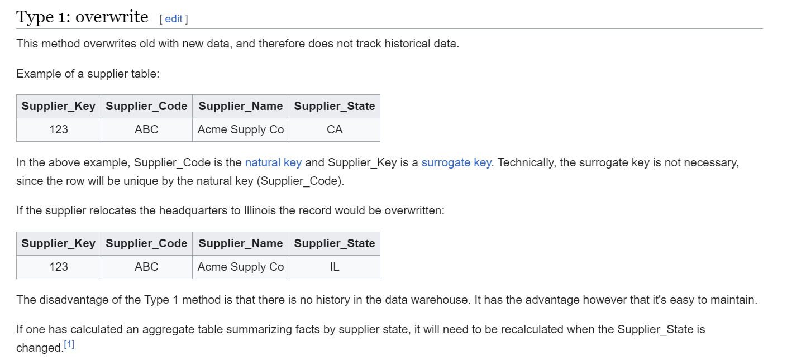

#### Ingest Data with Auto Loader

```sql
CREATE OR REFRESH STREAMING LIVE TABLE customers_bronze
COMMENT "Raw data from customers CDC feed"
AS SELECT current_timestamp() processing_time, input_file_name() source_file, *
FROM cloud_files("${source}/customers", "json")
```

#### Quality Checks

The query below demonstrates:
* The 3 options for behavior when constraints are violated
* A query with multiple constraints
* Multiple conditions provided to one constraint
* Using a built-in SQL function in a constraint

About the data source:
* Data is a CDC feed that contains **`INSERT`**, **`UPDATE`**, and **`DELETE`** operations. 
* Update and insert operations should contain valid entries for all fields.
* Delete operations should contain **`NULL`** values for all fields other than the timestamp, **`customer_id`**, and operation fields.

In order to ensure only good data makes it into our silver table, we'll write a series of quality enforcement rules that ignore the expected null values in delete operations.

```sql
CREATE STREAMING LIVE TABLE customers_bronze_clean
(CONSTRAINT valid_id EXPECT (customer_id IS NOT NULL) ON VIOLATION FAIL UPDATE,
CONSTRAINT valid_operation EXPECT (operation IS NOT NULL) ON VIOLATION DROP ROW,
CONSTRAINT valid_name EXPECT (name IS NOT NULL or operation = "DELETE"),
CONSTRAINT valid_address EXPECT (
  (address IS NOT NULL and 
  city IS NOT NULL and 
  state IS NOT NULL and 
  zip_code IS NOT NULL) or
  operation = "DELETE"),
CONSTRAINT valid_email EXPECT (
  rlike(email, '^([a-zA-Z0-9_\\-\\.]+)@([a-zA-Z0-9_\\-\\.]+)\\.([a-zA-Z]{2,5})$') or 
  operation = "DELETE") ON VIOLATION DROP ROW)
AS SELECT *
  FROM STREAM(LIVE.customers_bronze)
```

#### Requirements that ```APPLY CHANGES INTO``` Provides

* Performs incremental/streaming ingestion of CDC data.

* Provides simple syntax to specify one or many fields as the primary key for a table.

* Default assumption is that rows will contain inserts and updates.

* Can optionally apply deletes.

* Automatically orders late-arriving records using user-provided sequencing key.

* Uses a simple syntax for specifying columns to ignore with the **`EXCEPT`** keyword.

* Will default to applying changes as Type 1 SCD.


#### Processing CDC Data From ```bronze_cleaned``` to ```customers_silver``` table

* Creates the **`customers_silver`** table; **`APPLY CHANGES INTO`** requires the target table to be declared in a separate statement.

* Identifies the **`customers_silver`** table as the target into which the changes will be applied.

* Specifies the table **`customers_bronze_clean`** as the streaming source.

* Identifies the **`customer_id`** as the primary key.

* Specifies that records where the **`operation`** field is **`DELETE`** should be applied as deletes.

* Specifies the **`timestamp`** field for ordering how operations should be applied.

* Indicates that all fields should be added to the target table except **`operation`**, **`source_file`**, and **`_rescued_data`**.

```sql
CREATE OR REFRESH STREAMING LIVE TABLE customers_silver;

APPLY CHANGES INTO LIVE.customers_silver` `
  FROM STREAM(LIVE.customers_bronze_clean)
  KEYS (customer_id)
  APPLY AS DELETE WHEN operation = "DELETE"
  SEQUENCE BY timestamp
  COLUMNS * EXCEPT (operation, source_file, _rescued_data)
```

### Querying Tables with Applied Changes

#### Why Downstream Table Can't Perform Streaming Operations?

While the target of our operation in the previous cell was defined as a streaming live table, data is being updated and deleted in this table (and so breaks the append-only requirements for streaming live table sources). As such, downstream operations cannot perform streaming queries against this table. 

This pattern ensures that if any updates arrive out of order, downstream results can be properly recomputed to reflect updates. It also ensures that when records are deleted from a source table, these values are no longer reflected in tables later in the pipeline.

```sql
CREATE LIVE TABLE customer_counts_state
  COMMENT "Total active customers per state"
AS SELECT state, count(*) as customer_count, current_timestamp() updated_at
  FROM LIVE.customers_silver
  GROUP BY state
```

### Views in DLT

The query below defines a DLT view by replacing **`TABLE`** with the **`VIEW`** keyword.

Views in DLT differ from persisted tables, and can optionally be defined as **`STREAMING`**.

Views have the same update guarantees as live tables, but the results of queries are not stored to disk.

Unlike views used elsewhere in Databricks, DLT views are not persisted to the metastore, meaning that they can only be referenced from within the DLT pipeline they are a part of. (This is similar scoping to temporary views in most SQL systems.)

Views can still be used to enforce data quality, and metrics for views will be collected and reported as they would be for tables.

### Joining and Referencing Tables

In the query below, we create a new view by joining the silver tables from our **`orders`** and **`customers`** datasets. Note that this view is not defined as streaming; as such, we will always capture the current valid **`email`** for each customer, and will automatically drop records for customers after they've been deleted from the **`customers_silver`** table.

### Final Pipeline
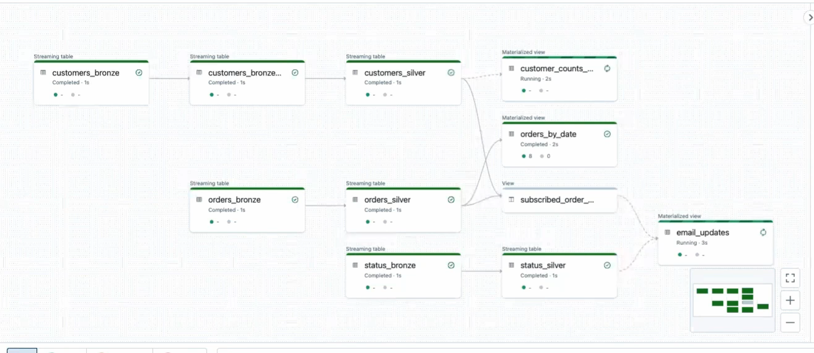

### Python vs SQL


### Pipeline Results and Internals of DLT

#### Checking List of All Tables

```sql
USE ${DA.schema_name};

SHOW TABLES;
```


#### Querying Orders Bronze Table
```sql
SELECT * FROM orders_bronze
```
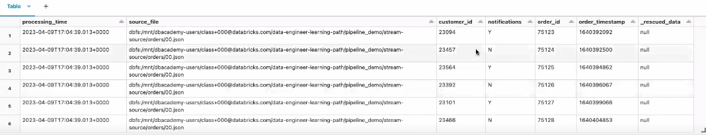
Recall that **`orders_bronze`** was defined as a streaming live table in DLT, but our results here are static.

Because DLT uses Delta Lake to store all tables, each time a query is executed, we will always return the most recent version of the table. But queries outside of DLT will return snapshot results from DLT tables, regardless of how they were defined.

#### Querying ```customers_silver``` table
```sql
SELECT * FROM customers_silver
```


This table dowes not have the additional fields like ```__TimeStamp```, ```__deleteVersion``` and ```__updateVersion```.

The customers_silver table is actually a view oof another hidden table called ```__apply_changes_storage_customer_silver```.

This is seen when we run the describe command.

```sql
DESCRIBE EXTENDED customers_silver
```

Its being read from the ```__apply_changes_storage_customer_silver``` table


#### Checking the ```__apply_changes_storage_customer_silver``` table records

```sql
SELECT * FROM __apply_changes_storage_customers_silver
```


### What is in the storage location?

```python
files = dbutils.fs.ls(DA.paths.storage_location)
display(files)
```


The **autoloader** and **checkpoint** directories contain data used to manage incremental data processing with Structured Streaming.

The **system** directory captures events associated with the pipeline.

#### Event Logs

```python
files = dbutils.fs.ls(f"{DA.paths.storage_location}/system/events")
display(files)
```


Querying the Event Logs gives us lot of information

```python
display(spark.sql(f"SELECT * FROM delta.`{DA.paths.storage_location}/system/events`"))
```
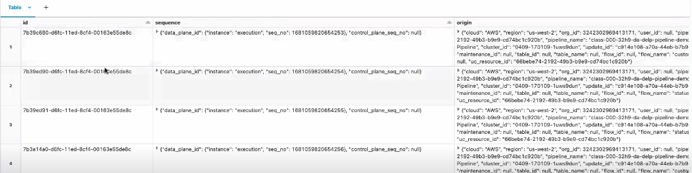

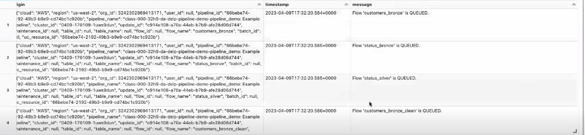

### Pipeline Event Logs Deep Dive

#### Query the Event Log

```python
event_log_path = f"{DA.paths.storage_location}/system/events"

event_log = spark.read.format('delta').load(event_log_path)
event_log.createOrReplaceTempView("event_log_raw")

display(event_log)
```

The dataset includes an id for each transaction performed. 

#### Check the Latest Update Id

```python
latest_update_id = spark.sql("""
    SELECT origin.update_id
    FROM event_log_raw
    WHERE event_type = 'create_update'
    ORDER BY timestamp DESC LIMIT 1""").first().update_id

print(f"Latest Update ID: {latest_update_id}")

# Push back into the spark config so that we can use it in a later query.
spark.conf.set('latest_update.id', latest_update_id)
```

#### Perform Audit Logging

Events related to running pipelines and editing configurations are captured as **`user_action`**.

Yours should be the only **`user_name`** for the pipeline you configured during this lesson.

```sql
SELECT timestamp, details:user_action:action, details:user_action:user_name
FROM event_log_raw 
WHERE event_type = 'user_action'
```


#### Examining Data Lineage

```sql
SELECT details:flow_definition.output_dataset, details:flow_definition.input_datasets 
FROM event_log_raw 
WHERE event_type = 'flow_definition' AND 
      origin.update_id = '${latest_update.id}'
```

DLT provides built-in lineage information for how data flows through your table.

While the query below only indicates the direct predecessors for each table, this information can easily be combined to trace data in any table back to the point it entered the lakehouse.


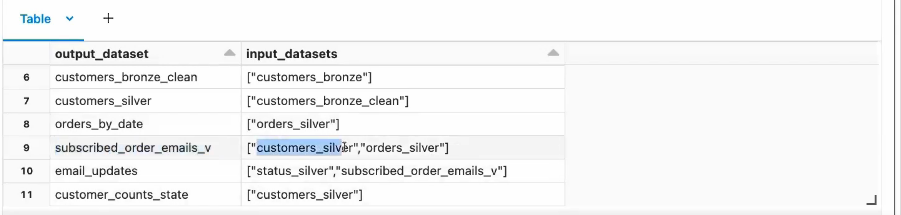

#### Checking Data Quality Metrics ⚠️

If you define expectations on datasets in your pipeline, the data quality metrics are stored in the details:flow_progress.data_quality.expectations object. Events containing information about data quality have the event type flow_progress. The following example queries the data quality metrics for the last pipeline update:

```SQL
SELECT row_expectations.dataset as dataset,
       row_expectations.name as expectation,
       SUM(row_expectations.passed_records) as passing_records,
       SUM(row_expectations.failed_records) as failing_records
FROM
  (SELECT explode(
            from_json(details :flow_progress :data_quality :expectations,
                      "array<struct<name: string, dataset: string, passed_records: int, failed_records: int>>")
          ) row_expectations
   FROM event_log_raw
   WHERE event_type = 'flow_progress' AND 
         origin.update_id = '${latest_update.id}'
  )
GROUP BY row_expectations.dataset, row_expectations.name
```


### Databricks Workflows
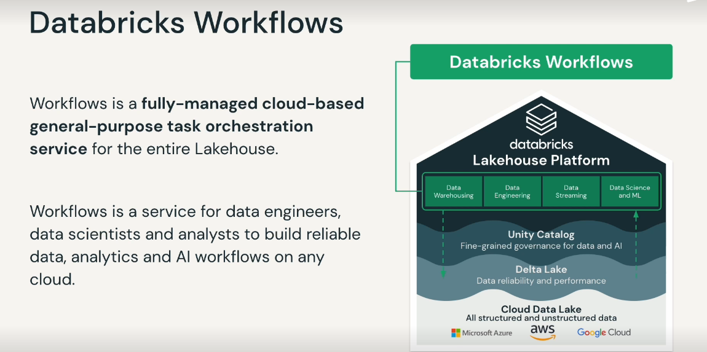

#### Workflows vs DLT Pipelines

Workflows orchestrate all types of tasks(any kind of sql,spark and ml models)

DLT is used to create streaming data pipelines using Python/SQL. It has quality controls and monitoring.

These two can be integrated. DLT pipeline can be executed as a task in a workflow.


#### Differences


#### Use Cases


#### Features of Workflows

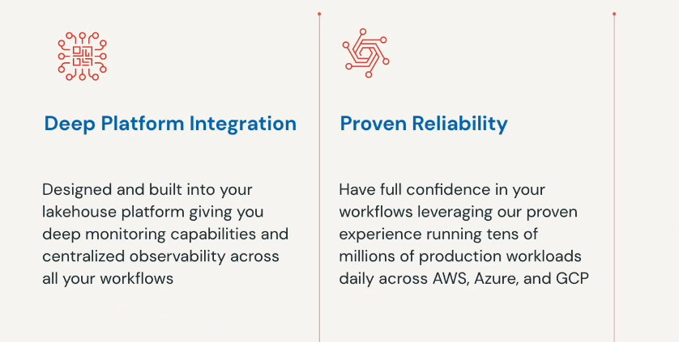

#### How to Leverage Workflows?


#### Common Workflow Patterns


The Fan-Out Pattern can be used when we have a single API from which data comes in but there are various data stores that the data must be stored in different shapes.

#### Example Pipeline


### Workflow Job Components


Shared Job Clusters provide flexibility by providing the ability to use same job cluster for more than one task. 

### Defining Tasks


### Scheduling and Alerts


### Access Controls


### Job Rrun History
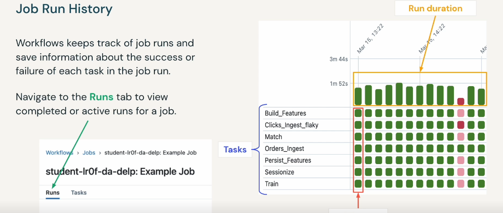

### Repairing Jobs
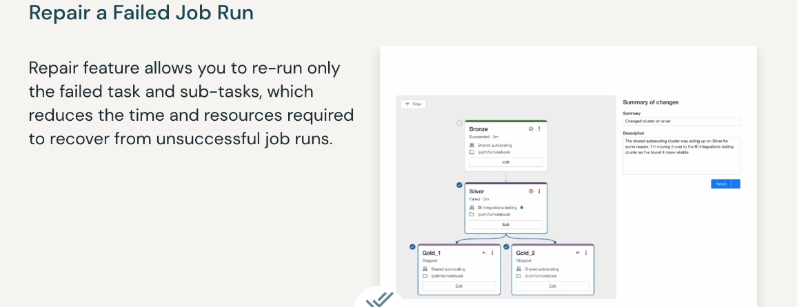
In the above figure we can only rerun from the Silvers job and not the bronze one since its executed properly.

### Demo of Workflow

Go to Workflows > Create new workflow

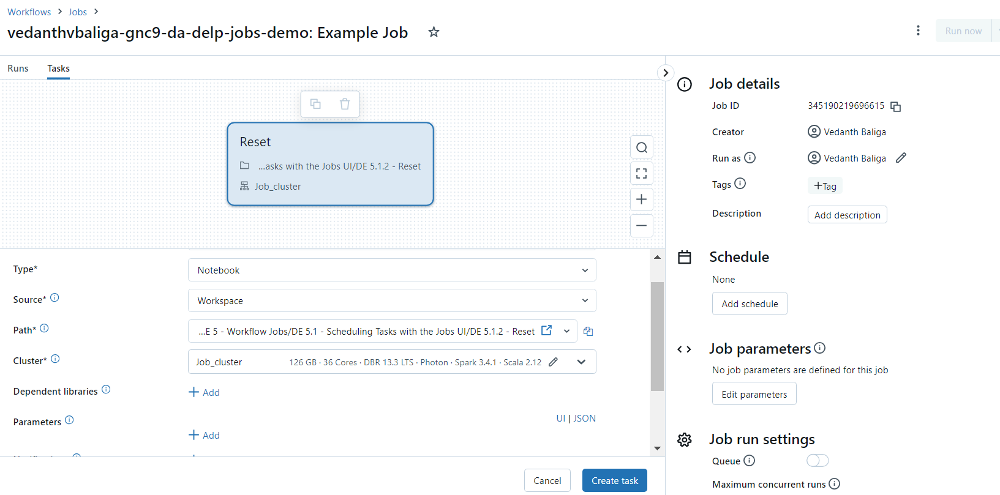

Here is the workflow run from the course. I cant run it on my workkspace due to resource constraints.

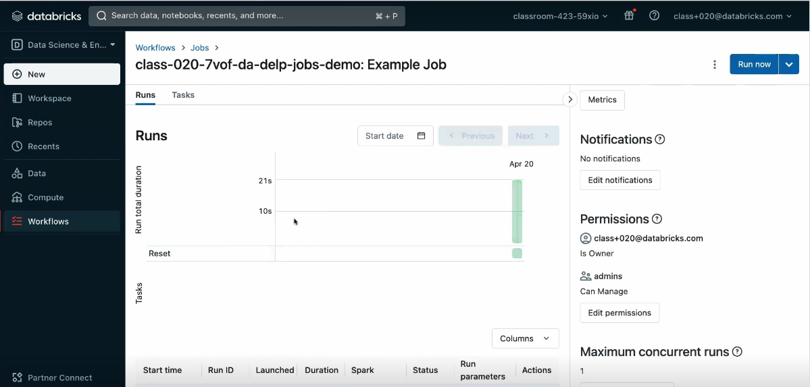

Go to the same notebookDE 5.1.1 and Run the script under ```Generate Pipeline```

**Creating a DLT Pipeline in the Workflow**


For more info on workflows check [this](https://adb-6109119110541327.7.azuredatabricks.net/?o=6109119110541327#notebook/2951115793282232/command/2951115793282237)

### Unity Catalog

- There is something called Unity Catalog Metastore that is different from the Hive Metastore and has advanced data lineage, security and auditing capabilities.

- Metadata like data about the tables, columns and ACL for the objects is stored in the Control Plane
- Data related objects that are managed by the metastore are stored in the Cloud Storage.
- Once we connect to Unity Catalog, it connects the Hive Metastore as a special catalog named ```hive_metastore```
- Assets within the hive metastore can be easily referenced from Unity Catalog.
- Unity Catalog won't control access to the hive metastore but we can use the traditional ACLs

#### Components of Unity Catalog

- Catalogs - Containers that only contain schemas
- Schema - Its a container for data bearing assets.
- Tables - They have two main information associated with them : data and metadata
- Views - perform SQL transformation of other tables or views. They do not have the ability to modify the other tables or views.
- Storage Credential - Allows Unity Catalog to access the external cloud storage via access creds.
- External Location - Allow users to divide the containers into smaller pieces and exercise control over it, They are mainly used to support external tables.
- Shares - They are used to define a read only logical collection of tables. These can be shared with a data reader outside the org.

#### Unity Catalog Architecture


- In case before UC, we should provide different ACL's for each workspace and it must be shared.
- If the compute resources are not properly configured then the access rules can be bypassed very easily.
- In case of Unity Catalog, we can take out the entire User and Config Management outside workspaces.
- We just need to take care of the Compute Resources in the Workspaces. Any changes in the UC is automatically reflected in the Workspaces.

#### Query Lifecycle

- Queries can be issued via a data warehouse or BI tool. The compute resource begins processing the query.
- The UC then accepts the query, logs it and checks the security constraints.
- For each object of the query, UC assumes the IAM role or service principal governing the object as provided by a cloud admin.
- UC then generates a short term token and returns that token to the principal with the access url.
- Now the principal can request data using the URL from the cloud storage with the token.
- Data is then sent back from the cloud storage.
- Last mile row or column filtering can now be applied on the sql warehouse data.


#### Compute Resources and Unity Catalog


- Dynamic Views are not supported on Single User Cluster.
- Cluster level installations don't work on Shared Clusters
- Dynamic Views offer row and column protection.


#### Roles and Admins in Unity Catalog


We can assign the roles via access connectors and there is no manual intervention needed.


- Account and Metastore admins have full access to grant privileges and have the access to data objects.
- The Metastore admins have same privileges as Cloud Admin but only within the metastore that they own.
- There is also a Data Owner that controls and owns only the data objects that they created.


#### Identities in Unity Catalog

- Service Principal is an individual identity for use with automated tools to run jobs and applications.
- They are assigned a name by the creator but are uniquely identified by the Global Unique Identifier ID.
- An access token can be used by the Service Principal using an API to access the data or use Databricks workflows.
- The Service Principals can be elevated to have admin privileges.


#### Groups in Unity Catalog

- Basically its a set of individual users gathered in one place to simplify the access.
- Any grants given to group are inherited by the users.

- Groups can define who can access what data objects and how simplifying data governance policies.


#### Multiple Nested Groups


#### Identity Federation


- There are two main identities, account identity and workspace identity.
- They are linked by a common identity like the email id of a user.
- So its important to have the same email in Account and Workspace, otherwise users can login to the workspace using one email but may not be able to access any data.
- To simplify this identity federation is used where the users, groups and their access controls are defined once in the Account Console and then they can be assigned to one or more workspaces as needed.

### Data Access Privileges

The access privileges are not implied or imperative in the case of Databricks.

**CREATE** - Allows us to create child data objects like views, table and functions within the catalog.

**USAGE** - Allows the person to traverse the child objects. To access a table we need usage access on the containing schema and the catalog.

The privileges are propagated to child objects. For example, granting privileges to a catalog gives us the access to all the tables within the catalog.

**SELECT** - allows querying of the table.

**MODIFY** - allows modification of the table.

**VIEWS** - users don't need access to the underlying source tables to access the view.

**EXECUTE** - allows us to use the functions.

**STORAGE CREDENTIALS** and **EXTERNAL LOCATION** - support three privileges, READ FILES, WRITE FILES and CREATE TABLE.

**SHARE** - supports select statements only.


#### Privilege on various objects


#### Dynamic Views


Dropping objects in any scenario can be done only by the owner.

#### External Locations and Storage Credentials

We can refer to a single storage credential from various external locations.

Because there can be many external locations that use the same storage credentials, DB recommends defining access using the external locations.


#### Best Practices using Unity Catalog

1. One Unity Catalog per region
2. We can implement table sharing across many regions. But when we are sharing the tables, they appear as read only in the destination metastore.
3. ACL's are not implemented in Region B, so they need to be setup separately.
4. It may be costly to do this because data is queried across regions, we can rather ingest the data into region B and then query it.


### Data Segregation

1. We should not use Metastores to segregate data, because switching metastores needs workspace reassignment so the access and creds get spread across several roles in the workspaces.
2. Metastores are actually a thin layer that references the meta data cloud storage object. Using UC container constructs [schemas and catalogs], enables the entire access and credentials to be handled by the metastore admins and the other catalog and workspace admins dont need to get involved.


#### Methods of Data Segregation


- Workspace only identities will not have access to data access within unity catalog.
- But in June 2022, DB elevated all workspace and service principal users to account level privileges.
- No one should run 	production jobs in the prod environment. This risks overwriting the prod data. Users should never be allowed modify access on prod tables.

#### Storage Credential vs External Location

The same access credentials that are part of the storage location is provided to the External Locations.


### Unity Catalog

- There is something called Unity Catalog Metastore that is different from the Hive Metastore and has advanced data lineage, security and auditing capabilities.

- Metadata like data about the tables, columns and ACL for the objects is stored in the Control Plane
- Data related objects that are managed by the metastore are stored in the Cloud Storage.
- Once we connect to Unity Catalog, it connects the Hive Metastore as a special catalog named ```hive_metastore```
- Assets within the hive metastore can be easily referenced from Unity Catalog.
- Unity Catalog won't control access to the hive metastore but we can use the traditional ACLs

#### Components of Unity Catalog

- Catalogs - Containers that only contain schemas
- Schema - Its a container for data bearing assets.
- Tables - They have two main information associated with them : data and metadata
- Views - perform SQL transformation of other tables or views. They do not have the ability to modify the other tables or views.
- Storage Credential - Allows Unity Catalog to access the external cloud storage via access creds.
- External Location - Allow users to divide the containers into smaller pieces and exercise control over it, They are mainly used to support external tables.
- Shares - They are used to define a read only logical collection of tables. These can be shared with a data reader outside the org.

#### Unity Catalog Architecture


- In case before UC, we should provide different ACL's for each workspace and it must be shared.
- If the compute resources are not properly configured then the access rules can be bypassed very easily.
- In case of Unity Catalog, we can take out the entire User and Config Management outside workspaces.
- We just need to take care of the Compute Resources in the Workspaces. Any changes in the UC is automatically reflected in the Workspaces.

#### Query Lifecycle

- Queries can be issued via a data warehouse or BI tool. The compute resource begins processing the query.
- The UC then accepts the query, logs it and checks the security constraints.
- For each object of the query, UC assumes the IAM role or service principal governing the object as provided by a cloud admin.
- UC then generates a short term token and returns that token to the principal with the access url.
- Now the principal can request data using the URL from the cloud storage with the token.
- Data is then sent back from the cloud storage.
- Last mile row or column filtering can now be applied on the sql warehouse data.


#### Compute Resources and Unity Catalog


- Dynamic Views are not supported on Single User Cluster.
- Cluster level installations don't work on Shared Clusters
- Dynamic Views offer row and column protection.


#### Roles and Admins in Unity Catalog


We can assign the roles via access connectors and there is no manual intervention needed.


- Account and Metastore admins have full access to grant privileges and have the access to data objects.
- The Metastore admins have same privileges as Cloud Admin but only within the metastore that they own.
- There is also a Data Owner that controls and owns only the data objects that they created.


#### Identities in Unity Catalog

- Service Principal is an individual identity for use with automated tools to run jobs and applications.
- They are assigned a name by the creator but are uniquely identified by the Global Unique Identifier ID.
- An access token can be used by the Service Principal using an API to access the data or use Databricks workflows.
- The Service Principals can be elevated to have admin privileges.


#### Groups in Unity Catalog

- Basically its a set of individual users gathered in one place to simplify the access.
- Any grants given to group are inherited by the users.

- Groups can define who can access what data objects and how simplifying data governance policies.


#### Multiple Nested Groups


#### Identity Federation


- There are two main identities, account identity and workspace identity.
- They are linked by a common identity like the email id of a user.
- So its important to have the same email in Account and Workspace, otherwise users can login to the workspace using one email but may not be able to access any data.
- To simplify this identity federation is used where the users, groups and their access controls are defined once in the Account Console and then they can be assigned to one or more workspaces as needed.

### Data Access Privileges

The access privileges are not implied or imperative in the case of Databricks.

**CREATE** - Allows us to create child data objects like views, table and functions within the catalog.

**USAGE** - Allows the person to traverse the child objects. To access a table we need usage access on the containing schema and the catalog.

The privileges are propagated to child objects. For example, granting privileges to a catalog gives us the access to all the tables within the catalog.

**SELECT** - allows querying of the table.

**MODIFY** - allows modification of the table.

**VIEWS** - users don't need access to the underlying source tables to access the view.

**EXECUTE** - allows us to use the functions.

**STORAGE CREDENTIALS** and **EXTERNAL LOCATION** - support three privileges, READ FILES, WRITE FILES and CREATE TABLE.

**SHARE** - supports select statements only.


#### Privilege on various objects


#### Dynamic Views


Dropping objects in any scenario can be done only by the owner.

#### External Locations and Storage Credentials

We can refer to a single storage credential from various external locations.

Because there can be many external locations that use the same storage credentials, DB recommends defining access using the external locations.


#### Best Practices using Unity Catalog

1. One Unity Catalog per region
2. We can implement table sharing across many regions. But when we are sharing the tables, they appear as read only in the destination metastore.
3. ACL's are not implemented in Region B, so they need to be setup separately.
4. It may be costly to do this because data is queried across regions, we can rather ingest the data into region B and then query it.


### Data Segregation

1. We should not use Metastores to segregate data, because switching metastores needs workspace reassignment so the access and creds get spread across several roles in the workspaces.
2. Metastores are actually a thin layer that references the meta data cloud storage object. Using UC container constructs [schemas and catalogs], enables the entire access and credentials to be handled by the metastore admins and the other catalog and workspace admins dont need to get involved.


#### Methods of Data Segregation


- Workspace only identities will not have access to data access within unity catalog.
- But in June 2022, DB elevated all workspace and service principal users to account level privileges.
- No one should run 	production jobs in the prod environment. This risks overwriting the prod data. Users should never be allowed modify access on prod tables.

#### Storage Credential vs External Location

The same access credentials that are part of the storage location is provided to the External Locations.


#### Practical Example

I cannot create metastore in my account due to privilege problems. Just check the code to understand. Here is a video from the course regarding the [example](https://customer-academy.databricks.com/learn/course/1266/play/14569/create-and-govern-data-with-unity-catalog;lp=10).

##### Create a New Catalog

Let's create a new catalog in our metastore. The variable **`${DA.my_new_catalog}`** was displayed by the setup cell above, containing a unique string generated based on your username.

Run the **`CREATE`** statement below, and click the **Data** icon in the left sidebar to confirm this new catalog was created.

```sql
CREATE CATALOG IF NOT EXISTS ${DA.my_new_catalog}
```

##### Selecting the Default Catalog

SQL developers will probably also be familiar with the **`USE`** statement to select a default schema, thereby shortening queries by not having to specify it all the time. To extend this convenience while dealing with the extra level in the namespace, Unity Catalog augments the language with two additional statements, shown in the examples below:

    USE CATALOG mycatalog;
    USE SCHEMA myschema;  
    
Let's select the newly created catalog as the default. Now, any schema references will be assumed to be in this catalog unless explicitly overridden by a catalog reference.

```sql
USE CATALOG ${DA.my_new_catalog}
```

##### Create a New Schema

Next, let's create a schema in this new catalog. We won't need to generate another unique name for this schema, since we're now using a unique catalog that is isolated from the rest of the metastore. Let's also set this as the default schema. Now, any data references will be assumed to be in the catalog and schema we created, unless explicitely overridden by a two- or three-level reference.

Run the code below, and click the **Data** icon in the left sidebar to confirm this schema was created in the new catalog we created.

```sql
CREATE SCHEMA IF NOT EXISTS example;
USE SCHEMA example
```

##### Set Up Tables and Views

With all the necessary containment in place, let's set up tables and views. For this example, we'll use mock data to create and populate a *silver* managed table with synthetic patient heart rate data and a *gold* view that averages heart rate data per patient on a daily basis.

Run the cells below, and click the **Data** icon in the left sidebar to explore the contents of the *example* schema. Note that we don't need to specify three levels when specifying the table or view names below, since we selected a default catalog and schema.

```sql
CREATE OR REPLACE TABLE heartrate_device (device_id INT, mrn STRING, name STRING, time TIMESTAMP, heartrate DOUBLE);

INSERT INTO heartrate_device VALUES
  (23, "40580129", "Nicholas Spears", "2020-02-01T00:01:58.000+0000", 54.0122153343),
  (17, "52804177", "Lynn Russell", "2020-02-01T00:02:55.000+0000", 92.5136468131),
  (37, "65300842", "Samuel Hughes", "2020-02-01T00:08:58.000+0000", 52.1354807863),
  (23, "40580129", "Nicholas Spears", "2020-02-01T00:16:51.000+0000", 54.6477014191),
  (17, "52804177", "Lynn Russell", "2020-02-01T00:18:08.000+0000", 95.033344842);
  
SELECT * FROM heartrate_device
```


```sql
CREATE OR REPLACE VIEW agg_heartrate AS (
  SELECT mrn, name, MEAN(heartrate) avg_heartrate, DATE_TRUNC("DD", time) date
  FROM heartrate_device
  GROUP BY mrn, name, DATE_TRUNC("DD", time)
);
SELECT * FROM agg_heartrate
```


Querying the table above works as expected since we are the data owner. That is, we have ownership of the data object we're querying. Querying the view also works because we are the owner of both the view and the table it's referencing. Thus, no object-level permissions are required to access these resources.

##### The ```accounts_user_group```

In accounts with Unity Catalog enabled, there is an _account users_ group. This group contains all users that have been assigned to the workspace from the Databricks account. We are going to use this group to show how data object access can be different for users in different groups.

##### Grant Access to Data Objects

Unity Catalog employs an explicit permission model by default; no permissions are implied or inherited from containing elements. Therefore, in order to access any data objects, users will need **USAGE** permission on all containing elements; that is, the containing schema and catalog.

Now let's allow members of the *account users* group to query the *gold* view. In order to do this, we need to grant the following permissions:
1. USAGE on the catalog and schema
1. SELECT on the data object (e.g. view)

We need the USAGE command to actually make sure that the user reaches the point through the tree level structure to get to where the catalog is stored.

**Grant Privileges**

```sql
GRANT USAGE ON CATALOG ${DA.my_new_catalog} TO `account users`;
GRANT USAGE ON SCHEMA example TO `account users`;
GRANT SELECT ON VIEW agg_heartrate to `account users`
```

##### Generate a Query and access the data

```sql
SELECT "SELECT * FROM ${DA.my_new_catalog}.example.agg_heartrate" AS Query
```


##### Can we query the silver table?

Back in the same query in the Databricks SQL session, let's replace *gold* with *silver* and run the query. This time it fails, because we never set up permissions on the *silver* table. 

Querying *gold* works because the query represented by a view is essentially executed as the owner of the view. This important property enables some interesting security use cases; in this way, views can provide users with a restricted view of sensitive data, without providing access to the underlying data itself. We will see more of this shortly.

##### Granting Access to UDF

```sql
CREATE OR REPLACE FUNCTION mask(x STRING)
  RETURNS STRING
  RETURN CONCAT(REPEAT("*", LENGTH(x) - 2), RIGHT(x, 2)
); 
SELECT mask('sensitive data') AS data
```

The above function masks the last two characters of the string ```sensitive_data```

Now let's grant access to the function

```sql
GRANT EXECUTE ON FUNCTION mask to `account users`
```

Run the function using

```sql
SELECT "SELECT ${DA.my_new_catalog}.example.mask('sensitive data') AS data" AS Query
```

Now run the query in the SQL Editor you can see that the last two characters are redacted.

# Data Engineering Professional Learning Pathway

## Top Level Concepts

This is the course material that's part of [Databricks AI Summit Learning Festival](https://community.databricks.com/t5/events/dais-2025-virtual-learning-festival-11-june-02-july-2025/ec-p/119323#M3413)


### Advantages of Stream Processing


### Stream Processing Architecture


### Challenges with Streaming


## What is Structured Streaming?


### Unbounded Tables For Streaming


### Execution Mode in Streaming


### Anatomy of a Streaming Query

Source, Input Tables, Result tables and storage layer in streaming.


#### Step 1: Read data from any streaming source


#### Step 2 : Transform the data


#### Step 3 : Sink


#### Step 4 : Trigger Mechanism

Checkpoint is there to ensure fault tolerance.


The API definitions for batch and streaming is the same.

### Types of Triggers


### Output Modes


### Demo : Streaming Data Query

"readStream" instead of "read" the tranformations are the same. 


**Data Metrics**


#### Writing Data to a Delta Lake Sink


We can see the status of the query


... and also see the metrics from the previous query


### Using Delta tables as a Streaming Source


#### Tuning the parameters for a delta streaming source


#### Streaming to a delta table

For any arbitary aggregations on streaming data, use complete mode.


### Aggregations, Time Windows and Watermark

#### Types of Stream Processing

There are two types of Stream Processing

- Stateless
- Stateful
  


#### Intermediate State to Keep Track


### Aggregations over Time Windows

### Event Time vs Processing Time

The unbounded tables must always be processed in order.


### Tumbling Window vs Sliding Window


### Sliding Window Example

Here is a 10 min window with 5 min overlap


### Challenges with Sliding Window

There is a lot of Memory Pressure with using sliding window because all the data is stored in executor memory.


We can tackle this by storing the data off heap


### Watermarking / Late Threshold


Watermarking is a technique that basically tells how long is too late?

For example if data record with id = 100 came in now at 12:05am then if we keep window as 10 min then we will wait until 12:15am and if no data arrives for that id we purge the state.

The dog record in the below pic has eventTime of 12:04 but its beyond our 10 min window (12:05 - 12:15) so we dont consider that record and miss the count.


**Late arriving data state is dropped and we save memory**


### Demo : Time window aggregations with Watermarking


#### Read and Process Streaming Source


Output


**Windowing**

Goal is to find the revenue in USD in a 60 min time window.


- Here the window is of 60 min but we add a watermark of 90 min to cater to any late arriving data.
- Then we group by both eventTimestamp and the city to find the revenue.

Output


### Writing Data in Append Mode


The catch with append mode is that the data is not going to be written into the sink until and unless we finish the hour (window duration)

The **availableNow** trigger processes all the data currently available in the source and then stops. It’s like a one-time cleanup of everything in your inbox.

```python
writeStreamAvailableNow = (
    df.writeStream.format("delta")
    .option("checkpointLocation", f"{checkpoint_location}")
    .trigger(availableNow=True)
    .outputMode("append")
    .queryName("AvailableNow")
    .toTable("default.streaming_circuits")
)
```


Result: here, the query processes all data available in the source and then terminates. This is a great choice when you want to process data in a “stream-like” fashion but only once.

There is always some delay between creating streaming table and the commits happening to it.


### Writing Data in update mode


#### Step 1 : Create a table


#### Step 2 : Write a MERGE Query to merge the data based on start and end time


### Data Ingestion Patterns


#### How to deal with ephemeral data?

We can deal with transient data by creating STREAMING LIVE tables that contain raw data from source.


Then we can update other tables like silver tables (also live) with transformations.

#### Simplex vs Multiplex Ingestion


#### Dont use Kafka as bronze table


#### Solution

- First simplex and store data in bronze
- Then multiplex it and transform into multiple silver tables.


### DLT Demo

#### Autoloader for bronze ingestion


Here are the conf parameters


This is the syntax of a dlt table.

- we first define the parameters of the table and dont allow reset on it.
  


- now we stream data from cloud files using autoloader.


Final dlt pipeline


#### Transforming the data


### Quality Enforcement in DLT

#### Quality enforcement in Bronze


#### Quality enforcement in Silver


#### Schema Enforcement Patterns


#### Alternate Enforcement Methods


#### Defining Expectations in DLT


### Demo: Enforcing Validations on the Data


#### Quarantining Records

We say expect all or drop which indicates that all rules must pass else drop records.


Now we can use those rules


**The Data Quality metrics in the UI**


## Databricks Data Privacy


### Storing Data Securely


#### Regulatory Compliance

**GDPR and CCPA**


#### Databricks Simplifying Compliance


#### 3 Key Aspects of Data Privacy


### Advanced Unity Catalog Concepts


#### Components of Unity Catalog


How unity catalog provides single governance model?


#### Access Control Lists


#### Managing ACLs


#### Tagging and AI Docs


#### Search objects with tags


#### Fine Grained Access Control


**Dynamic Views Fine Grained Access Control**


``current_user`` 


``is_member()``


### Row level security and Column Masking


**What are row filters?**

Row filters allow you to apply a filter to a table so that queries return only rows that meet the filter criteria. You implement a row filter as a SQL user-defined function (UDF). Python and Scala UDFs are also supported, but only when they are wrapped in SQL UDFs.

**What are column masks?**
Column masks let you apply a masking function to a table column. The masking function evaluates at query runtime, substituting each reference of the target column with the results of the masking function. For most use cases, column masks determine whether to return the original column value or redact it based on the identity of the invoking user. Column masks are expressions written as SQL UDFs or as Python or Scala UDFs wrapped in SQL UDFs.

Each table column can have only one masking function applied to it. The masking function takes the unmasked value of the column as input and returns the masked value as its result. The return value of the masking function should be the same type as the column being masked. The masking function can also take additional columns as input parameters and use those in its masking logic.

#### Examples

This example creates a SQL user-defined function that applies to members of the group admin in the region US.

When this sample function is applied to the sales table, members of the admin group can access all records in the table. If the function is called by a non-admin, the RETURN_IF condition fails and the region='US' expression is evaluated, filtering the table to only show records in the US region.

```sql
CREATE FUNCTION us_filter(region STRING)
RETURN IF(IS_ACCOUNT_GROUP_MEMBER('admin'), true, region='US');
```
Use it on a table

```sql
CREATE TABLE sales (region STRING, id INT);
ALTER TABLE sales SET ROW FILTER us_filter ON (region);
```

### Column Mask Examples

```sql
CREATE FUNCTION ssn_mask(ssn STRING)
  RETURN CASE WHEN is_account_group_member('HumanResourceDept') THEN ssn ELSE '***-**-****' END;
```

```sql
--Create the `users` table and apply the column mask in a single step:

CREATE TABLE users (
  name STRING,
  ssn STRING MASK ssn_mask);
```

### Filtering on unspecified columns

```sql
DROP FUNCTION IF EXISTS row_filter;

CREATE FUNCTION row_filter()
  RETURN EXISTS(
    SELECT 1 FROM valid_users v
    WHERE v.username = CURRENT_USER()
);
```

```sql
DROP TABLE IF EXISTS data_table;

CREATE TABLE data_table
  (x INT, y INT, z INT)
  WITH ROW FILTER row_filter ON ();

INSERT INTO data_table VALUES
  (1, 2, 3),
  (4, 5, 6),
  (7, 8, 9);
```

### Performance Considerations


### Auditing Data

#### Table Level Data

What was the last updated time?


#### User Level Data

Who used which tables?


#### Lineage Data

What is the lineage of the tables?


#### Data Isolation


#### Centralized and Distributed Metastore Models

**Centralized**

The metastore owners govern all the objects.


**Distributed**

The governance is at the catalog level.

### External Locations and Storage Credentials


### Unity Catalog Model to Access data


- The data comes from the cloud storage to the user, not from the table. Unity catalog only checks the permissions and audit log.

### Encryption by Default


### Managing Access to PII


### Best Practices


### Demo


#### Protecting Columns and Rows


#### Dynamic Views


#### Example


#### Row filters and Column Mask


**Applying the filter**


**Creating Column Mask**


**Table Tags**


### PII Data security


#### Pseudonymization


##### Hashing


##### Tokenization


#### Anonymization


### PII Data Security : Demo


Two methods hashing and tokenization.

#### Hashing


Create a dlt table


Create a salt and hash


Create user lookup table with alt id generated from above.


Now check user_id_hashed table


#### Tokenization


Create a join with real and pseudo lookup table.


The lookup table


The tokennized joined table


#### Anonymization 

Irreversible 


Setting up tables


#### Schema for users bronze table


Age bins function


### Change Data Feed


#### Solution I : Ignore deletes and updates


#### Benefits of Change Data Feed


#### CDC vs CDF


#### How CDF works?


#### Consuming Delta CDF


If multiple updates come in one micro batch we need to select 1 of them.


#### How to collect changes?


### Deleting PII data


#### Data Vacuuming 


Materialized views cannot be used for DML ops, we need to REFRESH manually


### CDF Demo


Step 1 : Create stream from source


Step 2 : Create silver and upsert_to_delta function


Step 3 : Initiate the stream and check history


We will have two images for any updates


Step 4 : Insert New data


Step 5 : Check what is changed


We can get operational metrics also


Check all rows that were updated


Adding commit messages in history


Create a table called delete_requests


How to process delete requests?


Collect Deleted silver users to process with CDF


Propogate deletes to gold tables


Are deletes fully commited?

No, we can see them in previous versions of the data.


## Performance Optimization in Databricks

Some common problems


Avoiding small files problem


### Demo : File Explosion


Partitioning by Id


Now we do some aggregation on non partitioned columns. It takes 7 seconds to compute.


Because we partitioned by Id the query is looking into 2500 files


Instead if we dont add partitioning then the reads are much faster.

### Data Skipping

#### Z-Ordering

We have stored data in min and max column basis.


#### Some Considerations


#### Liquid Clustering


🧱 **Partitioning**
Partitioning physically organizes data into separate folders on storage based on the values of one or more columns. For example, partitioning a sales table by region and year results in directories like /region=US/year=2024/. This allows partition pruning: when queries filter on those columns, Databricks reads only relevant partitions, improving performance.

Partitioning works best when:

- You have low-cardinality columns (few unique values).

- You know the access patterns ahead of time.

- You want predictable file organization.

However, partitioning becomes problematic with high-cardinality columns (e.g., user_id or product_id) because it creates too many folders. This is called partition explosion, which leads to small files, slow queries, and high metadata overhead.

🌊 **Liquid Clustering**
Liquid Clustering is a newer, automatic file organization technique that clusters data logically, not physically. Instead of creating folders, it reorganizes data within Delta files based on specified columns (like user_id, timestamp). It improves filtering performance without the downsides of static partitioning.

- It works incrementally—Databricks automatically reclusters the data in the background using OPTIMIZE jobs. This makes it ideal for:

- High-cardinality columns.

- Streaming or frequently updated datasets.

- Situations where partitioning would be too rigid or hard to manage.

With Liquid Clustering, you just define the clustering columns using table properties, and Databricks takes care of the rest. It’s flexible, scalable, and low-maintenance.

If we want to change liquid clustering columns, we dont need to rewrite whole table.

Liquid clustering intelligently makes sure the files are of same size.


### Predictive Optimization


### Code Optimizations

#### Data Skew


Salting approach by adding some suffix to each key


#### Data Shuffling


Mitigate Shuffling


### Demo of Shuffling


This data shows the shuffling of data, we can see that around 1.5 G of shuffling happenend.


#### Broadcast Join


After enabling broadcast join there are only few Kb worth of shuffling


### Spill


When does skew occur


Spilling to memory and disk


#### Mitigating Serialization Issues


#### Demo : UDF


For 60 records it takes one minute because the data is not being run on diff cores, its being run one after another.

Solution: We repartition the data


#### How SQL UDF is better?


Query is supported by Photon


### Cluster Optimization


#### Photon


#### Cluster Optimization Techniques


🎈 Imagine you're at a birthday party...

There are 200 kids playing a game where they all have to sort their candies by color. But there’s a rule:
All the red candies go to one basket, all the green to another, and so on.

Now, to do this, the kids need to share and move candies around — this is like a shuffle in Spark. It’s when data (candies) gets moved around to be grouped or sorted.

🧺 Now, what is spark.sql.shuffle.partitions?

It’s like saying:

“How many baskets should we use to sort all the candies?”

So if we set:

spark.sql.shuffle.partitions = 200 → Spark uses 200 baskets

spark.sql.shuffle.partitions = 50 → Uses 50 baskets

🎨 Why it matters:

Too many baskets (e.g. 1000): Some baskets might only get 1 candy, but the kids still have to carry them — too much work!

Too few baskets (e.g. 5): Baskets get too full, hard to carry — some kids may drop candies 😬

So we need a good number of baskets so all the kids can sort fast, without making a mess!

🧠 What Spark does:

When Spark runs a big job (like sorting, grouping, or joining), it shuffles data. Then it needs to know:

“Into how many parts (baskets) should I split the shuffled data?”

That’s what spark.sql.shuffle.partitions controls.

🧁 In short:

It's like how many baskets Spark uses to sort data after mixing it.

Default is 200 baskets.

If your job is small → use fewer baskets.

If your job is huge → maybe more baskets help.

Or better yet, let Spark decide by itself using Adaptive Query Execution — like having a smart friend who picks the perfect number of baskets for each game 🎯
