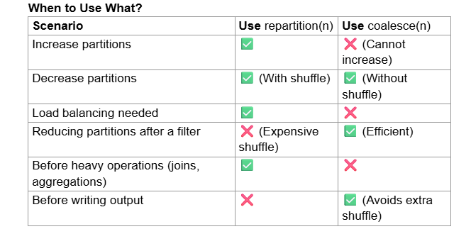

# What Actually Happens in `coalesce()`

`coalesce(n)` is a **narrow transformation**, but that does **not mean zero data movement**.

It means:

* No **full shuffle across all partitions**
* But **some data may still be reassigned/moved**

---

# How Coalesce Reduces Partitions

Spark:

1. Selects a subset of existing partitions as targets
2. Maps multiple old partitions → fewer new partitions
3. Avoids re-hashing / global redistribution

---

## Example

### Before (4 partitions across executors)

```text
Executor 1 → P1 [A, B]  
Executor 2 → P2 [C, D]  
Executor 3 → P3 [E, F]  
Executor 4 → P4 [G, H]
```

---

### After `coalesce(2)`

Possible mapping:

```text
New Partition 1 ← P1 + P2  
New Partition 2 ← P3 + P4
```

---

# Does Data Move?

## Case 1: Ideal (Same Executor)

If:

* P1 and P2 are already on same executor

Then:

* Minimal or no data movement

---

## Case 2: Different Executors

If:

* P1 is on Executor 1
* P2 is on Executor 2

Then:

* One partition’s data **must move** to the other executor

---

# Key Insight

> `coalesce()` avoids **global shuffle**, but **does not guarantee data locality**

* It does **not rebalance data evenly**
* It just **collapses partitions with minimal coordination**

---

# Why It’s Still Faster Than `repartition()`

### `coalesce()`

* Moves **only necessary partitions**
* No re-hashing
* No all-to-all communication

### `repartition()`

* Every partition sends data to every other partition
* Full network shuffle

---

# Internal Behavior (Important)

* Uses a **Partition Coalescer**
* Groups partitions into fewer buckets
* Tries to:

  * Prefer data locality
  * Minimize cross-node transfer

But:

* No strict guarantee

---

# Visual Comparison

## coalesce(2)

```text
P1 ┐
P2 ┘ → New P1

P3 ┐
P4 ┘ → New P2
```

(Limited movement)

---

## repartition(2)

```text
P1 ─┬─→ P1'
P2 ─┼─→ P1'
P3 ─┼─→ P1'
P4 ─┘

P1 ─┬─→ P2'
P2 ─┼─→ P2'
P3 ─┼─→ P2'
P4 ─┘
```

(All-to-all shuffle)

---

# Final Answer

> `coalesce()` does **not strictly merge partitions within the same executor**. It **may move data across executors**, but only as needed, avoiding a full shuffle and minimizing network I/O.

---

# Interview One-Liner

> `coalesce()` minimizes data movement but does not eliminate it; it can move data across executors, just without triggering a full shuffle like `repartition()`.

Here’s a **real-world case study** that clearly shows how `coalesce()` behaves (including data movement) and why it’s chosen over `repartition()` in practice.

---

# Case Study: Databricks ETL Pipeline (Event Logs → Delta Lake)

## Scenario

You’re a Data Engineer processing **clickstream / event data**:

* Source: Kafka → Bronze table (raw JSON)
* Processing: Spark (Databricks)
* Output: Delta table in S3 / ADLS
* Volume: ~500 GB/day
* Initial partitions: **2000 partitions**

---

# Step 1: Raw Data Load

After ingestion:

```python
df = spark.read.table("bronze_events")
print(df.rdd.getNumPartitions())  # 2000
```

Why so many partitions?

* Auto Loader / Kafka ingestion
* Small micro-batches
* High parallelism

---

# Step 2: Transform + Filter

```python
df_filtered = df.filter("event_type = 'purchase'")
```

Now:

* Data volume drops to ~50 GB
* But partitions are still **2000**

---

## Problem

If you write directly:

```python
df_filtered.write.format("delta").save("/silver/purchases")
```

You get:

* **2000 small files**
* Poor query performance
* Metadata overhead
* Slow downstream reads

---

# Step 3: Optimize with `coalesce()`

```python
df_filtered = df_filtered.coalesce(100)
```

---

# What Actually Happens Internally

### Before

```text
2000 partitions (~25 MB each after filter)
Spread across many executors
```

---

### Coalesce Mapping (Example)

```text
New Partition 1  ← P1 + P2 + ... + P20
New Partition 2  ← P21 + ... + P40
...
New Partition 100 ← ...
```

---

# Important: Does Data Move?

### Yes — but selectively

#### Case A: Same Executor

If P1–P20 are on same executor:

* No network movement
* Just merged locally

#### Case B: Different Executors

If partitions are spread:

* Some partitions must move across executors
* But:

  * No full shuffle
  * No all-to-all exchange

---

# Why Not Use `repartition(100)`?

```python
df_filtered.repartition(100)
```

This would:

* Trigger **full shuffle**
* Every partition sends data everywhere
* Massive network I/O for 50 GB

---

# Performance Comparison (Realistic)

| Operation              | Shuffle | Time                   | Network |
| ---------------------- | ------- | ---------------------- | ------- |
| No change (2000 files) | None    | Fast write, slow reads | Low     |
| `coalesce(100)`        | Minimal | Fast                   | Low     |
| `repartition(100)`     | Full    | Slow                   | High    |

---

# Step 4: Write Optimized Output

```python
df_filtered.write.format("delta").mode("overwrite").save("/silver/purchases")
```

Result:

* ~100 files (~500 MB each)
* Much better for:

  * Query performance
  * File pruning
  * Metadata handling

---

# Where This Matters in Real Systems

## 1. Delta Lake Optimization

In platforms like Databricks:

* Small file problem is very common
* `coalesce()` is frequently used before writes

---

## 2. Daily Batch Pipelines

Typical pattern:

```python
df = transform(df)
df = df.coalesce(target_partitions)
df.write(...)
```

---

## 3. Cost Optimization

* Less shuffle → less compute time
* Less network → lower cloud cost
* Fewer files → faster queries

---

# When This Strategy Fails

## Skewed Data Example

If:

```text
Partition 1 → 10 GB  
Others → 10 MB
```

Then:

* `coalesce()` may create uneven partitions
* One task becomes a bottleneck

In such cases:

```python
df.repartition(100)
```

is better

---

# Key Takeaways

### 1. `coalesce()` in real life

* Used to **reduce output files**
* Common before writes

---

### 2. Data Movement Reality

> It **can move data across executors**, but avoids full shuffle

---

### 3. Why Engineers Prefer It

* Faster than repartition
* Good enough distribution for writes
* Minimizes shuffle cost

---

Let’s build a clean, **first-principles understanding of skew, partitions, tasks, and how Spark actually executes work**—the way you should think about it in interviews and real systems.

---

# 1. Fundamental Building Blocks

## Partition

* A **logical chunk of data**
* Smallest unit Spark can process independently

## Task

* A **unit of computation on one partition**

> **1 partition → 1 task**

## Executor

* A JVM process with CPU + memory
* Runs multiple tasks (based on available cores)

---

# 2. How Spark Actually Executes a Job

Suppose you have:

```text
100 partitions
5 executors
Each executor = 4 cores
```

### Total parallel capacity:

```text
5 executors × 4 cores = 20 tasks at a time
```

### Execution:

* Spark launches **20 tasks in parallel**
* Remaining tasks wait in queue

---

# 3. Where Skew Comes From

## Ideal Case (Balanced)

```text
Partition sizes:
[100MB, 100MB, 100MB, 100MB]
```

All tasks:

* Start together
* Finish roughly together

Cluster utilization = high

---

## Skewed Case (Problem)

```text
Partition sizes:
[10MB, 10MB, 10MB, 500MB]
```

Execution:

```text
Task 1 → 10MB → finishes fast  
Task 2 → 10MB → finishes  
Task 3 → 10MB → finishes  
Task 4 → 500MB → runs long
```

Now:

* 3 executors become idle
* Only 1 executor is busy

This is called a **straggler task**

---

# 4. Why Spark Cannot Fix This Automatically

Because:

* Each partition is **independent**
* A task cannot be split across executors
* Spark cannot “steal” work from a running task

So one big partition = one long-running task

---

# 5. Where Skew Happens Most Often

## 5.1 Joins (Most common)

```python
df1.join(df2, "user_id")
```

Spark:

* Shuffles data by `user_id`
* Same keys go to same partition

### Problem:

```text
user_id = 1 → 1 million rows  
user_id = others → few rows
```

→ One partition becomes huge

---

## 5.2 Aggregations

```python
groupBy("country")
```

If:

```text
India → 90% data
Others → 10%
```

→ One partition gets overloaded

---

## 5.3 Repartition by key

```python
repartition("product_id")
```

Same issue if key distribution is uneven

---

# 6. How Shuffle Creates Skew

During shuffle:

1. Data is redistributed based on key
2. Hash function assigns key → partition

```text
partition_id = hash(key) % num_partitions
```

If one key is frequent:

→ That partition gets most of the data

---

# 7. Diagnosing Skew

In Spark UI:

* One task takes much longer than others
* Large difference in:

  * Input size
  * Shuffle read size
  * Duration

This is a clear sign of skew

---

# 8. Solutions (Deep Understanding)

## 8.1 Repartition (General balancing)

```python
df.repartition(200)
```

* Full shuffle
* Redistributes rows more evenly

But:

* Does NOT fix skew caused by a **single heavy key**

---

## 8.2 Salting (Best for key skew)

Idea:

Break one heavy key into multiple smaller keys

### Example:

Instead of:

```text
user_id = 1
```

Make:

```text
user_id = 1_0, 1_1, 1_2, ..., 1_9
```

Code:

```python
from pyspark.sql.functions import col, rand

df = df.withColumn("salt", (rand()*10).cast("int"))
df = df.withColumn("user_id_salted", concat(col("user_id"), col("salt")))
```

Now:

* Data spreads across partitions
* No single partition is overloaded

---

## 8.3 Broadcast Join (Best when one table is small)

```python
from pyspark.sql.functions import broadcast

df_large.join(broadcast(df_small), "id")
```

* No shuffle on large dataset
* Eliminates skew entirely

---

## 8.4 Skew Join Optimization (Spark 3+)

Spark can automatically:

* Detect skewed partitions
* Split large partitions

Config:

```python
spark.conf.set("spark.sql.adaptive.enabled", "true")
spark.conf.set("spark.sql.adaptive.skewJoin.enabled", "true")
```

---

## 8.5 Coalesce (Not for skew)

```python
df.coalesce(10)
```

* Reduces partitions
* No full shuffle
* Does NOT rebalance data

---

# 9. Repartition vs Coalesce (Final Clarity)

| Feature             | Repartition | Coalesce    |
| ------------------- | ----------- | ----------- |
| Shuffle             | Yes         | No (mostly) |
| Balancing           | Yes         | No          |
| Increase partitions | Yes         | No          |
| Decrease partitions | Yes         | Yes         |
| Fix skew            | Partial     | No          |

---

# 10. Final Mental Model

Think like this:

* Spark = **parallel system**
* Parallelism depends on **number of partitions**
* Efficiency depends on **balanced partitions**

> The goal is not just “more partitions” but **evenly sized partitions**

---

# 11. One-Line Summary

Skew occurs when one or few partitions contain disproportionately large data, causing long-running tasks (stragglers) and underutilized executors, and it must be handled using techniques like repartitioning, salting, broadcast joins, or adaptive execution.

---



Example Use Cases

Repartition for Large Joins:

```python
df.repartition(100).join(other_df.repartition(100), "id")
```

Ensures both datasets have balanced partitions before joining.
Coalesce Before Writing to Disk:

```python
df.filter(col("status") == "active").coalesce(1).write.parquet("output/")
```

Reduces shuffle and writes fewer output files.

### Repartitioning by column name

When you use .repartition(column_name), Spark redistributes the data based on the values in the specified column. This helps when working with data that needs to be grouped by a specific column before performing operations like joins or aggregations.

Syntax:

```python
df.repartition("category") # Redistributes based on 'category' column
```

- This will shuffle data so that all rows with the same category value end up in the same partition.
- The number of partitions will be decided by Spark's default settings (typically based on cluster size and data volume).

**Repartition with Both Column & Number of Partitions**

You can also specify both a column name and a number of partitions:
df.repartition(10, "category") # Redistributes by 'category' into 10 partitions

Spark will first hash partition the data based on category values.
Then, it will further distribute the data into 10 partitions.

This ensures a controlled number of partitions while still grouping data by column.